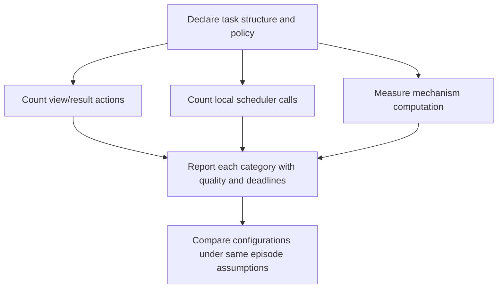

# Measure coordination overhead in the declared environment

## Verified categories, bounded claim

TR 94-14 §4.1 separates coordination overhead into: (1) communication and information-gathering action executions, (2) invocations of the local scheduler, and (3) algorithmic computation of the coordination mechanisms. These costs relate to represented task/method count, relationship structure, overlap, and commitments. The report does not license a universal additive cost model.

The inspected PDF extraction preserved Table 2’s categories and headers but not its symbolic coefficients reliably. Therefore this reference deliberately omits inherited asymptotic formulas, “roughly N messages” claims, and numerical latency extrapolations. Do not infer an exact number of calls from big-O notation.

## A useful measurement worksheet

For each run, record the selected M1/M2 policy, enabled M3–M5 mechanisms, task/method counts, detected cross-agent relations, commitments, communication/information actions, scheduler calls, mechanism CPU time, method execution time, quality, deadline outcome, and local stop time. Compare configurations on the same generated or observed episode. A result may improve one measure and worsen another; no source theorem makes overhead decrease monotonically.

## Constructed edge fixture

Policy A uses M1 `none` and M2 `minimal`; policy B uses M1 `all` and M2 `all`. On a two-agent task group with no detected relationship and no owed result, B can create additional information/result actions without a modeled scheduling benefit. This is an edge case to measure, not proof that sparse communication wins elsewhere.

## Boundary

The report’s simulation framework and local scheduler are not a current runtime cost model. Network delay, retries, privacy filtering, failure recovery, and scheduling implementation must be separately defined before using these measurements operationally.
