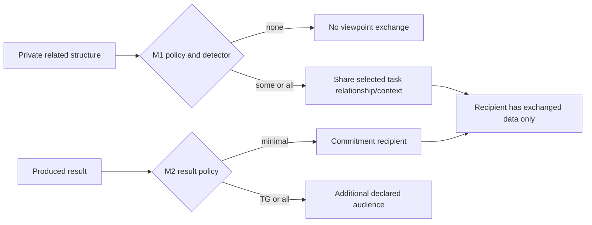

# Subjective views are not a global shared graph

## Source and model boundary

TR 94-14 §§2.1 and 3.2 models each agent with a subjective task view. A view may be incomplete or inconsistent with an objective task structure. GPGP’s M1 detects and shares selected non-local task relationships; it does not establish global knowledge, common knowledge, eventual delivery, or shared beliefs merely by sending a message.

## M1 and M2 answer different questions

| Mechanism | Policy choices | What is exchanged | What it does not establish |
| --- | --- | --- | --- |
| M1 non-local views | none, some, all | detected cross-agent task structure, relationship, and relevant context | complete objective graph or common knowledge |
| M2 results | minimal, TG, all | owed commitment result; optionally final task-group or all results | that recipients have needed structure for future scheduling |

M1’s relationship detector is domain-specific (§3.2). `Some` does not mean “some globally known graph”; it means the policy shares a detected relationship and required context. M2’s minimal commitment result goes to its recipient, while TG/all can have broader audiences (§3.3). These audience and information differences must not be collapsed.

## Constructed A/B check

A knows task `x`; B knows task `y` and `facilitates(y,x)`. With M1 `none`, A does not receive that relation. With M1 `some`, B’s detector shares the relation and relevant context. After B finishes, M2 `minimal` sends an owed result only to its commitment recipient; `TG` adds a final task-group result and `all` broadcasts all results. The example does not supply a delivery, retry, trust, or common-knowledge protocol.

## Information actions and scheduling

Relationship detection and view exchange consume work and can be prompted by locally represented events; they are not a proof that information gathering finishes before every scheduling decision. A local scheduler can still be asked to produce schedules from a partial view. Its estimates and alternatives remain local and contingent on the available `E`, `C`, and `NLC` inputs.
