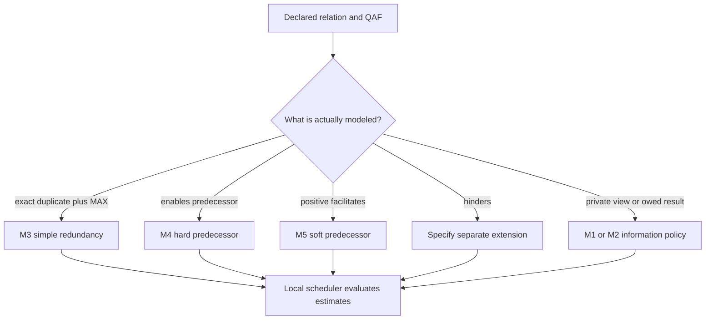

# TÆMS task structure and relationship-triggered coordination

## Representation

TÆMS represents task groups, tasks, methods, quality accumulation functions, temporal relationships, and agent views. The exact representation is what gives a coordination mechanism a condition to react to; it is not a guarantee that an agent has learned every relationship or selected an optimal schedule (TR §§2.1, 3.2–3.6).

## Quality accumulation and simple redundancy

A **MAX** quality accumulation structure is OR-like only under declared equivalence assumptions: if two methods have the same result and no other relationships intervene, one can suffice. This is the narrow setting for M3 simple redundancy (§3.4). A **MIN** parent is AND/bottleneck-like: missing a required child can leave the parent at zero even if another child has quality 0.8. A MAX result must never be applied to a MIN parent.

| Constructed parent | Method outcomes | Result | M3 conclusion |
| --- | --- | --- | --- |
| MAX with equivalent `mA,mB` | both 0.8 | `max(0.8,0.8)=0.8` | choose one using shared deterministic tie break |
| MIN with required `mA,mC` | 0.8 and absent/0 | `min(0.8,0)=0` | one method cannot satisfy the parent |

## Relationship mapping

- `enables`: M4 hard predecessor handling; it uses estimated quality/deadline commitments from predecessor toward interested successor.
- positive `facilitates`: M5 soft predecessor handling; it offers an intermediate high-negotiability commitment so the successor can plan around a possible duration/quality improvement.
- exact duplicate method under MAX: M3 simple redundancy.
- `hinders`: **not handled by the initial five mechanisms**; it needs an explicitly designed extension with its own resource/conflict semantics.
- private related structure and owed results: M1 and M2 information policies, respectively, rather than task-relationship mechanisms.

This is not “one mechanism per relationship type.” M1/M2 are information policies, M3–M5 cover selected cases, and hinders is intentionally outside the supplied implementation.

## Constructed facilitation edge

Let a successor take 10 time units with maximum quality 100 absent help. In this fixture a predecessor completing first gives duration 5 and maximum quality 150. With successor deadline 9, predecessor completion at time 3 and zero communication/setup delay let the successor finish at time 8. Completion at time 5 would instead finish at time 10; the baseline also misses this deadline if it starts at time 0, so neither route is feasible in that late fixture. Other deadline or cost choices require a new comparison. These numbers illustrate the report’s half-time/1.5×-quality style example; they are not a universal `phi` formula or threshold.

## Boundary

Do not attribute arbitrary SUM-QAF arithmetic, resource control, negative-dependency resolution, or production agent effects to this report without a separately inspected source and modeled scheduler.
