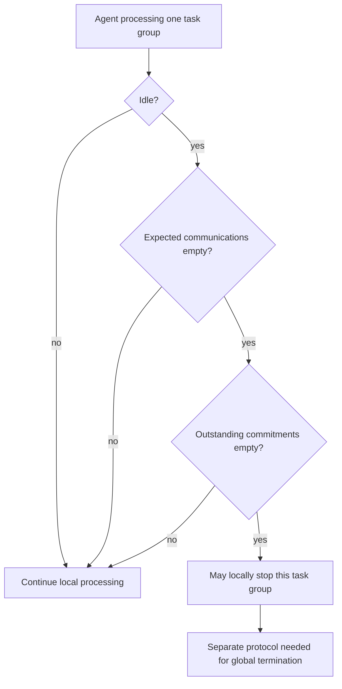

# Local task-group quiescence is not distributed termination

## Exact local criterion

TR 94-14 §3.1 states a local stopping condition for processing a task group: the agent is idle, has no expected communications, and has no outstanding commitments. This is a predicate over that agent’s represented state. It is not an algorithm proving global quiescence, all-peer termination, deadlock freedom, consensus, delivery, timeout behavior, or failure detection.

## Expected does not mean delivered

The report describes expected communications in relation to represented events and non-local commitments. A received directed commitment can create an expectation of its result (§2.2). The local predicate does not say that every expected message arrives, that message loss is impossible, or that a late message cannot occur. A deployment must add delivery, retry, clock, expiration, and failure semantics before it can reason about those cases.

An expired unsatisfied deadline commitment is not silently declared non-outstanding by this reference. The report’s local criterion does not specify that transition. A protocol must define whether it is revised, explicitly failed, retained, or escalated; the predicate consumes the resulting modeled set rather than inventing expiration semantics.

## Constructed counterexamples

- A is idle yet has an outstanding commitment to B and expects B’s result. The predicate is false.
- A is idle and its queue is empty, but its modeled expected-communication set contains `result:B`. The predicate is false.
- A is idle with an expired but unsatisfied commitment still in its outstanding set. The predicate is false. If its modeled disposition is unknown, a separate protocol must reconcile it; the local criterion alone does not authorize clearing it.
- When the agent is idle and both declared local sets are empty, A may stop processing that task group. This does not prove peers stopped or no message is in flight.

## Scheduling scope

Information gathering, schedule construction, and mechanism execution are interleaved local activities in the report. It does not prescribe a universal ordering, prove the checks lightweight, or make a queue-empty observation sufficient. Treat every event/order choice as an application protocol decision and test it against that application’s delivery and recovery model.
