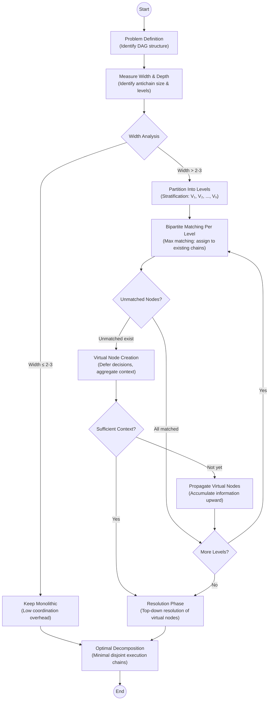

# Stratification Phase Transitions

```mermaid
flowchart TD
    Start((Start)) --> ProblemDefinition

    ProblemDefinition["Problem Definition<br/>(Identify DAG structure)"]
    ProblemDefinition --> MeasureWidthDepth

    MeasureWidthDepth["Measure Width & Depth<br/>(Identify antichain size & levels)"]
    MeasureWidthDepth --> WidthAnalysis{"Width Analysis"}

    WidthAnalysis -->|Width ≤ 2-3| KeepMonolithic
    WidthAnalysis -->|Width > 2-3| PartitionLevels

    KeepMonolithic["Keep Monolithic<br/>(Low coordination overhead)"]
    KeepMonolithic --> OptimalDecomposition

    PartitionLevels["Partition Into Levels<br/>(Stratification: V₁, V₂, ..., Vₕ)"]
    PartitionLevels --> BipartiteMatching

    BipartiteMatching["Bipartite Matching Per Level<br/>(Max matching: assign to existing chains)"]
    BipartiteMatching --> MatchingDecision{"Unmatched Nodes?"}

    MatchingDecision -->|All matched| NextLevel{"More Levels?"}
    MatchingDecision -->|Unmatched exist| VirtualNodeCreation

    VirtualNodeCreation["Virtual Node Creation<br/>(Defer decisions, aggregate context)"]
    VirtualNodeCreation --> ResolutionDecision{"Sufficient Context?"}

    ResolutionDecision -->|Not yet| PropagateUp
    ResolutionDecision -->|Yes| ResolutionPhase

    PropagateUp["Propagate Virtual Nodes<br/>(Accumulate information upward)"]
    PropagateUp --> NextLevel

    NextLevel -->|Yes| BipartiteMatching
    NextLevel -->|No| ResolutionPhase

    ResolutionPhase["Resolution Phase<br/>(Top-down resolution of virtual nodes)"]
    ResolutionPhase --> OptimalDecomposition

    OptimalDecomposition["Optimal Decomposition<br/>(Minimal disjoint execution chains)"]
    OptimalDecomposition --> End((End))
```
