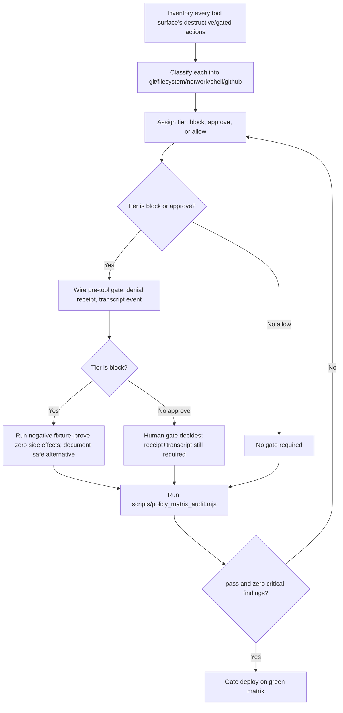

# Destructive Action Policy Matrix

Classify every destructive/gated action into block/approve/allow, then prove the governance behind that classification is real, not asserted.

## Use This For

- Building Agent Harbor's C5 governance gate: destructive git blocker, approval request/result, denial receipts, tool-result persistence, safe alternatives.
- Gating a new tool or MCP surface before it can run destructive commands (`rm -rf`, `git reset --hard`, `gh repo delete`, arbitrary shell exec, egress to a new host).
- Auditing an existing "we block destructive git" claim to check whether a negative fixture actually proved zero side effects, or whether it's just documentation.
- Deciding whether a denial is real (receipt + transcript event + safe alternative) or just a log line nobody reads.
- Catching a report that overclaims containment for a same-UID or unmanaged agent body.

## Do Not Use This For

- Proving an already-classified, already-isolated action's sandbox actually holds against an active adversary (`sandboxed-adversarial-test-harness`) — this skill audits the *policy and evidence*, not the isolation mechanism itself.
- Designing where in a DAG a human review node belongs or how the approval UX looks (`human-gate-designer`) — this skill only asks whether an `approve`-tier action has the pre-tool gate, receipt, and transcript coverage a human gate depends on.
- Designing the general work-receipt schema for an entire agent task's evidence (`agent-work-receipt-designer`) — a denial receipt here is one specialized row of that broader shape, not the schema itself.

## Classification And Audit Process

1. **Inventory every destructive/gated action** the tool surface exposes. A new MCP tool or CLI is unclassified by default — never implicitly `allow`.
2. **Classify each action's category** (`git`, `filesystem`, `network`, `shell`, `github`) using `references/destructive-action-taxonomy.md`. Category creep or "it's usually fine" reasoning is a finding waiting to happen.
3. **Assign a tier** (`block`, `approve`, `allow`) by the action's *worst-case* effect, not its typical case.
4. **For `block`/`approve` tiers, wire pre-tool enforcement, a denial receipt, and a transcript event** (see `references/denial-receipt-and-transcript-envelope.md` for the exact envelope and receipt shapes).
5. **For `block` tier specifically**, run the negative fixture (e.g. `git reset --hard` in a dirty worktree) and prove zero side effects before setting `sideEffectFreeOnBlockFixture: true`; document a concrete, runnable safe alternative.
6. **Run `scripts/policy_matrix_audit.mjs`** against the assembled matrix. It statically audits classification completeness, evidence, and any containment claim — before any live enforcement is trusted.
7. **Gate deployment on `pass: true`** with zero critical findings. A matrix with an unproven block or an evidence-free denial is a blocker, not an FYI.

## Output Contract

- **Policy matrix**: one row per destructive/gated action — category, tier, pre-tool gate, denial receipt, transcript event, safe alternative (block-tier), side-effect-free-on-block proof.
- **Containment claim** (if the report makes one): explicit `sameUidBodyMarkedContained` boolean — never `true` for an unmanaged or same-UID body.
- **Policy-matrix audit**: `{ pass, score, findings, recommendations }` from `scripts/policy_matrix_audit.mjs`, matching `schemas/policy-matrix.schema.json` for the input shape.

Use `scripts/policy_matrix_audit.mjs` to compute the score and flag unclassified actions, unproven blocks, evidence-free denials, and overclaimed containment deterministically.

## Anti-Patterns

### The Blocker That Still Ran

**Novice**: "We block `git reset --hard`" — meaning the intent is documented, or a warning is logged, but the command still executes.
**Expert**: A block-tier action is only a blocker if a negative fixture has proven the command produces zero side effects when denied. Intent, a log line, or a code comment is not proof; a passing fixture is.
**Detection**: `policy_matrix_audit.mjs` fires `blocked-action-has-side-effects` (critical) when a `block`-tier action's `sideEffectFreeOnBlockFixture` is false or absent.

### The Silent Denial

**Novice**: A destructive action gets denied, and that's the end of it — no record, no way for the agent (or a reviewer) to know what to do instead.
**Expert**: Every denial on a `block`/`approve` action must produce a durable receipt, a visible transcript event, and — for `block` tier — a concrete safe alternative. A denial with none of these teaches nothing and leaves no evidence a governance gate exists at all.
**Detection**: `policy_matrix_audit.mjs` fires `denial-without-receipt` (critical) when a gated action has no denial receipt, `denial-without-transcript-event` (critical) when it emits no transcript event, and `gated-action-no-safe-alternative` (critical) when a `block`-tier action has no `safeAlternative`.

### Overclaiming Containment

**Novice**: A report marks an unmanaged, same-UID debug shell or fallback code path as "contained" because it happens to be sitting behind the same policy matrix as everything else.
**Expert**: Containment is a property of an enforced isolation boundary (separate OS user, sandbox, container) — not of having a policy on file. A same-UID or unmanaged body can be *governed* by this matrix, but it can never be truthfully marked *contained*.
**Detection**: `policy_matrix_audit.mjs` fires `same-uid-marked-contained` (critical) whenever `containmentClaim.sameUidBodyMarkedContained` is `true`.

## References

| File | Load When |
| --- | --- |
| `references/destructive-action-taxonomy.md` | Need the five action categories, the three tiers, the tier decision test, and common misclassification traps. |
| `references/denial-receipt-and-transcript-envelope.md` | Need the pre-tool/post-tool event envelope, the human gate payload shape, or the denial receipt shape. |
| `examples/expected-output.md` | Need a weak policy matrix audited (`pass:false`), then the same matrix fixed and passing. |
| `examples/sample-input.json` | Need a complete, passing policy-matrix spec to copy as a starting point. |
| `templates/output-template.md` | Need a reusable policy-matrix template with a pre-gate checklist. |
| `schemas/policy-matrix.schema.json` | Need to validate a policy-matrix JSON payload's structure before auditing it. |
| `scripts/policy_matrix_audit.mjs` | Need deterministic scoring of a policy matrix's classification completeness and evidence. |
| `agents/openai.yaml` | Need a subagent descriptor for delegated policy-matrix design/audit. |

<!-- BEGIN BUNDLE INDEX (auto: index_references.py) -->

## Skill Bundle Index

*Every file in this skill, and when to open it. Auto-generated; run `scripts/index_references.py --fix`.*

**root**
- [`CHANGELOG.md`](CHANGELOG.md) — Destructive Action Policy Matrix — Changelog — - Initial skill creation - Core classification and evidence-audit process defined (Agent Harbor binder C5) - Reference files and determinist
- [`README.md`](README.md) — Destructive Action Policy Matrix — Classify every destructive/gated action an agent body can attempt into block/approve/allow tiers, then audit whether the pre-tool and post-t

**`agents/`**
- [`agents/openai.yaml`](agents/openai.yaml) — openai (data/schema)

**`examples/`**
- [`examples/expected-output.md`](examples/expected-output.md) — Example Output: Destructive Action Policy Matrix — Scenario: a first pass at Agent Harbor's C5 governance gate.
- [`examples/sample-input.json`](examples/sample-input.json) — sample input (data/schema)

**`references/`**
- [`references/denial-receipt-and-transcript-envelope.md`](references/denial-receipt-and-transcript-envelope.md) — Denial Receipt And Pre-Tool/Post-Tool Event Envelope — Use this when defining what actually gets emitted when a gated action is blocked or held — the shapes the C5 governance work order calls out
- [`references/destructive-action-taxonomy.md`](references/destructive-action-taxonomy.md) — Destructive Action Taxonomy — Use this when classifying a new action into a category and tier, or when deciding whether an existing classification is still correct after 

**`schemas/`**
- [`schemas/policy-matrix.schema.json`](schemas/policy-matrix.schema.json) — policy matrix.schema (data/schema)

**`scripts/`**
- [`scripts/policy_matrix_audit.mjs`](scripts/policy_matrix_audit.mjs)

**`templates/`**
- [`templates/output-template.md`](templates/output-template.md) — Destructive Action Policy Matrix Template — Fill in one row per destructive/gated action before running the audit.

<!-- END BUNDLE INDEX -->
