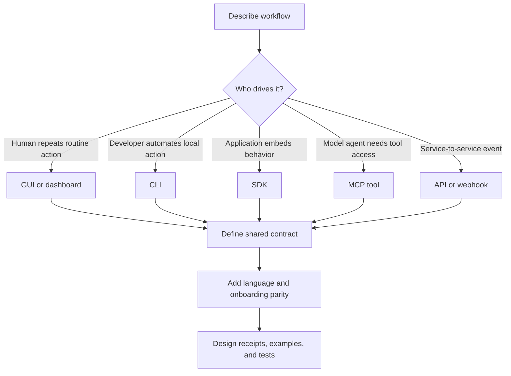

# Developer Surface Strategist

Decide which developer surface should exist, why it exists, and what minimum contract makes it useful instead of just
another way to call the same endpoint.

## Use This For

- Choosing between SDK, CLI, MCP, GUI, REST/API, webhooks, and background agents.
- Explaining why someone would use an SDK instead of a CLI, MCP tool, or GUI.
- Planning Python SDK parity for a product that already has CLI or TypeScript affordances.
- Designing `pd tube`-style listener/sender workflows and code-generation briefs across languages.
- Making agent invocation easy enough that a user can create listeners and senders without memorizing infrastructure.

## Do Not Use This For

- Implementing a full SDK or server runtime.
- Writing exhaustive API docs after the surface has already been chosen.
- Visual design, layout, or component polish.

## Decision Process

1. Name the workflow and its actor: end user, developer, model agent, background worker, or external service.
2. Choose the primary surface by intent:
   - GUI for routine human operations and status.
   - CLI for local automation, scripts, and agent/operator emergency paths.
   - SDK for embedding Port Daddy behavior in an app, service, or library.
   - MCP for model clients that need safe tool calls.
   - API/webhooks for service integration and external systems.
3. Define the shared contract once: message schema, auth, idempotency, receipts, errors, and telemetry.
4. Add parity expectations by language. If Python developers are a target audience, require a Python SDK plan.
5. For `pd tube` workflows, specify listener, sender, channel naming, message schema, auth, retry, receipt, and codegen targets.
6. Use `scripts/surface_matrix.mjs` to generate a deterministic surface recommendation and gap list.

## Output Contract

Return:

- `surfaceMatrix`: workflows with primary and secondary surfaces.
- `rationale`: why each surface exists and what it must not do.
- `tubeWorkflow`: listener/sender contract, schema, receipt, and codegen targets.
- `sdkParity`: language list, Python SDK requirement, examples, tests, and release criteria.
- `onboarding`: how a new user discovers the right surface without reading the source.

## Anti-Patterns

### Everything Is A CLI

**Novice**: "Power users can run commands."
**Expert**: Routine operator tasks need GUI affordances. CLI is for agents, scripts, and emergencies.
**Timeline**: By 2026, agentic products must distinguish human control surfaces from automation surfaces.
**Detection**: Signup, credentials, restart, status, or feedback require terminal commands.

### SDK As Fancy API Wrapper

**Novice**: "An SDK is just generated REST calls."
**Expert**: An SDK should encode workflows: auth setup, typed messages, retries, idempotency, receipts, local fixtures, and examples.
**Timeline**: Agentic SDKs need safety defaults and workflow helpers, not only endpoint coverage.
**Detection**: SDK plan has method names but no examples, no retry/receipt semantics, and no local test fixture.

### MCP For Everything

**Novice**: "If a model might use it, make it MCP-only."
**Expert**: MCP is excellent for model tool access, but applications still need SDK/API surfaces and humans still need GUI/CLI.
**Timeline**: Modern agent systems work best when MCP is one adapter over a shared contract, not the source of truth.
**Detection**: No non-MCP path for services, scripts, or humans.

## References

| File | Load When |
| --- | --- |
| `references/surface-decision-guide.md` | Need SDK vs CLI vs MCP vs GUI decision rules. |
| `references/tube-workflow-patterns.md` | Need listener/sender workflow and multi-language codegen requirements. |
| `examples/expected-output.md` | Need the shape of a finished surface matrix. |
| `templates/output-template.md` | Need a reusable surface strategy template. |
| `schemas/surface-strategy.schema.json` | Need the JSON input contract for the surface matrix. |
| `scripts/surface_matrix.mjs` | Need deterministic surface recommendations and gap checks. |
| `agents/openai.yaml` | Need a subagent descriptor for delegated developer-surface strategy. |

<!-- BEGIN BUNDLE INDEX (manual) -->

## Skill Bundle Index

**root**
- [`CHANGELOG.md`](CHANGELOG.md) - Changelog for this skill.
- [`README.md`](README.md) - Quick start and purpose.

**`agents/`**
- [`agents/openai.yaml`](agents/openai.yaml) - OpenAI/Codex-style agent descriptor for surface strategy.

**`examples/`**
- [`examples/expected-output.md`](examples/expected-output.md) - Example surface matrix and tube workflow brief.

**`references/`**
- [`references/surface-decision-guide.md`](references/surface-decision-guide.md) - Decision rules for SDK, CLI, MCP, GUI, API, and webhooks.
- [`references/tube-workflow-patterns.md`](references/tube-workflow-patterns.md) - Listener/sender workflow patterns and codegen requirements.

**`schemas/`**
- [`schemas/surface-strategy.schema.json`](schemas/surface-strategy.schema.json) - JSON contract for `surface_matrix.mjs`.

**`scripts/`**
- [`scripts/surface_matrix.mjs`](scripts/surface_matrix.mjs) - Builds surface recommendations and gap lists.

**`templates/`**
- [`templates/output-template.md`](templates/output-template.md) - Copyable surface strategy template.

<!-- END BUNDLE INDEX -->
