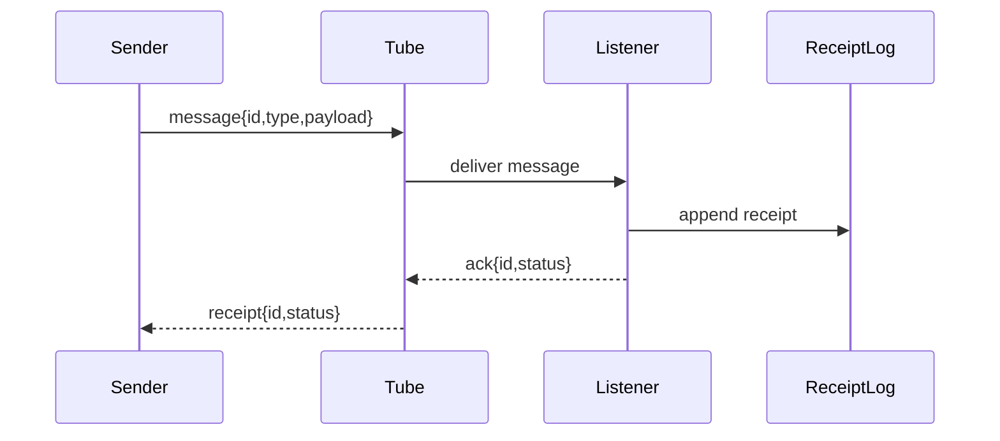

# Tube Workflow Patterns

Use this when making a `pd tube`-style workflow easy to implement in any language.

## Minimum Contract

A listener/sender workflow needs:

1. Channel naming convention.
2. Message schema with version, id, type, payload, sender, and timestamp.
3. Auth or local trust model.
4. Idempotency key or message id.
5. Sender example.
6. Listener example.
7. Receipt or ack path.
8. Retry/backoff and duplicate handling.
9. Error envelope.
10. Tests or a fake bus.

## Codegen Brief Shape

For each target language, generate:

- install/setup command
- sender function
- listener loop or callback
- message type
- error type
- receipt parser
- local fake for tests

## Workflow Example

## Port Daddy Product Rule

If the user says "pd tube lets you do anything to trigger an agent," the product answer is not "read the CLI help."
The product should offer a wizard or generator that asks for channel, schema, trigger, language, auth, and receipt
requirements, then emits sender/listener code and a local fake.
