# Drydock Diagram and Proof Atlas

This atlas contains every decision-relevant view needed by the current Drydock
program. It intentionally does not force every Mermaid grammar into the bundle:
a decorative pie chart or timeline would add ink without proving a relationship.

For each diagram, record the exact component versions and evidence witnesses when
using it in a real packet. These are architecture models, not runtime receipts.

## Coverage map

| View | Use when | Primary question |
|---|---|---|
| 1. Program context | Explaining the whole product | Who acts, controls, executes, and observes? |
| 2. Trust boundary | Reviewing containment | What remains outside the adversary? |
| 3. Authority split | Detecting circular trust | Who may request, authorize, execute, witness, and project? |
| 4. Source provenance | Protecting main and inputs | How does exact source become guest input and reviewed output? |
| 5. Durable data model | Designing storage | Which identities and records have one-to-many relationships? |
| 6. Lifecycle state machine | Implementing controller transitions | What are all legal body states and terminal failures? |
| 7. Cold birth | Testing start races | What happens before a body may act? |
| 8. Resurrection | Switching bodies/backends | How is old authority fenced and new authority proved? |
| 9. Crash-storm breaker | Preventing spawn loops | Where are retries globally bounded and persisted? |
| 10. Effect reservation | Bounding external effects | How do reserve, dispatch, uncertainty, and settlement differ? |
| 11. Capacity route | Using subscriptions honestly | What happens when native allowance evidence is stale or low? |
| 12. Context lifecycle | Compacting before walls | When do we checkpoint, hibernate, or rebody? |
| 13. Capability compilation | Moving between backends | Which tools and permissions transfer, narrow, or block? |
| 14. Receipt chain | Auditing claims | How do witness-class records become tamper-evident evidence? |
| 15. Operator journey | Designing pd-console/FleetBar/iOS | Can a human start, inspect, intervene, and resume? |
| 16. Implementation DAG | Sequencing work | What must land before dynamic authority? |
| 17. Promotion ladder | Reviewing release claims | Which evidence grants the next exact tier? |

## 1. Program context

**Proves visually:** product roles and direction of proposed control/evidence flow.

**Does not prove:** authentication, containment, persistence, or implementation.

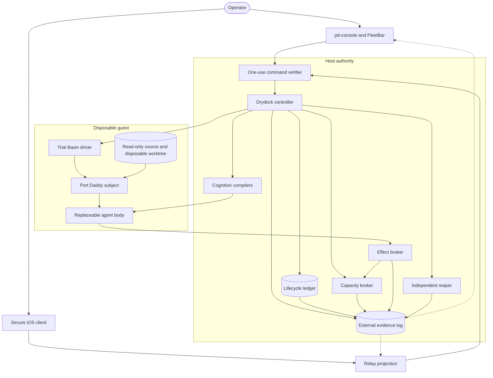

## 2. Trust boundary and channel absence

**Proves visually:** keys, policy, ledger, kill, and verdict remain outside the
guest; guest channels are enumerated.

**Does not prove:** the hypervisor or device configuration actually matches.

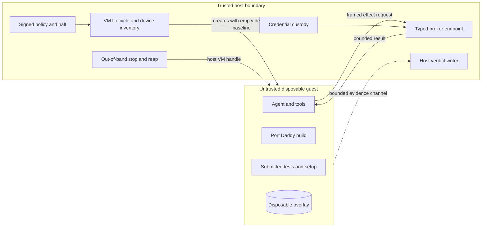

Required absence claims: no shared home, canonical checkout, host `.git`, raw
credential, ambient Unix socket, general network device, production remote, or
unbounded output channel.

## 3. Consequence-separated authority

**Proves visually:** no one role owns the whole consequential transition.

**Does not prove:** the implementation has prevented confused-deputy paths.

```mermaid
flowchart LR
    Requester["Operator or scheduler proposes"]
    Verifier["Verifier authenticates and scopes"]
    Admission["Admission writer reserves"]
    Launcher["Controller provisions"]
    Executor["Body executes"]
    Broker["Broker mediates effects"]
    Witness["Independent host witnesses"]
    Judge["Gate evaluates evidence"]
    Projection["Console projects result"]

    Requester --> Verifier
    Verifier --> Admission
    Admission --> Launcher
    Launcher --> Executor
    Executor --> Broker
    Launcher --> Witness
    Broker --> Witness
    Witness --> Judge
    Judge --> Projection
    Projection -.-> Requester
```

## 4. Immutable source and worktree provenance

**Proves visually:** main is not an authoring or guest input path; output returns
through quarantine and a separate review worktree.

**Does not prove:** remote authenticity or tree equality without digest receipts.

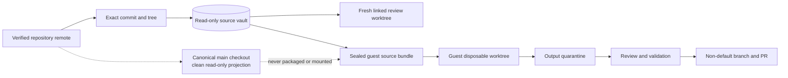

## 5. Durable identity and receipt data model

**Proves visually:** one durable actor may have many runs and body generations,
while capabilities and effects attach to a specific admitted generation.

**Does not prove:** transactional constraints; encode those in schema and tests.

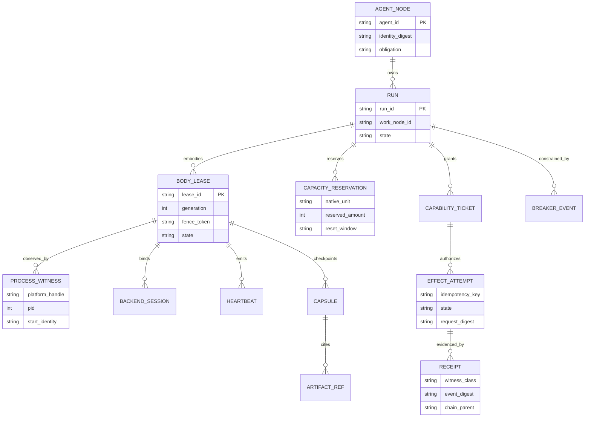

## 6. Body lifecycle state machine

**Proves visually:** legal state transitions include birth failure, unknown start,
quarantine, hibernation, and reconciliation rather than optimistic RUNNING.

**Does not prove:** liveness or atomic storage.

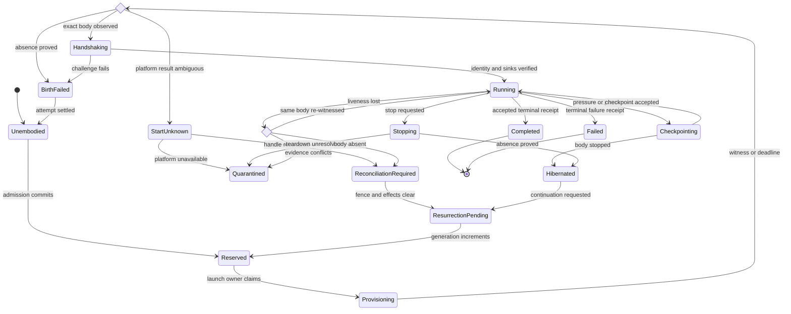

## 7. Cold birth sequence

**Proves visually:** reservation and durable intent precede VM/process creation;
RUNNING follows an external challenge.

**Does not prove:** API idempotency or crash consistency without negative tests.

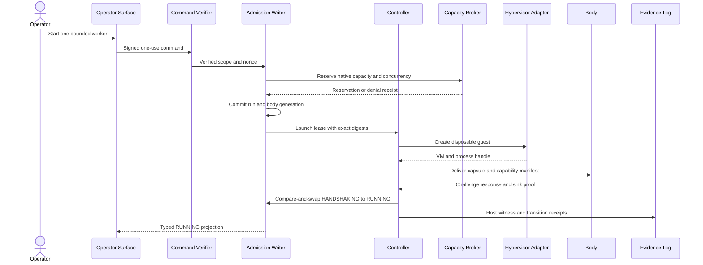

## 8. Resurrection and backend switch

**Proves visually:** predecessor fencing, effect reconciliation, capsule proof,
fresh capacity, and capability translation all precede successor authority.

**Does not prove:** semantic equivalence across models; that needs fixtures and
adversarial evaluation.

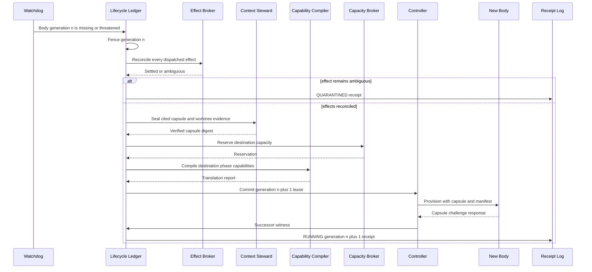

## 9. Crash-storm and spawn breaker

**Proves visually:** retry decisions are durable, scoped, and outside the failed
body; delay does not replace a hard cap.

**Does not prove:** chosen thresholds are appropriate without workload evidence.

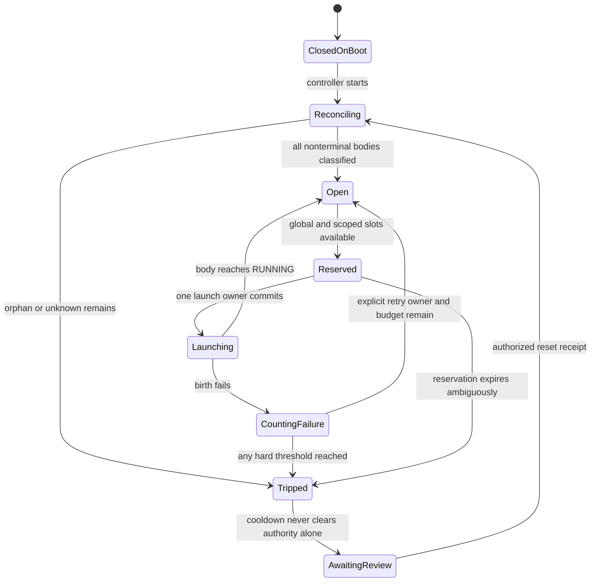

Scopes include global, operator, repository, project, provider, AgentNode,
work-node digest, parent ancestry, and time window. Persist all counters and
generation attempts.

## 10. Effect and spend reservation

**Proves visually:** reservation, dispatch, uncertainty, and settlement have
different refund rules.

**Does not prove:** provider-enforced financial custody.

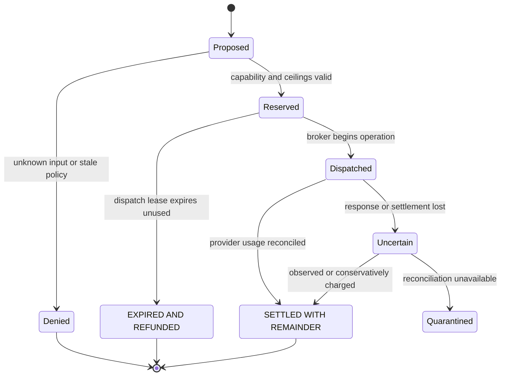

## 11. Capacity-aware route selection

**Proves visually:** subscription-backed work needs fresh native-unit evidence and
checkpoint reserve; cash and subscriptions take different paths.

**Does not prove:** remaining allowance when the provider exposes no measurement.

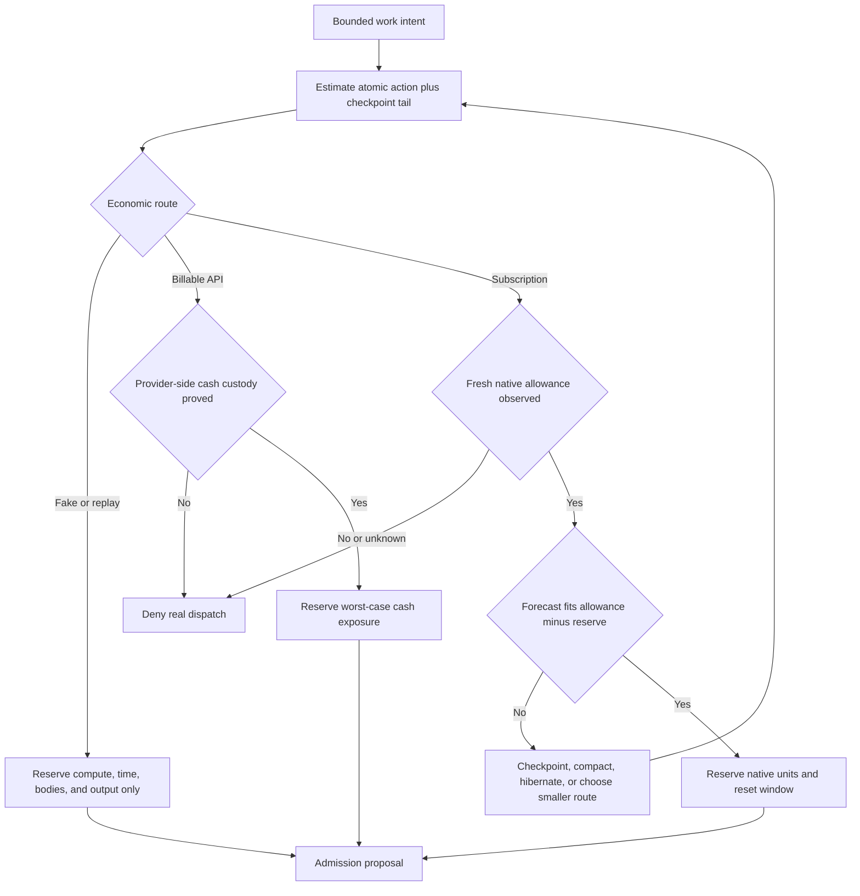

## 12. Context pressure and capsule lifecycle

**Proves visually:** compaction and rebodiment happen at safe boundaries and are
gated by capsule verification.

**Does not prove:** summary fidelity without citation and challenge fixtures.

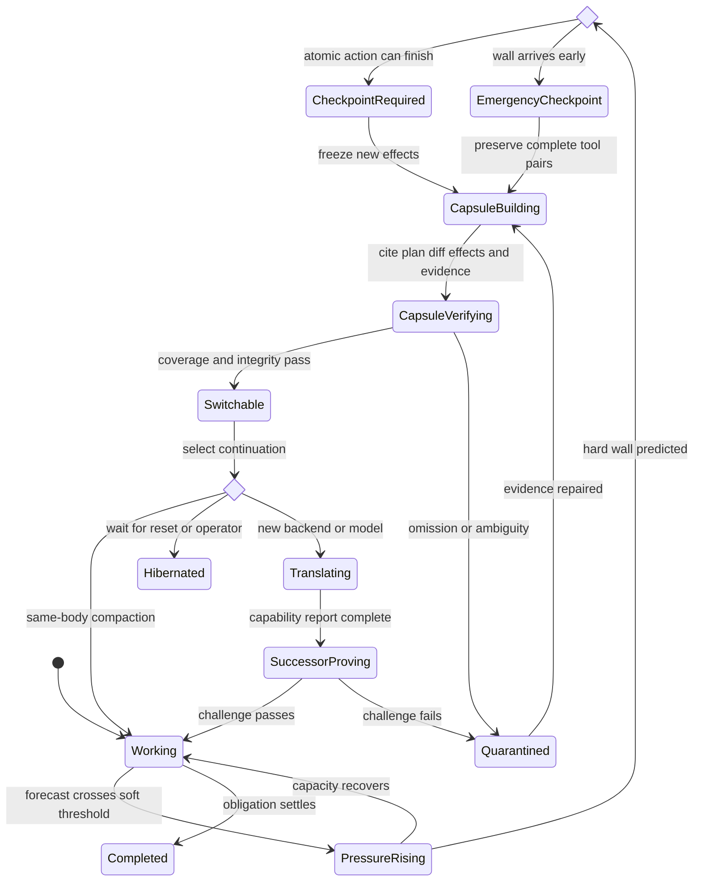

## 13. Capability compilation

**Proves visually:** capability translation begins from required semantics and
can narrow or block; it does not copy ambient tool catalogs.

**Does not prove:** equivalent tools behave equivalently without conformance
fixtures.

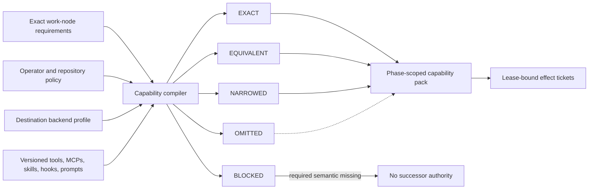

## 14. External receipt and Merkle evidence chain

**Proves visually:** observations are append-only, content-addressed, and anchored
outside guest-writable state.

**Does not prove:** a witness told the truth; witness class and collection
position remain part of every claim.

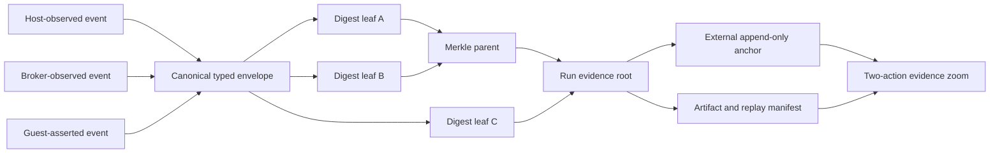

## 15. Operator journey

**Proves visually:** the intended control path keeps denial, intervention,
inspection, and continuation visible to a non-terminal operator.

**Does not prove:** usability until the actual product UI is rendered and tested.

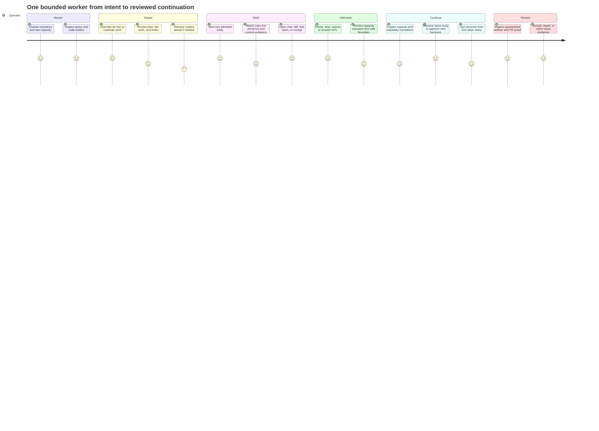

## 16. Implementation dependency DAG

**Proves visually:** dynamic execution and provider canaries are downstream of
contracts, durable accounting, capacity, breakers, and fake deterministic proof.

**Does not prove:** the machine-readable hypertree is valid; run its validator.

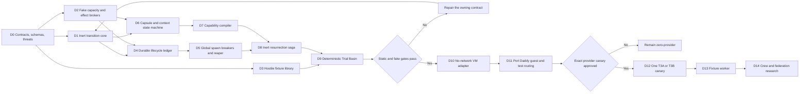

## 17. Exact-tier promotion ladder

**Proves visually:** authority increases only after evidence and a new operator
grant; no test tier silently promotes itself.

**Does not prove:** any rung has passed for a particular build.

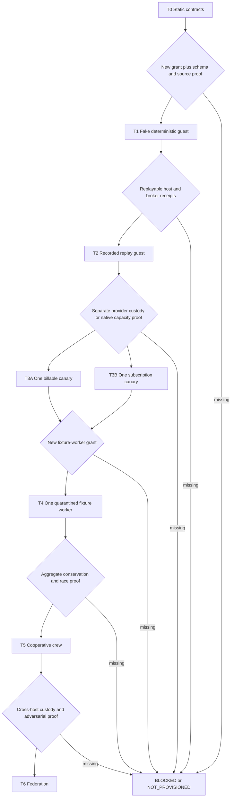

## Selecting and maintaining diagrams

Use the smallest set that covers the claim, but never omit a boundary-changing
view. If a code change adds a state, process, authority, record, channel, or
promotion edge, update the matching diagram and its negative test in the same
slice. If prose and diagram disagree, neither is accepted until reconciled.

For a full integrated architecture packet, include at least views 2, 4, 5, 6,
8, 9, 10, 12, 13, 14, 16, and 17. Product UI work also requires view 15 plus
actual operator-facing captures; the journey chart alone is not pixel evidence.
