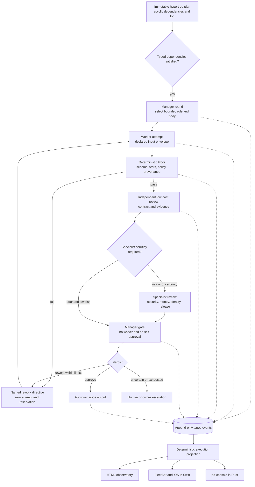
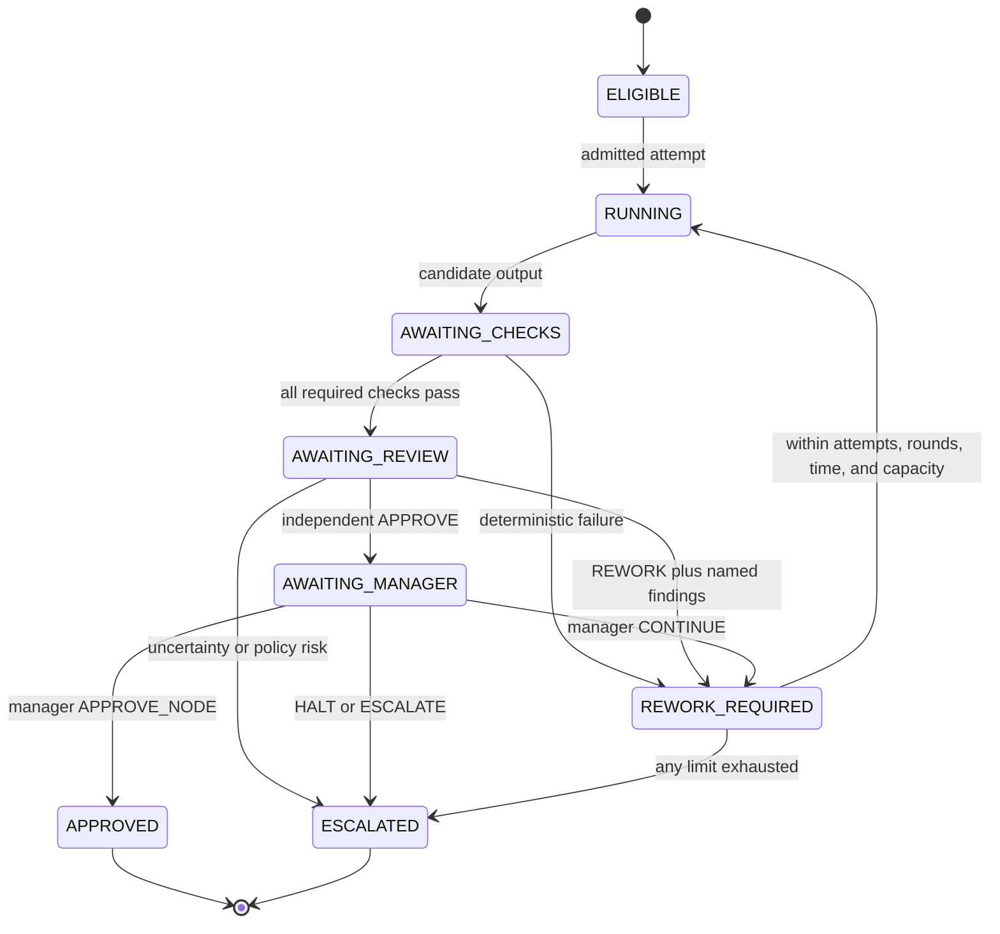
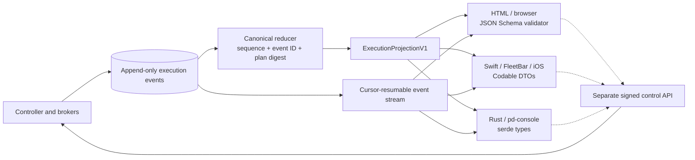
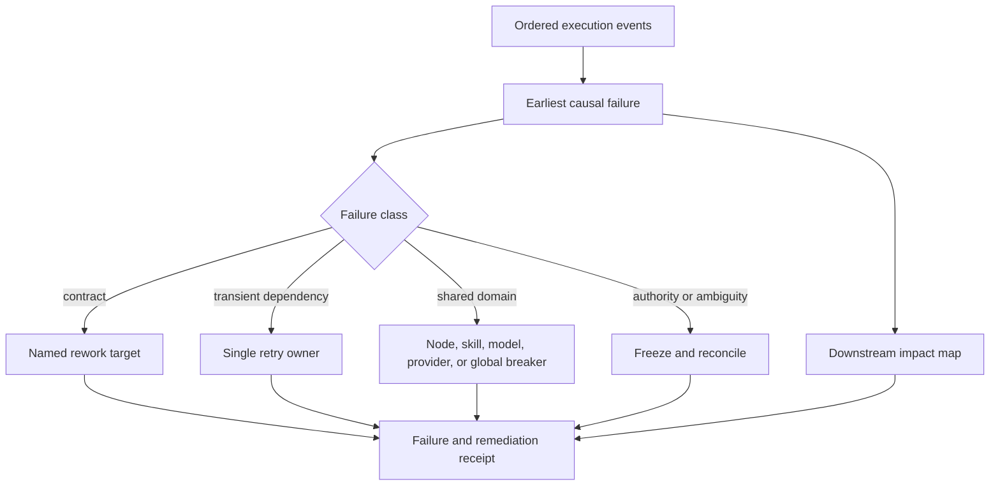

# Hypertree Execution, Review, and Observatory Contract

## Truth state

**TARGET, with a T0 fixture foundation in this skill.** The repository now has a
closed execution schema, a semantic trace validator, and a bounded review-loop
fixture. It does not yet have a live Drydock controller, execution endpoint,
native observer, or approved subject run. The local Port Daddy halt remains the
upper bound on proof.

The static hypertree answers **what could be built and in what dependency
order**. This contract answers four different questions:

1. What exact input may a node consume?
2. What exact output did one attempt produce?
3. Which checks, independent reviews, and manager decisions permit progress?
4. How do HTML, Swift, and Rust show the same execution truth?

## DAG and hypertree are related, not interchangeable

A **DAG** is the executable dependency projection: nodes plus directed edges,
with no directed cycle. It answers whether a node is eligible and gives a
machine-checkable partial order.

A **hypertree** is the operator's richer planning object. It contains the DAG,
but also nested problem regions, typed hyperedges joining several inputs or
outputs, manager rounds, alternative decompositions, review/rework loops, and
fog nodes whose future shape is intentionally vague. A hypertree may project
one executable DAG for the current round without pretending the entire future
has already been decomposed.

| Term | Carries | Must not imply |
|---|---|---|
| Proposal | operator intent, end-state class, constraints, open questions | executable authority |
| Hypertree | current decomposition plus groups, joins, alternatives, rounds, and fog | that fog can launch |
| Round DAG | the acyclic executable slice selected from the hypertree | that later rounds are fixed |
| Workflow | review, rework, escalation, and consent routes around node outputs | cyclic work eligibility |
| Event projection | what happened across all shapes | authority to change any shape |

“DAG/hypertree decomposition” therefore means: grow a hypertree from the
proposal, then compile the currently knowable and admitted portion into a DAG.
Do not call the two structures synonyms, and do not force dissent, rework, or
future uncertainty into fake dependency edges.

## What the JSON Schema adds

The plan's [JSON Schema](../schemas/drydock-resurrection-hypertree.schema.json)
is a closed structural contract. It rejects unknown fields and malformed roles,
nodes, hyperedges, source identities, and digest shapes. The semantic validator
then proves properties JSON Schema cannot conveniently express: unique IDs,
acyclic dependencies, topological critical-path order, launcher ancestry, and
the canonical plan digest.

That is necessary, but it is not execution governance. A structurally valid
plan does not prove that:

- a worker received only declared inputs;
- an output satisfies the producing node's contract;
- a reviewer is independent of the producer;
- the manager did not waive a failed check;
- a rework loop is bounded;
- a retry was safe rather than an amplified side effect;
- a screen is current or derived from the same event history as another screen.

The companion [execution schema](../schemas/hypertree-execution.schema.json),
[review-loop fixture](../examples/hypertree-execution.review-loop.json), and
[semantic validator](../scripts/validate-hypertree-execution.mjs) add those
joins. JSON Schema proves record shape. The semantic validator proves ordering,
identity separation, contract coverage, review precedence, loop bounds, and
deterministic projection. Runtime witnesses will still be required at later
Drydock tiers.

## One program, five coordination shapes

A large project should not be forced into one fashionable topology. Drydock
uses a composite whose routing authority is explicit at every layer.

| Concern | Topology | Decider | Stop rule |
|---|---|---|---|
| Work eligibility | Acyclic hypertree / DAG | Satisfied typed dependencies | No eligible nodes remain |
| Produce-review-rework | Bounded workflow | Check/review verdict | Approve, escalate, or exhaust limit |
| Dynamic staffing | Manager-driven rounds | Manager decision over typed evidence | Ship, halt, or round limit |
| Shared live truth | Append-only event log / blackboard projection | Deterministic reducer | Terminal event plus settled effects |
| Screen refresh | Recurring observer | Cursor/freshness state | Disconnect, terminal run, or operator stop |

The wire vocabulary is deliberately literal: quality routing is
`bounded-workflow`, reviewer selection is `lowest-capable-reviewed-tier`, and
observation is `append-only-event-projection`. Producer/reviewer/manager
identities are separate fields and must resolve to three distinct actors at a
terminal approval gate.



**Runtime honesty:** the repository's existing legacy DAG compatibility path can
execute DAG and workflow shapes, while several richer labels are projected
through DAG execution. This Drydock composition is therefore a target contract,
not proof that manager rounds or the shared blackboard execute natively today.

## Proposal-to-proof round protocol

Each manager round follows the same typed sequence. A stage advances only on
artifacts, never on a conversational impression of agreement.

```mermaid
flowchart LR
    Intent["Work intent\nend state + constraints"]
    Tree["Hypertree decomposition\ngroups + joins + fog"]
    DAG["Current round DAG\neligible nodes only"]
    Context["Context partitions\nsealed per node"]
    Agents["Node agents\nbounded role + lifetime"]
    Drafts["Proposal drafts\nartifacts + evidence"]
    Dissent["Steel-man dissent\nstrongest blocking case"]
    Consent["Scoped consent\nagreement + reservations"]
    Manager["Manager synthesis\nno self-approval"]
    Contract["Typed round artifacts\nplan delta + decisions"]
    Validate["Deterministic + independent validators"]
    Mutate["Constructed lies\nattack each important invariant"]
    Porthole["Porthole receipts\nreplay + rejection coverage"]

    Intent --> Tree --> DAG --> Context --> Agents --> Drafts
    Drafts --> Dissent
    Drafts --> Consent
    Dissent --> Manager
    Consent --> Manager
    Manager --> Contract --> Validate --> Mutate --> Porthole
    Porthole -. "survivor or gap" .-> Tree
```



Required per-round artifacts are:

- `DecompositionDelta`: new, changed, retired, and fog nodes with rationale;
- `ContextPartitionManifest`: declared inputs, omissions, trust labels, and
  capability digest for every node;
- `DraftSet`: content-addressed candidate outputs and producer identities;
- `DissentPacket`: the strongest good-faith objection, its evidence, and what
  observation would resolve it;
- `ConsentPacket`: scoped agreements, reservations, expiries, and explicit
  non-agreements; silence is never consent;
- `ManagerSynthesis`: accepted/rejected arguments, plan delta, assignments,
  unresolved risks, and next gate;
- `RoundContract`: exact node input/output contracts and acceptance gates;
- `ValidationSet`: deterministic checks and independent review verdicts;
- `MutationEvidenceSet`: killed, survived, inconclusive, and not-run lies;
- `RoundReceipt`: event-head binding and Porthole replay entry points.

Context partitions should be sufficient for the node contract and deliberately
insufficient for unrelated authority. Cross-node discovery becomes an explicit
manager, Parley, or artifact edge rather than shared ambient context.

## Node input and output contracts

Every admitted node attempt is bound to all of the following before a body can
start:

| Binding | Why it exists |
|---|---|
| Plan ID and canonical `planDigest` | A similarly named or later plan cannot inherit authority |
| Node contract ID | Inputs and outputs are interpreted under one versioned contract |
| Declared artifact IDs and kinds | Ambient transcript or filesystem discovery is not input |
| Capability-set digest | The worker cannot acquire tools merely because a UI knows they exist |
| Capacity reservation IDs | Work and review consume finite native allowance even at zero marginal cash price |
| Attempt and manager round | Rework cannot masquerade as the original attempt |
| Producer identity and body witness | Output is attributable without equating actor, body, and process |

An output is a candidate, never self-certified success. Each artifact carries a
kind, media type, content digest, and evidence URI. Missing required kinds cause
rework. Undeclared output is quarantined rather than silently added to the plan.

The schema is deliberately language-neutral. It is the shared wire contract;
HTML/TypeScript, Swift `Codable`, and Rust `serde` bindings are generated or
handwritten against golden fixtures and parity-tested. None may invent fields
or state mappings privately.

## Review is a ladder, not a swarm of expensive judges

Yes: every consequential worker output should face a cheaper independent layer
before expensive or human scrutiny. “Cheaper” means the lowest **capable and
measured** review route under a fresh native-unit reservation, not a hard-coded
provider name and never “free.”

### Layer 0: deterministic Floor

Run without an LLM whenever possible:

- JSON Schema and semantic contract validation;
- compiler, type, lint, unit, property, and fixture checks;
- changed-surface and scope verification;
- source/worktree/plan/capability digests;
- budget, permission-subset, and evidence-link checks.

Floor failure stops neural review. Paying a model to notice a malformed object
is both wasteful and weaker than executable validation.

### Layer 1: independent bounded reviewer

Every candidate gets an independent reviewer with a narrow checklist derived
from its node contract and diff. The reviewer:

- sees the candidate, contract, checks, and primary evidence;
- does not inherit mutation, launch, merge, or manager authority;
- cannot be the producer;
- returns exactly `APPROVE`, `REWORK`, or `ESCALATE`;
- names every finding, severity, evidence URI, rework target, and required proof;
- spends only a separately reserved review allowance.

This is the normal “cheap eyes before dear eyes” layer. It catches missing
artifacts, contract drift, untested branches, scope creep, and unsupported
claims before they reach the manager.

### Layer 2: conditional specialist scrutiny

Do not run an expensive reviewer on every trivial node. Escalate when:

```text
failureProbability × downstreamWaste > reviewCost
```

or when the node touches identity, authority, money, security, lifecycle,
release, or destructive effects. The formula is a routing heuristic, not an
excuse to skip mandatory risk review. Unknown cost, risk, or reviewer capability
escalates rather than rounding down.

### Layer 3: manager gate

The manager sees a compact typed packet: node contract, attempts, changed
artifacts, check results, reviewer findings, unresolved effects, capacity, and
downstream impact. It may assign work, activate or retire roles, ask for rework,
halt, or approve. It may not:

- produce and approve the same output;
- act as both independent reviewer and manager;
- waive mandatory checks or blocking findings;
- widen capability or budget;
- turn uncertain evidence into PASS;
- silently mutate the plan.

A manager round emits a durable decision event with evidence IDs and any new
assignments. Role changes are stabilized by the round boundary rather than
thrashing on every event.

### Layer 4: human gate

Human review is reserved for permission expansion, budget expansion, disputed
or low-confidence verdicts, irreversible effects, constitutional/product
choices, and exhausted rework. Batch related questions; do not pepper the
operator with a gate for every node.

## The lie-per-invariant standard

Every important invariant must have at least one deliberately constructed lie
that proves the owning validator rejects that exact lie. This applies to Port
Daddy, its skills, and the systems it builds for other people.

The minimum mutation loop is:

1. name one falsifiable invariant and the validator that owns it;
2. preserve an unchanged baseline that the validator accepts;
3. construct the smallest plausible lie that violates only that invariant;
4. run the same validator against baseline and mutant;
5. record `killed`, `survived`, `inconclusive`, or `not-run`;
6. publish a `PortholeMutationReceipt` with exact digests and replay location;
7. regenerate `PortholeRejectionCoverage` for the subsystem;
8. route a survivor or uncovered important claim back to a named owner.

Examples include a receipt without a permit, an expired capability, actor or
attempt substitution, a signature over the wrong payload, a PASS contradicted
by evidence, a substituted Merkle leaf, widened handoff authority, self-review,
and removal of a required field. Schema-invalid junk is useful but insufficient:
the strongest mutants are plausible records that violate semantic joins.

“Demonstrated” is intentionally existential and digest-bound: at least one
receipt proves rejection of one exact lie in the claim class. It is not a
universal theorem. Unknown and uncovered claims remain visible; a coverage
percentage may summarize, but may never replace the named list.

Skills use the same standard. Important activation boundaries, forbidden
actions, input/output contracts, evidence requirements, and halt behavior each
need negative fixtures. A skill that describes a prohibition but has never
rejected a fixture violating it reports that claim as `not-demonstrated`.

## Bounded rework and retry

Rework and retry are different mechanisms.

- **Rework** means the output is understandable but subpar. It creates a new
  attempt with named findings and required evidence.
- **Retry** means the same operation plausibly failed for a classified transient
  reason. Exactly one layer owns it.
- **Resurrection** means a new body continues the same durable obligation after
  fencing and reconciliation. It is neither retry nor rework.
- **Mutation** means the plan or role topology changes and requires a logged
  before/after event and revalidation.



The initial contract caps node attempts at three, rework rounds at two, manager
rounds at three, topology mutations at three, recursive births at zero, and
retry authority at one external-controller layer. Those are conservative launch
defaults, not universal constants. Any change is a policy revision with new
fixtures.

Never blindly rerun:

| Failure class | Action |
|---|---|
| Invalid schema or missing artifact | Rework with exact validation errors |
| Subpar reasoning or incomplete proof | Rework, possibly change skill/reviewer after one failed correction |
| Transient read-only dependency failure | One owner may retry within deadline, breaker, and reservation |
| Permission or capability mismatch | Halt and recompile or escalate; no retry |
| Ambiguous non-idempotent effect | Freeze and reconcile; never replay |
| Repeated finding or no evidence delta | Escalate or replace approach; do not loop |
| Budget/capacity uncertainty | Stop at safe boundary, compact/hibernate, or ask operator |
| Shared provider/skill/model failure | Open the matching breaker without blocking unrelated routes |

## One event history, three operator clients

The observer architecture follows the existing Port Daddy rule that product
surfaces are projections, not second authorities.



The read path is snapshot plus resumable stream:

1. fetch a schema-valid snapshot with `asOfSequence` and `asOfEventId`;
2. subscribe after that cursor;
3. reject gaps, duplicates with different bytes, plan-digest drift, and invalid
   transitions;
4. refetch after a gap or reducer-version change;
5. render `STALE`, `OFFLINE`, or `UNKNOWN` when freshness cannot be proved.

Under delivery slices H1-H4, the HTML client will use a cursor-resumable SSE
JSON feed. Swift will consume the same feed locally or through authenticated
Relay and decode it into `Codable` DTOs. The planned Rust crate will own the
high-assurance reducer and expose `serde` types to pd-console; a later WASM
export may share that reducer with HTML, but no UI waits on WASM to preserve
schema parity. Golden fixtures must decode and reduce to byte-equivalent
normalized projections in all three clients.

### Product views

All three clients expose the same four modes, adapted to their form factor:

| Mode | Operator question | Default presentation |
|---|---|---|
| Plan | What exists, what is fog, and what can run next? | Nested hypertree with eligible frontier |
| Execution | What is happening now and what is waiting? | Active wave, body, attempts, checks, reviews, spend |
| Evidence | Why is this node green, red, stale, or blocked? | Receipt chain and two-action links |
| Team | Who was assigned, reviewed, replaced, or escalated? | Manager rounds and role/body lineage |
| Rejection coverage | Which lies can this subsystem demonstrably reject? | Named invariant rows, killed/survived receipts, and replay |

For 1–50 visible nodes, render full nodes. From 51–150, compact labels and keep
details in the inspector. Above 150, collapse completed subtrees/waves and keep
the active frontier expanded. Above 500, show a meta-view first. These are
starting performance budgets; implementation must measure them on each client.

The status language is shape plus text plus color. The graph never relies on a
permanent animation to prove life. Meaningful new activity gets one short edge
or card cue, then a calm persistent state; reduced-motion users get a static
contrast change and announcement. This intentionally narrows the older DAG-runtime
“traveling dot” suggestion to the shared AgentPresence rule.

Every node summary must zoom in no more than two actions to:

- exact node contract and declared inputs;
- worker identity, body generation, session, and worktree witness;
- current diff or artifact digest;
- command/test output;
- independent review and findings;
- manager decision;
- capacity reservation and settlement;
- blocker, retry, breaker, or resurrection receipt.

### Cooperative coding shell

The primary product is a Codex/Claude Code-like coding environment with two
equal entry points over the same contracts:

- a scriptable CLI for intents, plan inspection, node/round status, evidence,
  and separately authorized controls;
- a polished GPUI desktop IDE where repositories, branches, worktrees, agent
  chat, diffs, terminals, artifacts, and the execution hypertree are first-class.

The default center is manager chat beside a gigantic zoomable hypertree. Near
nodes are concrete and receipt-backed; farther nodes lose detail into visibly
vague fog. Selecting any node opens its worktree, conversation, artifacts,
checks, dissent, mutation evidence, and downstream impact without changing
execution. The operator speaks in work intents and declares the intended end
state—`durable`, `ephemeral`, or `prototype`—before staffing is proposed.

Project Epistemology runs forward-looking analysis as evidence, not prophecy:
likely conflicts, missing claims, brittle assumptions, knowledge gaps, and
future gates appear as uncertain risk overlays with sources and confidence.
They may propose new fog nodes or reviews; they may not launch or block work
without the owning policy/manager transition.

Artifacts are visual citizens. A selected node may show the evolving UI,
diagram, document, plot, diff, test failure, or recorded interaction in the
main canvas, with chat and evidence adjacent. Operators should see the thing
being built, not only agent status cards.

### Orthogonal fleet-service agents

Long-lived service roles sit beside the work hypertree rather than masquerading
as project nodes. They observe and propose; managers decide when their proposal
changes a round.

| Service | Watches for | Emits | Never owns |
|---|---|---|---|
| Skill fitter | missing or weak node capability | graft/skill proposal with conformance evidence | launch or capability grant |
| Parley scout | collision, overlap, and opportunity | scoped consultation proposal | consent or settlement |
| Epistemology sentinel | assumptions, gaps, and likely downstream failure | cited risk/fog proposal | truth or veto by itself |
| Tool/MCP maintainer | adapter drift, broken schemas, stale integrations | repair proposal and compatibility evidence | ambient tool installation |
| HITL concierge | decisions that truly need a person | batched question with deadline and impact | inferred approval |
| Validator/judge | contract violations and evidence gaps | typed verdict and findings | production plus self-review |
| Rework shepherd | repeated findings and stalled correction | bounded rework or escalation proposal | infinite retry |

Their live service/evaluation visualizations form an orthogonal rail: queue,
freshness, confidence, capacity, current observation, recent proposal, validator
quality, surviving mutants, and breaker state. Service health is not project
progress, and a green service card never turns a work node green.

## Failure projection

The failure analyzer consumes temporal events rather than scraping colored
cards. It identifies the earliest causal failure, distinguishes dependents that
were merely blocked, and preserves at least error, timing, and context evidence
before claiming a root cause.



An unavailable body, stalled wave, missing event cursor, and failed work product
are distinct states. The observer must not collapse all four into “agent failed.”

## Required test matrix

### Schema and reducer

- unknown fields and enum values fail;
- each scoped node has exactly one contract;
- contract input/output kinds match the exact plan node;
- all three client bindings use the same projection schema;
- event sequence and predecessor chain are contiguous;
- replay from any valid cursor converges on the same projection;
- duplicate event ID with different bytes fails closed;
- changed plan digest invalidates the run;
- schema evolution adds an explicit version and migration fixture; a reader
  never reinterprets authority from an older version.

### Review and manager

- review before deterministic checks is rejected;
- producer self-review is rejected;
- reviewer-manager identity collision is rejected;
- APPROVE with a failed/unknown check is rejected;
- APPROVE with a missing required artifact is rejected;
- REWORK without named findings/target/evidence is rejected;
- attempts, rounds, mutations, wall time, and native units stop the loop;
- the same unresolved finding beyond policy escalates;
- manager bypass lists are structurally empty;
- high-risk nodes cannot use low-cost review as final specialist approval.

### Mutation and rejection coverage

- every important invariant has at least one registered constructed lie;
- `killed` requires accepted baseline plus rejected mutant under one validator digest;
- a mutant accepted by the validator is `survived`, never PASS or expected failure;
- demonstrated coverage requires a replayable mutation receipt;
- not-demonstrated coverage has no borrowed receipt and names owner plus gap;
- changing source, validator, contract, or test-bundle digest invalidates inherited coverage;
- Porthole replay converges on the same baseline, mutant, verdict, and event head;
- skill activation, halt, output, and prohibited-action fixtures use the same receipt contract.

### Runtime and clients

- crash between output and review resumes without duplicate work authority;
- stream gap forces snapshot repair rather than fabricated continuity;
- stale/offline/unknown are independently renderable;
- HTML, Swift, and Rust golden fixtures reduce to the same normalized bytes;
- 100-, 300-, and 500-node views remain navigable under measured budgets;
- keyboard, screen reader, text scaling, 44px touch targets, and reduced motion;
- control requests are signed and receipted through the separate command path;
- no read client can write lifecycle state directly.

## Delivery slices

| Slice | Output | Gate | State |
|---|---|---|---|
| H0 | Closed execution schema, validator, bounded review fixture | Static contract tests | **THIS PR / T0** |
| H0M | Porthole mutation receipt and rejection-coverage contracts; design projections | Schema fixtures and negative contract tests | **THIS PR / T0** |
| H1 | Rust event/reducer crate plus golden projection fixtures | Property tests, replay, mutation tests | TARGET |
| H2 | HTML observatory consuming snapshot + fake deterministic stream | Browser E2E, accessibility, 500-node budget | TARGET |
| H3 | pd-console Rust graph/timeline/evidence/team views | Rust fixture parity, GPUI visual proof | TARGET |
| H4 | Swift FleetBar/iOS observer and authenticated Relay resume | Swift fixture parity, reconnect/offline tests | TARGET |
| H5 | Deterministic manager/review workflow in Trial Basin | Fault, cost, loop, and identity-separation tests | TARGET |
| H6 | One no-network Drydock run after a separate operator grant | Host-witnessed T1 evidence | DEFERRED BY HALT |

Rust is the right first implementation for the reducer and authority-adjacent
state machine under [ADR-0120](../../../docs/adr/0120-rust-kernel-boundary.md).
HTML and Swift remain product projections. The separate action-command path must
compose with [ADR-0140](../../../docs/adr/0140-provable-action-adjudication-contract.md):
observation never becomes retrospective permission.

## Sources and inherited constraints

- [JSON Schema Draft 2020-12](https://json-schema.org/draft/2020-12)
- [WHATWG server-sent events and `Last-Event-ID`](https://html.spec.whatwg.org/dev/server-sent-events.html)
- [Apple encoding, decoding, and serialization](https://developer.apple.com/documentation/swift/encoding-decoding-and-serialization)
- [Serde JSON representation](https://serde.rs/json.html)
- [Workflow Patterns](https://doi.org/10.1023/A:1022883727209)
- [ADR-0092 suggestibility ladder](../../../docs/adr/0092-suggestibility-ladder-and-cloud-coordination-federation.md)
- [ADR-0107 conversation protocol](../../../docs/adr/0107-conversation-protocol.md)
- [ADR-0109 Steward review boundary](../../../docs/adr/0109-the-steward-single-approver.md)
- [ADR-0120 Rust kernel boundary](../../../docs/adr/0120-rust-kernel-boundary.md)
- [ADR-0140 provable action adjudication](../../../docs/adr/0140-provable-action-adjudication-contract.md)

The imported DAG-planning principles applied here are BC-PLAN-003 (failure-domain isolation),
BC-EXEC-002/006 (logged mutation and infrastructure-enforced protocol),
BC-FAIL-004 (independent breakers), BC-EVAL-001/002 (ordered evaluation and no
self-scoring), BC-UX-003/006 (typed live events and bounded human gates), and
BC-BIZ-003 (orchestration overhead must stay subordinate to useful work). Where
older DAG-runtime or visualization guidance conflicts with Drydock's
halt, hypervisor, capacity, or calm-presence constraints, Drydock narrows it and
records the divergence rather than pretending parity.
