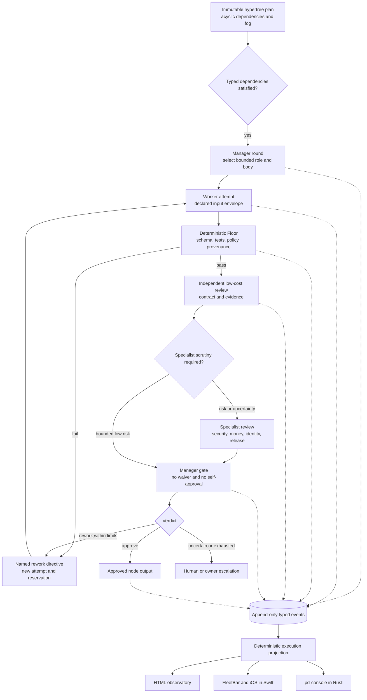
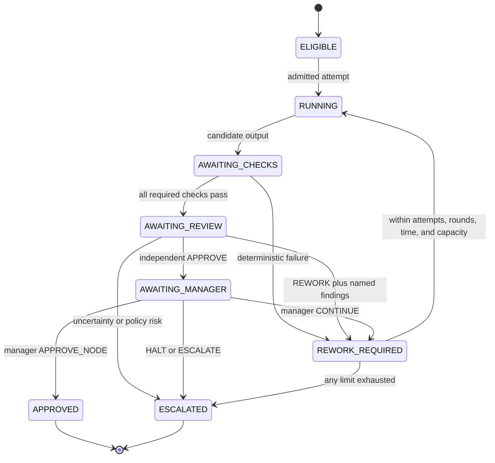
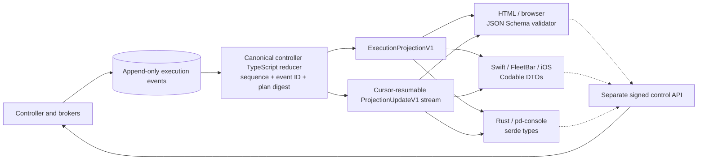
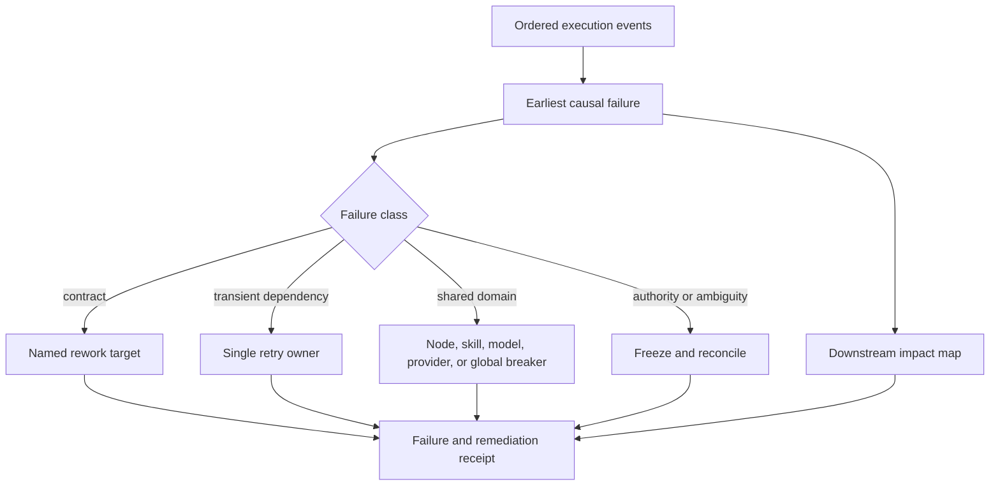

# Hypertree Execution, Review, and Observatory Contract

## Truth state

**SOURCE-PRESENT at T0.** H0 supplies a closed execution schema, semantic trace
validator, and bounded review-loop fixture. H1 now supplies a pure
controller-local TypeScript reducer, a closed projection-update envelope, a
projection-only cursor consumer, and sealed golden-prefix tests. The repository
still has no live Drydock controller, execution endpoint, native observer, or
approved subject run. The local Port Daddy halt remains the upper bound on
dynamic proof, not on ordinary source implementation.

The static hypertree answers **what could be built and in what dependency
order**. This contract answers four different questions:

1. What exact input may a node consume?
2. What exact output did one attempt produce?
3. Which checks, independent reviews, and manager decisions permit progress?
4. How do HTML, Swift, and Rust show the same execution truth?

## What the JSON Schema adds

The plan's [JSON Schema](../schemas/drydock-resurrection-hypertree.schema.json)
is a closed structural contract. It rejects unknown fields and malformed roles,
nodes, hyperedges, source identities, and digest shapes. The semantic validator
then proves properties JSON Schema cannot conveniently express: unique IDs,
acyclic dependencies, topological critical-path order, launcher ancestry, and
the canonical plan digest.

That is necessary, but it is not execution governance. A structurally valid
plan does not prove that:

- a worker received only declared inputs;
- an output satisfies the producing node's contract;
- a reviewer is independent of the producer;
- the manager did not waive a failed check;
- a rework loop is bounded;
- a retry was safe rather than an amplified side effect;
- a screen is current or derived from the same event history as another screen.

The companion [execution schema](../schemas/hypertree-execution.schema.json),
[projection-update schema](../schemas/hypertree-execution-projection-update.schema.json),
[review-loop fixture](../examples/hypertree-execution.review-loop.json), and
[semantic validator](../scripts/validate-hypertree-execution.mjs) add those
joins. JSON Schema proves record shape. The fixture validator is an independent
T0 oracle for ordering, identity separation, contract coverage, review
precedence, loop bounds, and expected projection. Runtime event admission is
owned by the pure
[TypeScript reducer](../../../lib/drydock/hypertree-execution-reducer.ts), not by
that command-line fixture validator. Runtime witnesses will still be required
at later Drydock tiers.

## One program, five coordination shapes

A large project should not be forced into one fashionable topology. Drydock
uses a composite whose routing authority is explicit at every layer.

| Concern | Topology | Decider | Stop rule |
|---|---|---|---|
| Work eligibility | Acyclic hypertree / DAG | Satisfied typed dependencies | No eligible nodes remain |
| Produce-review-rework | Bounded workflow | Check/review verdict | Approve, escalate, or exhaust limit |
| Dynamic staffing | Manager-driven rounds | Manager decision over typed evidence | Ship, halt, or round limit |
| Shared live truth | Append-only event log / blackboard projection | Deterministic reducer | Terminal event plus settled effects |
| Screen refresh | Recurring observer | Cursor/freshness state | Disconnect, terminal run, or operator stop |

The wire vocabulary is deliberately literal: quality routing is
`bounded-workflow`, reviewer selection is `lowest-capable-reviewed-tier`, and
observation is `append-only-event-projection`. Producer/reviewer/manager
identities are separate fields and must resolve to three distinct actors at a
terminal approval gate.

The execution dependency list is the sealed, execution-local frontier: it must
cover every scoped node exactly once, may reference only scoped nodes, and must
be acyclic. `RUN_OPENED` makes only roots eligible. A dependent remains blocked
until every declared predecessor has a controller-admitted `NODE_APPROVED`
event; a plausible output, green check, or manager opinion is not enough.



**Runtime honesty:** the repository's existing legacy DAG compatibility path can
execute DAG and workflow shapes, while several richer labels are projected
through DAG execution. This Drydock composition is therefore a target contract,
not proof that manager rounds or the shared blackboard execute natively today.

H1 also fixes the witness class for each event instead of accepting a caller's
self-description:

| Event | Required witness |
|---|---|
| `RUN_OPENED`, `NODE_STARTED`, `CHECKS_COMPLETED`, `REWORK_REQUESTED`, `NODE_APPROVED`, `RUN_COMPLETED` | `HOST_OBSERVED` |
| `OUTPUT_PRODUCED` | `GUEST_ASSERTED` |
| `REVIEW_COMPLETED`, `MANAGER_DECIDED` | `MODEL_CHECKED` |

These labels describe who observed a claim; they do not by themselves prove a
signature, process identity, or external effect. Later controller slices must
bind the admitted event to those independent receipts.

## Node input and output contracts

Every admitted node attempt is bound to all of the following before a body can
start:

| Binding | Why it exists |
|---|---|
| Plan ID and canonical `planDigest` | A similarly named or later plan cannot inherit authority |
| Node contract ID | Inputs and outputs are interpreted under one versioned contract |
| Declared artifact IDs and kinds | Ambient transcript or filesystem discovery is not input |
| Capability-set digest | The worker cannot acquire tools merely because a UI knows they exist |
| Provider/account-bound capacity reservation receipts | Work, review, and manager judgment consume finite native allowance even at zero marginal cash price |
| Attempt and assignment receipt | Rework cannot masquerade as the original attempt or silently jump a staffing round |
| Producer identity and body witness | Output is attributable without equating actor, body, and process |

Capacity reservation IDs and idempotency keys are one-shot across the complete
execution, not merely within one node. Every receipt is bound to a sealed
provider, account, native unit, purpose, node, attempt, TTL, and evidence URI.
One provider/account/unit authority may appear under only one budget ID in a
sealed execution; aliases cannot multiply the same underlying allowance.
The reducer admits the receipt in the same atomic transition as work, review, or
manager judgment; a rejected event consumes neither cursor nor allowance. Gross
reserved units never fall, so release/refund loops cannot manufacture new
capacity. Settlements distinguish `CONSUMED`, `RELEASED`, and `UNKNOWN`; unknown
outcomes charge the full reservation, while unresolved reservations stay visible
as held crash residue and prevent terminal completion.
Producer, reviewer, and manager role families remain disjoint across every
attempt of a node, so a later retry cannot launder a prior authority collision.

At T0, receipt digests, evidence URIs, and witness classes prove deterministic
binding inside the fixture; they do **not** prove that a broker really issued a
reservation or that an external witness is authentic. The future controller
ingress must verify the signed host/broker envelope before constructing an
admissible event. Callers may never self-assert a witness class. Until that
ingress and broker reconciliation exist, this reducer proves protocol limits,
not provider custody or a financial loss ceiling.

An output is a candidate, never self-certified success. Each artifact carries a
kind, media type, byte length, content digest, and evidence URI. Missing required kinds cause
the candidate event to fail before checks or model review. Undeclared output is
quarantined rather than silently added to the plan. Review is reserved for
substantive quality that deterministic shape and floor checks cannot decide.

The schema is deliberately language-neutral. It is the shared wire contract;
HTML/TypeScript, Swift `Codable`, and Rust `serde` bindings are generated or
handwritten against golden fixtures and parity-tested. None may invent fields
or state mappings privately.

## Review is a ladder, not a swarm of expensive judges

Yes: every consequential worker output should face a cheaper independent layer
before expensive or human scrutiny. “Cheaper” means the lowest **capable and
measured** review route under a fresh native-unit reservation, not a hard-coded
provider name and never “free.”

### Layer 0: deterministic Floor

Run without an LLM whenever possible:

- JSON Schema and semantic contract validation;
- compiler, type, lint, unit, property, and fixture checks;
- changed-surface and scope verification;
- source/worktree/plan/capability digests;
- budget, permission-subset, and evidence-link checks.

Floor failure stops neural review. Paying a model to notice a malformed object
is both wasteful and weaker than executable validation.

### Layer 1: independent bounded reviewer

Every candidate gets an independent reviewer with a narrow checklist derived
from its node contract and diff. The reviewer:

- sees the candidate, contract, checks, and primary evidence;
- does not inherit mutation, launch, merge, or manager authority;
- cannot be the producer;
- returns exactly `APPROVE`, `REWORK`, or `ESCALATE`;
- names every finding, severity, evidence URI, rework target, and required proof;
- spends only a separately reserved review allowance.

This is the normal “cheap eyes before dear eyes” layer. It catches missing
artifacts, contract drift, untested branches, scope creep, and unsupported
claims before they reach the manager.

### Layer 2: conditional specialist scrutiny

Do not run an expensive reviewer on every trivial node. Escalate when:

```text
failureProbability × downstreamWaste > reviewCost
```

or when the node touches identity, authority, money, security, lifecycle,
release, or destructive effects. The formula is a routing heuristic, not an
excuse to skip mandatory risk review. Unknown cost, risk, or reviewer capability
escalates rather than rounding down.

### Layer 3: manager gate

The manager sees a compact typed packet: node contract, attempts, changed
artifacts, check results, reviewer findings, unresolved effects, capacity, and
downstream impact. It may assign work, activate or retire roles, ask for rework,
halt, or approve. It may not:

- produce and approve the same output;
- act as both independent reviewer and manager;
- waive mandatory checks or blocking findings;
- widen capability or budget;
- turn uncertain evidence into PASS;
- silently mutate the plan.

A staffing round begins with a durable assignment receipt naming the manager,
worker role, exact round, and evidence. Rounds advance exactly once. A manager
decision then binds the candidate, checks, all reviews, its own capacity
reservation/settlement, and any new assignments. Exactly one decision is admitted
per node attempt, so later events cannot overwrite a prior approval or halt.
The decision identity must be the manager named by that attempt's assignment
receipt; changing managers requires a newly sealed assignment/reassignment
contract rather than substituting another otherwise-valid identity at the gate.
Role changes are stabilized by the round boundary rather than thrashing on every
event.

The decision vocabulary is intentionally closed. `APPROVE_NODE` still requires
a separate host-witnessed `NODE_APPROVED` event bound to the exact output,
checks, reviews, and manager event. `CONTINUE` carries an exact finding and
required-artifact directive for the next attempt. `ADD_ROLE` may name only a
scoped node and immediately halts the sealed run so a controller can review and
reseal a new topology. `ESCALATE` and `HALT` are terminal for event admission.

### Layer 4: human gate

Human review is reserved for permission expansion, budget expansion, disputed
or low-confidence verdicts, irreversible effects, constitutional/product
choices, and exhausted rework. Batch related questions; do not pepper the
operator with a gate for every node.

## Bounded rework and retry

Rework and retry are different mechanisms.

- **Rework** means the output is understandable but subpar. It creates a new
  attempt with named findings and required evidence.
- **Retry** means the same operation plausibly failed for a classified transient
  reason. Exactly one layer owns it.
- **Resurrection** means a new body continues the same durable obligation after
  fencing and reconciliation. It is neither retry nor rework.
- **Mutation** means the plan or role topology changes and requires a logged
  before/after event and revalidation.

The next `NODE_STARTED` must reproduce the pending rework directive byte for
byte, bind every prior-attempt artifact ID, advance the assignment round, and use
fresh work-capacity receipts. Its candidate must include every artifact kind
named by that directive. Finding repetition, attempts, rounds, wall time,
global events, starts, reservations, provider-native gross reserves, artifact
count, output bytes, definition bytes, event-envelope bytes, projection bytes,
and capacity-budget cardinality are all finite and fail closed.



The initial contract caps node attempts at three, rework rounds at two, manager
rounds at three, topology mutations at three, recursive births at zero, and
retry authority at one external-controller layer. Those are conservative launch
defaults, not universal constants. Any change is a policy revision with new
fixtures.

Never blindly rerun:

| Failure class | Action |
|---|---|
| Invalid schema or missing artifact | Reject before model spend; correct the candidate under the same bounded attempt |
| Subpar reasoning or incomplete proof | Rework, possibly change skill/reviewer after one failed correction |
| Transient read-only dependency failure | One owner may retry within deadline, breaker, and reservation |
| Permission or capability mismatch | Halt and recompile or escalate; no retry |
| Ambiguous non-idempotent effect | Freeze and reconcile; never replay |
| Repeated finding or no evidence delta | Escalate or replace approach; do not loop |
| Budget/capacity uncertainty | Stop at safe boundary, compact/hibernate, or ask operator |
| Shared provider/skill/model failure | Open the matching breaker without blocking unrelated routes |

## One event history, three operator clients

The observer architecture follows the existing Port Daddy rule that product
surfaces are projections, not second authorities.



The read path is a controller snapshot plus a resumable stream of full,
digest-bound projection updates:

1. fetch a schema-valid snapshot with `asOfSequence` and `asOfEventId`;
2. subscribe to `ProjectionUpdateV1` after that cursor;
3. reject gaps, duplicates with different bytes, projection-digest mismatch,
   execution/plan drift, and reducer-version drift;
4. refetch after a gap or reducer-version change;
5. render `STALE`, `OFFLINE`, or `UNKNOWN` when freshness cannot be proved.

After snapshot hydration, a same-cursor update is not accepted as an idempotent
duplicate because the client never observed that update envelope's canonical
bytes. It refetches instead. Only a byte-identical replay of an envelope the
client itself already admitted is an authenticated duplicate.

Clients do not receive raw lifecycle events and do not decide whether a worker,
review, manager, or rework transition was legal. The controller reducer makes
that decision once. A client validates cursor and projection integrity, then
shows the last verified snapshot or an honest uncertainty state.

H1 implements the canonical reducer in the controller's TypeScript product
plane and the projection consumer in
[`lib/drydock`](../../../lib/drydock/). H2 will expose its update envelope over
a cursor-resumable SSE JSON feed. Swift will consume the same feed locally or
through authenticated Relay and decode it into `Codable` DTOs. Rust will expose
`serde` DTOs to pd-console. HTML, Swift, and Rust are deliberately thin
projection decoders; none carries a second state machine or waits on WASM.
Golden fixtures must decode to byte-equivalent normalized projections in all
three clients.

### Product views

All three clients expose the same four modes, adapted to their form factor:

| Mode | Operator question | Default presentation |
|---|---|---|
| Plan | What exists, what is fog, and what can run next? | Nested hypertree with eligible frontier |
| Execution | What is happening now and what is waiting? | Active wave, body, attempts, checks, reviews, spend |
| Evidence | Why is this node green, red, stale, or blocked? | Receipt chain and two-action links |
| Team | Who was assigned, reviewed, replaced, or escalated? | Manager rounds and role/body lineage |

For 1–50 visible nodes, render full nodes. From 51–150, compact labels and keep
details in the inspector. Above 150, collapse completed subtrees/waves and keep
the active frontier expanded. Above 500, show a meta-view first. These are
starting performance budgets; implementation must measure them on each client.

The status language is shape plus text plus color. The graph never relies on a
permanent animation to prove life. Meaningful new activity gets one short edge
or card cue, then a calm persistent state; reduced-motion users get a static
contrast change and announcement. This intentionally narrows the older DAG-runtime
“traveling dot” suggestion to the shared AgentPresence rule.

Every node summary must zoom in no more than two actions to:

- exact node contract and declared inputs;
- worker identity, body generation, session, and worktree witness;
- current diff or artifact digest;
- command/test output;
- independent review and findings;
- manager decision;
- capacity reservation and settlement;
- blocker, retry, breaker, or resurrection receipt.

## Failure projection

The failure analyzer consumes temporal events rather than scraping colored
cards. It identifies the earliest causal failure, distinguishes dependents that
were merely blocked, and preserves at least error, timing, and context evidence
before claiming a root cause.



An unavailable body, stalled wave, missing event cursor, and failed work product
are distinct states. The observer must not collapse all four into “agent failed.”

## Required test matrix

### Schema and reducer

- unknown fields and enum values fail;
- each scoped node has exactly one contract;
- dependency entries cover the scope exactly, stay internal, and are acyclic;
- a dependent cannot become eligible before every predecessor is approved;
- contract input/output kinds match the exact plan node;
- all three client bindings use the same projection schema;
- every event type carries its exact controller-defined witness class;
- event sequence and predecessor chain are contiguous;
- replay from any valid cursor converges on the same projection;
- duplicate event ID with different bytes fails closed;
- changed plan digest invalidates the run;
- schema evolution adds an explicit version and migration fixture; a reader
  never reinterprets authority from an older version.

### Review and manager

- review before deterministic checks is rejected;
- producer self-review is rejected;
- reviewer-manager identity collision is rejected;
- APPROVE with a failed/unknown check is rejected;
- a candidate missing a required artifact is rejected before checks or review;
- REWORK without named findings/target/evidence is rejected;
- attempts, rounds, mutations, wall time, and native units stop the loop;
- the same unresolved finding beyond policy escalates;
- manager bypass lists are structurally empty;
- manager evidence binds the exact output, check, review, and decision events;
- `CONTINUE` binds the next attempt and `ADD_ROLE` halts for topology resealing;
- high-risk nodes cannot use low-cost review as final specialist approval.

### Runtime and clients

- crash between output and review resumes without duplicate work authority;
- stream gap forces snapshot repair rather than fabricated continuity;
- stale/offline/unknown are independently renderable;
- HTML, Swift, and Rust golden fixtures decode to the same normalized bytes;
- 100-, 300-, and 500-node views remain navigable under measured budgets;
- keyboard, screen reader, text scaling, 44px touch targets, and reduced motion;
- control requests are signed and receipted through the separate command path;
- no read client can write lifecycle state directly.

## Delivery slices

| Slice | Output | Gate | State |
|---|---|---|---|
| H0 | Closed execution schema, validator, bounded review fixture | Static contract tests | SOURCE-PRESENT / T0 |
| H1 | Canonical TypeScript incremental reducer, projection-update contract, cursor consumer, and golden corpus | Transition, replay, atomic rejection, authority, budget, cursor, and tamper tests | **SOURCE-PRESENT / T0** |
| H2 | HTML observatory consuming snapshot + fake deterministic stream | Browser E2E, accessibility, 500-node budget | TARGET |
| H3 | pd-console Rust graph/timeline/evidence/team views | Rust fixture parity, GPUI visual proof | TARGET |
| H4 | Swift FleetBar/iOS observer and authenticated Relay resume | Swift fixture parity, reconnect/offline tests | TARGET |
| H5 | Deterministic manager/review workflow in Trial Basin | Fault, cost, loop, and identity-separation tests | TARGET |
| H6 | One no-network Drydock run after a separate operator grant | Host-witnessed T1 evidence | DEFERRED BY HALT |

ADR-0120 keeps this fast-changing execution-product policy in TypeScript. Rust
remains appropriate for stable security primitives, the host controller TCB,
and pd-console's GPUI rendering, but language choice cannot create containment
and a second Rust reducer would create semantic drift. HTML, Swift, and Rust
remain product projections. The separate action-command path must compose with
[ADR-0140](../../../docs/adr/0140-provable-action-adjudication-contract.md):
observation never becomes retrospective permission.

## Sources and inherited constraints

- [JSON Schema Draft 2020-12](https://json-schema.org/draft/2020-12)
- [WHATWG server-sent events and `Last-Event-ID`](https://html.spec.whatwg.org/dev/server-sent-events.html)
- [Apple encoding, decoding, and serialization](https://developer.apple.com/documentation/swift/encoding-decoding-and-serialization)
- [Serde JSON representation](https://serde.rs/json.html)
- [Workflow Patterns](https://doi.org/10.1023/A:1022883727209)
- [ADR-0092 suggestibility ladder](../../../docs/adr/0092-suggestibility-ladder-and-cloud-coordination-federation.md)
- [ADR-0107 conversation protocol](../../../docs/adr/0107-conversation-protocol.md)
- [ADR-0109 Steward review boundary](../../../docs/adr/0109-the-steward-single-approver.md)
- [ADR-0120 Rust kernel boundary](../../../docs/adr/0120-rust-kernel-boundary.md)
- [ADR-0140 provable action adjudication](../../../docs/adr/0140-provable-action-adjudication-contract.md)

The imported DAG-planning principles applied here are BC-PLAN-003 (failure-domain isolation),
BC-EXEC-002/006 (logged mutation and infrastructure-enforced protocol),
BC-FAIL-004 (independent breakers), BC-EVAL-001/002 (ordered evaluation and no
self-scoring), BC-UX-003/006 (typed live events and bounded human gates), and
BC-BIZ-003 (orchestration overhead must stay subordinate to useful work). Where
older DAG-runtime or visualization guidance conflicts with Drydock's
halt, hypervisor, capacity, or calm-presence constraints, Drydock narrows it and
records the divergence rather than pretending parity.
