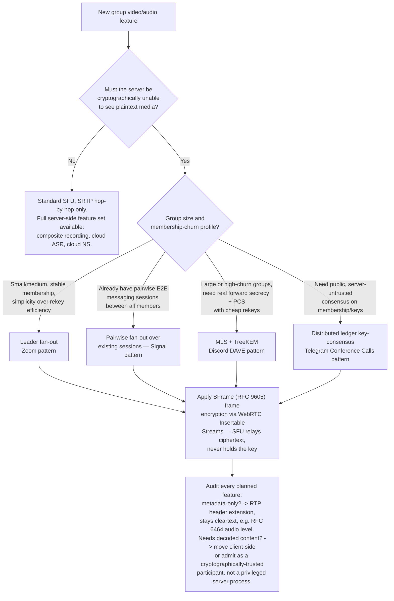
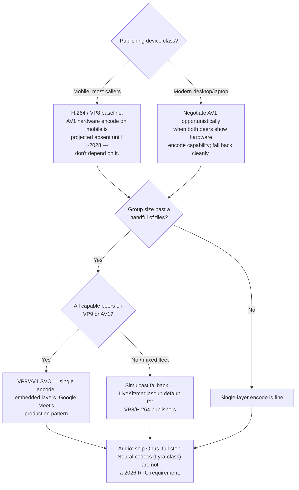

# E2EE Video Conferencing Pipeline

Architects the layer that turns a working SFU-based group call into a
Zoom-rooms- or Telegram-Conference-Call-style product: real end-to-end
encryption, a 2026-appropriate codec/transport strategy, and a premium
feature set that's honest about what does and doesn't survive encryption.

## When to Use

✅ **Use for**:
- Adding end-to-end encryption to an existing or planned SFU-based group
  video/audio call
- Choosing which group-key-management pattern fits your product (Zoom-style
  leader fan-out, Signal-style pairwise fan-out, MLS/TreeKEM, or a
  Telegram-style distributed ledger)
- Picking a codec and SVC/simulcast strategy for 2026 browsers and mobile
  devices
- Deciding which "premium" features (recording, live captions, virtual
  backgrounds, noise suppression, breakout rooms, spatial audio, reactions)
  are compatible with an E2EE product claim, and how to redesign the ones
  that aren't
- Auditing an "end-to-end encrypted" marketing claim against what the product
  actually does server-side

❌ **NOT for**:
- Choosing mesh vs. SFU vs. MCU, or LiveKit vs. mediasoup vs. a managed
  platform — see `webrtc-adhoc-video-chat`, which this skill assumes has
  already run
- One-way broadcast/streaming to non-publishing viewers — see
  `managed-video-streaming-pipeline`
- Text/DM chat backend architecture — see `realtime-messaging-backend-architecture`
- Building the ML models behind moderation/trust-and-safety signals — see
  `ml-trust-safety-signal-detection`

---

## Core Decision: Does This Call Need E2EE, and What Pattern Fits?

**One-line summary of each leaf** (full protocol detail in
`references/e2ee-key-management-patterns.md`):

- **No E2EE**: the common case. Standard SFU with SRTP terminating at the
  server is sufficient for most products and keeps every server-side feature
  (composite recording, cloud transcription, cloud noise suppression)
  available. Don't reach for E2EE by default — it's a real feature/ops
  trade-off, not a free security upgrade.
- **Leader fan-out** (Zoom, GA Oct 2020): one client (the meeting leader)
  generates the meeting key and individually encrypts it to each other
  participant's public key. O(n) per rekey, single coordination point,
  capped by Zoom at 1,000 participants with several features disabled (see
  the feature-compatibility reference). **Correction worth internalizing**:
  Zoom's own whitepaper does not use MLS — this is a common but incorrect
  assumption by analogy with Discord/Wire/Webex.
- **Pairwise fan-out** (Signal, launched Dec 2020/2021): the member changing
  keys sends new key material to every other member over already-existing
  1:1 Signal Protocol sessions. Reuses existing E2E messaging infrastructure;
  O(n) per rekey; makes sense specifically because Signal already has a
  pairwise E2E session with every contact.
- **MLS/TreeKEM** (RFC 9420, July 2023; used by Discord's DAVE protocol
  since Sept 2024, Wire, Cisco Webex): members sit at leaves of a binary
  tree; a single join/leave/rotation only re-encrypts the O(log n) nodes on
  the path to the root. The right choice for large or frequently-churning
  groups where O(n) rekeys would be too expensive.
- **Distributed ledger consensus** (Telegram Conference Calls, launched May
  2025): a blockchain-like shared, append-only ledger of membership and
  keying material that every client applies identically, so no single
  party — not even the server — can silently add a listener. A third
  architectural pattern, not a variant of MLS or leader fan-out.

Full protocol mechanics, primitives, and citations:
`references/e2ee-key-management-patterns.md`.

Run `python3 scripts/rekey_cost_calculator.py --participants 10 50 500 5000
--churn-events 20` to see the concrete O(n) vs. O(log n) rekey-cost gap that
drives the MLS-vs-leader-fan-out choice at scale.

---

## The Mechanism: SFrame + Insertable Streams (How an SFU Relays What It Can't Read)

The load-bearing architectural fact underneath every pattern above: an SFU
only ever needs **RTP header** fields (sequence numbers, timestamps, SSRC,
simulcast/SVC layer markers, the RFC 6464 audio-level extension) to forward,
switch simulcast layers, and run congestion control. It never needs the RTP
**payload** plaintext.

- **WebRTC Insertable Streams** (the "Encoded Transform" API — W3C Working
  Draft, most recent WD Oct 9 2025, shipped in Chrome/Firefox/Safari since
  2020-2023) exposes encoded frames after the encoder and before the RTP
  packetizer on send, and the reverse point on receive.
- **SFrame** (RFC 9605, IETF, Aug 2024) defines the actual authenticated
  frame-encryption format applied at that hook — independent of RTP, so it
  can secure non-RTP transports too.
- Result: sender encrypts each frame with a key the SFU never has → SRTP
  wraps that ciphertext for the transport hop → SFU forwards/switches based
  on headers alone, relaying pure ciphertext it cannot decrypt → receiver's
  Insertable Streams hook decrypts before the frame reaches the decoder.
- **Hard limit**: this only works for **SFU** topologies. It is
  architecturally incompatible with MCU (server-side decode/mix/re-encode)
  and with legacy PSTN/SIP/H.323/browser-proxy participants that require a
  transcoding bridge — Zoom's own whitepaper excludes exactly these
  participant types from E2EE-enabled meetings.
- **The cleanest illustration of "metadata vs. content"**: active-speaker
  detection normally requires decoded audio, but RFC 6464 defines a 4-byte
  *cleartext* RTP header extension carrying the sender-computed audio level.
  Because SFrame only encrypts the payload, an SFU can do accurate
  active-speaker detection on fully E2E-encrypted calls without ever seeing
  decrypted audio — the pattern to copy for every other "does the server
  need this" question.

Full mechanism detail, standardization status, and per-library support
(LiveKit's FrameCryptor, mediasoup's demo-level support, libwebrtc's native
implementation): `references/e2ee-key-management-patterns.md`.

---

## Codec and Transport Strategy for 2026

- **H.264 and VP8 remain the compatibility floor** — still the majority of
  real-world WebRTC video sessions in 2026. Negotiate them always.
- **VP9 SVC is proven in production** (Google Meet's default multi-party
  codec) but forces software decode on many clients — a real CPU trade-off
  for the bandwidth win.
- **AV1's blocker is mobile hardware encode, not decode.** Decode hardware
  is broadly available (Apple Silicon, recent Snapdragon/Exynos/Tensor);
  real-time *encode* hardware on phones is largely absent as of 2026, and
  industry projections put AV1 RTC dominance around 2028, not sooner. Offer
  it opportunistically for capable desktop/laptop peers; never require it.
- **Treat H.265 as out of scope** unless you've resolved licensing — Safari
  and Firefox's WebRTC stacks don't support it, and unresolved multi-pool
  patent licensing discourages open-source SFU bundling.
- **Opus is not a decision** — ship it as the sole mandatory audio codec.
  Neural codecs (Google's Lyra) matter for voice-AI pipelines, not
  browser-to-browser calling.
- **Don't hand-roll congestion control.** Use your stack's default GCC/
  transport-cc. RFC 8888 (per-SSRC CCFB with ECN) and L4S (RFC 9330/9331)
  are real IETF standards but experimental-maturity for RTC in 2026 — track,
  don't depend on.
- **Media over QUIC (MoQ)** is architecturally a better fit for large-scale
  one-to-many broadcast fan-out (Cloudflare's production MoQ relay network,
  Aug 2025) than for the symmetric, interactive core of a group call —
  layer it on top for a "watch this call" spectator feature, don't replace
  your SFU transport with it.
- **WHIP (RFC 9725, stable) for bringing external sources in** (OBS
  co-hosts, hardware encoders); **WHEP (still a pre-RFC draft but already
  production-used by LiveKit/Cloudflare) for lightweight spectator egress.**
  Neither replaces the N-way signaling a true group call needs.

Full codec/transport benchmarks, per-platform SVC support matrix, and
standardization tracking: `references/codec-and-transport-selection.md`.

---

## Premium Features vs. E2EE: What Survives, What Doesn't

The physics: any feature requiring the server to *understand* content, not
just forward encrypted bytes, needs server-side plaintext — incompatible
with true E2EE unless redesigned to run client-side or the processor is
admitted as a cryptographically-trusted call participant.

| Feature | Survives E2EE? | Why |
|---|---|---|
| Virtual backgrounds / blur | ✅ Yes | Runs client-side, pre-encoder, on the raw frame — never needed server plaintext in the first place |
| Noise suppression | ✅ Yes (if client-side) | Same as above; breaks only if a vendor SDK routes audio through a cloud service |
| Active-speaker detection | ✅ Yes | RFC 6464 cleartext header extension carries loudness — no decryption needed |
| Breakout rooms | ✅ Yes | Only needs membership/routing metadata + per-room re-keying, not plaintext access |
| Spatial/positional audio | ✅ Yes | Pure client-side Web Audio DSP on each already-decrypted incoming track |
| On-device live captions | ✅ Yes | Client-side ASR (e.g. whisper.cpp/distil-whisper in WASM) on audio the client already legitimately holds |
| Cloud live captions/transcription | ❌ No (unless redesigned) | Cloud ASR APIs need plaintext audio at a third party — Zoom disables this under E2EE |
| Server-side composite recording | ❌ No (unless redesigned) | An MCU-style compositor must decode every stream — Zoom/LiveKit both disable or restrict this under E2EE |
| DataChannel messages (reactions, raise-hand) | ⚠️ Not automatically | SFU-terminated DTLS is hop-by-hop, not sender-to-receiver — apply the same SFrame-style key to DataChannel payloads if you want a real E2EE claim to cover them |
| Bot/AI participants (notetakers, agents) | ⚠️ Only if admitted | Must be issued real decryption keys as a trusted call member (LiveKit's documented pattern) — not a magic server-side exception |

Full feature-by-feature implementation detail, library names, and the
"admit the bot as a trusted participant" pattern:
`references/premium-feature-e2ee-compatibility.md`.

Real-platform precedent for these trade-offs (Zoom's disabled-feature list,
Discord's DAVE exclusions, Telegram's two-product split, Google Meet's
scoped CSE):
`references/platform-case-studies.md`.

---

## Anti-Patterns

### Anti-Pattern: Assuming MLS Is Universal Because "Everyone Serious Uses It"

**Novice**: "We're building real E2EE like Zoom, so we'll use MLS for group
key agreement."

**Expert**: Zoom's own published whitepaper (read directly, through v4.7,
June 2025) uses a custom leader-fan-out design — no MLS, no TreeKEM
anywhere in it. MLS is real and production-proven (Discord's DAVE since
Sept 2024, Wire, Cisco Webex), but it's one of at least three genuinely
different production patterns, not the only "correct" one. Pick based on
your group-size/churn profile (see the decision diagram), not by copying a
name you saw in someone else's marketing.

**Detection**: A design doc says "we'll use MLS like Zoom" — that sentence
is factually wrong and worth catching before it shapes an architecture.

### Anti-Pattern: Assuming DataChannels Are Already End-to-End Encrypted

**Novice**: "WebRTC is E2E encrypted, so reactions/raise-hand over a
DataChannel are automatically covered by our E2EE claim."

**Expert**: In an SFU topology, DTLS for the DataChannel terminates at the
SFU hop-by-hop, exactly like SRTP for media — the SFU can read DataChannel
payloads by default. A product claiming full E2EE needs to apply its own
SFrame-style encryption to DataChannel payloads using the same key material
as media, or explicitly scope the E2EE claim to audio/video only.

**Detection**: An E2EE product claim exists, but DataChannel messages
(reactions, whiteboard strokes, chat-during-call) aren't run through the
same encryption layer as media frames.

### Anti-Pattern: Treating a Platform's Encryption Status as Monolithic

**Novice**: "Telegram isn't end-to-end encrypted for calls" (or the
opposite: "Telegram is E2E encrypted, it's a secure messenger").

**Expert**: Both are wrong as stated in 2026. Telegram runs two structurally
different group-calling products: the legacy "Voice Chat" feature
(server-relayed via MTProto, not E2E) and "Conference Calls" (launched May
2025, genuinely E2E via a blockchain-ledger key-consensus design, capped at
200 participants). Always ask "which specific feature/mode" before making
an encryption claim about any multi-product platform — the same trap
applies to Google Meet (default meetings vs. opt-in Client-Side Encryption)
and Zoom (E2EE is an opt-in per-meeting toggle, not the default).

**Timeline**: This is a live, moving target — Telegram's E2E group-call
product didn't exist before April 30, 2025. Verify current state against
primary sources (the platform's own API docs/blog) rather than repeating a
claim that may have been true a year ago.

### Anti-Pattern: Marketing "End-to-End Encrypted" While Still Running Cloud Processing

**Novice**: "We're E2E encrypted, and we also offer cloud noise suppression
and live transcription as premium add-ons."

**Expert**: If those add-ons run server-side on plaintext audio, the E2EE
claim is false for that data path even if media transport itself is
correctly encrypted. Either move the processing client-side (on-device
ASR, client-side noise suppression — both fully viable in 2026), admit the
processor as a cryptographically-trusted call participant with real
decryption keys, or be explicit in the product UI that the feature disables
E2EE for that session — exactly what Zoom does by greying out cloud
recording/transcription controls when E2EE mode is on.

**Detection**: A feature list advertises both "end-to-end encrypted" and a
cloud-hosted AI feature (transcription, translation, cloud noise
suppression) with no documented exception or trust boundary explaining how
the two coexist.

### Anti-Pattern: Hardcoding a Single Video Codec

**Novice**: "We picked AV1 because it's the best codec — one encoder path,
simpler code."

**Expert**: Real-time AV1 encoding on mobile hardware is largely unavailable
in 2026 (industry projections put broad RTC dominance around 2028), and
Safari/Firefox don't negotiate H.265. A 2026 group-video product needs a
negotiable codec list (H.264/VP8 floor, VP9/AV1 SVC as an enhancement for
capable peers) with graceful fallback, not a single hardcoded choice.

**Detection**: The SDP offer/answer or SFU config hardcodes one video codec
rather than offering a fallback-ordered list.

---

## References

Consult these for deep dives — they are NOT loaded by default:

| File | Consult When |
|------|-------------|
| `references/e2ee-key-management-patterns.md` | Choosing/implementing a group-key-management pattern (leader fan-out, pairwise fan-out, MLS/TreeKEM, ledger consensus); need SFrame/Insertable Streams mechanics or per-library E2EE support status |
| `references/codec-and-transport-selection.md` | Choosing video/audio codecs, SVC vs. simulcast, congestion control, or evaluating MoQ/WHIP/WHEP for a 2026 build |
| `references/premium-feature-e2ee-compatibility.md` | Deciding how to implement virtual backgrounds, noise suppression, captions, recording, breakout rooms, or spatial audio — and whether each survives an E2EE requirement |
| `references/platform-case-studies.md` | Need the verified, sourced comparison of Zoom/Telegram/Google Meet/Discord's actual architectures and encryption claims |

## Scripts

| File | Run When |
|------|----------|
| `scripts/rekey_cost_calculator.py` | Need concrete numbers showing why MLS/TreeKEM's O(log n) rekey cost beats O(n) leader/pairwise fan-out at scale |
