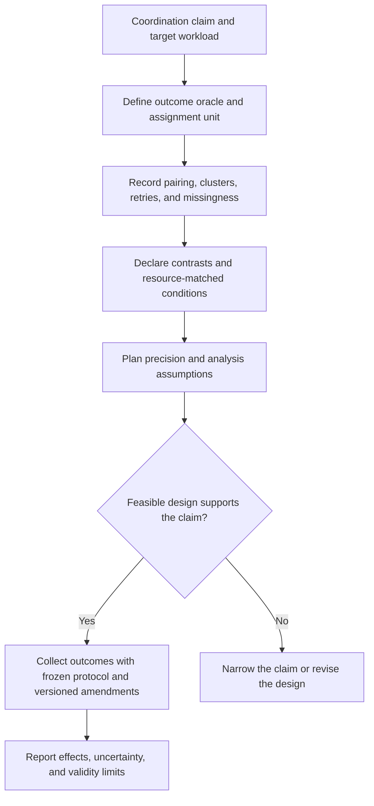

# Establish the estimand and evidence before choosing analysis

```mermaid
flowchart TD
  Q[Coordination claim and target workload] --> U[Define outcome oracle and assignment unit]
  U --> D[Record pairing, clusters, retries, and missingness]
  D --> C[Declare contrasts and resource-matched conditions]
  C --> P[Plan precision and analysis assumptions]
  P --> V{Feasible design supports the claim?}
  V -->|Yes| R[Collect outcomes with frozen protocol and versioned amendments]
  V -->|No| N[Narrow the claim or revise the design]
  R --> A[Report effects, uncertainty, and validity limits]
```
