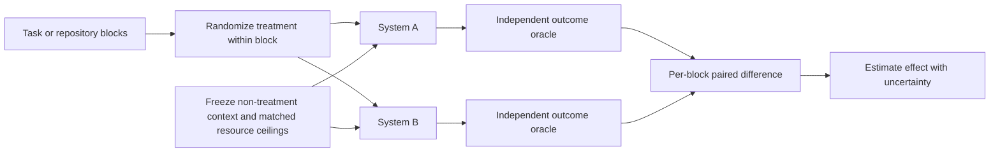

# E01 — Matched experiment and causal measurement

```mermaid
flowchart LR
  T[Task or repository blocks] --> R[Randomize treatment within block]
  R --> A[System A]
  R --> B[System B]
  Budget[Freeze non-treatment context and matched resource ceilings] --> A
  Budget --> B
  A --> OA[Independent outcome oracle]
  B --> OB[Independent outcome oracle]
  OA --> Pair[Per-block paired difference]
  OB --> Pair
  Pair --> Estimand[Estimate effect with uncertainty]
```
