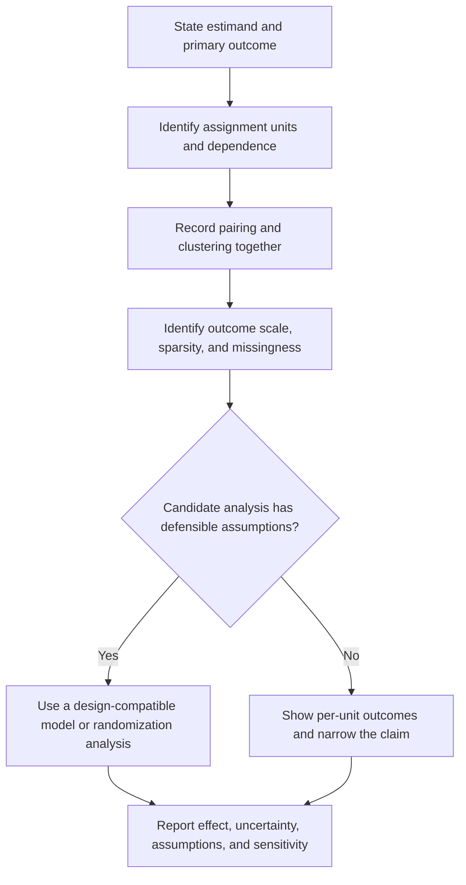

# E02 — Choose analysis from the joint design

Pairing and clustering can coexist. Sparse counts do not automatically make an arbitrary exact or permutation test valid; its assignment and distributional assumptions still matter.
