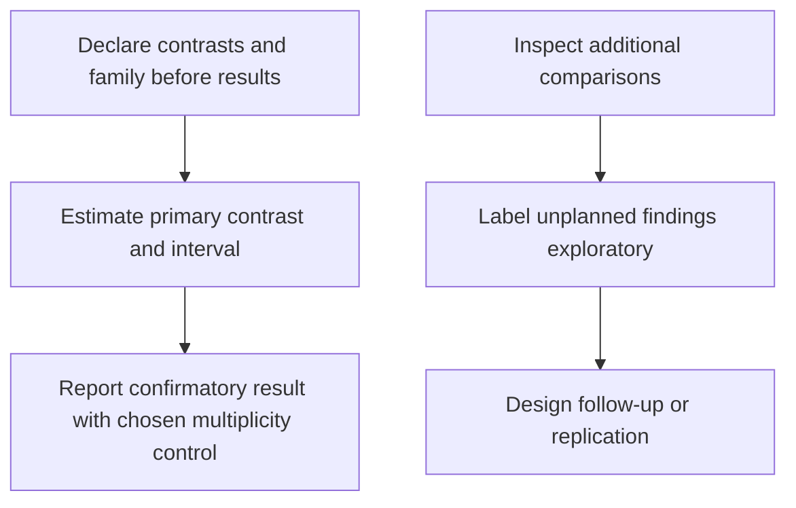

# E03 — Confirmatory contrasts and exploratory follow-up

```mermaid
flowchart TD
  Plan[Declare contrasts and family before results] --> Primary[Estimate primary contrast and interval]
  Primary --> Confirm[Report confirmatory result with chosen multiplicity control]
  All[Inspect additional comparisons] --> Exploratory[Label unplanned findings exploratory]
  Exploratory --> Follow[Design follow-up or replication]
```
