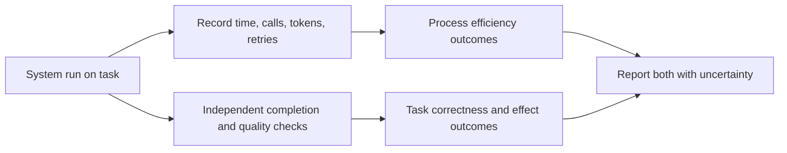

# E04 — Keep process metrics distinct from outcome evidence

```mermaid
flowchart LR
  Run[System run on task] --> Trace[Record time, calls, tokens, retries]
  Run --> Oracle[Independent completion and quality checks]
  Trace --> Process[Process efficiency outcomes]
  Oracle --> Task[Task correctness and effect outcomes]
  Process --> Report[Report both with uncertainty]
  Task --> Report
```
