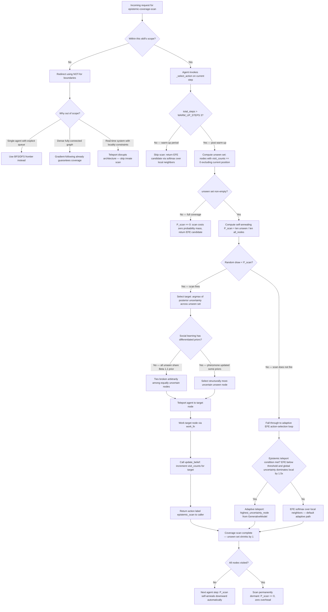

# Diagram 1: flowchart

```mermaid
flowchart TD
  A[Incoming request for epistemic-coverage-scan] --> B{Within this skill's scope?}
  B -->|No| C[Redirect using NOT-for boundaries]
  B -->|Yes| D[Agent invokes _select_action on current step]

  C --> C1{Why out of scope?}
  C1 -->|Single-agent with explicit queue| C2[Use BFS/DFS frontier instead]
  C1 -->|Dense fully-connected graph| C3[Gradient-following already guarantees coverage]
  C1 -->|Real-time system with locality constraints| C4[Teleport disrupts architecture — skip innate scan]

  D --> E{total_steps > WARM_UP_STEPS 3?}
  E -->|No — warm-up period| F[Skip scan: return EFE candidate via softmax over local neighbors]
  E -->|Yes — post warm-up| G[Compute unseen set: nodes with visit_counts == 0 excluding current position]

  G --> H{unseen set non-empty?}
  H -->|No — full coverage| I[P_scan == 0: scan costs zero probability mass, return EFE candidate]
  H -->|Yes| J[Compute self-annealing P_scan = len unseen / len all_nodes]

  J --> K{Random draw < P_scan?}
  K -->|No — scan does not fire| L[Fall through to adaptive EFE action-selection loop]
  K -->|Yes — scan fires| M[Select target: argmax of posterior uncertainty across unseen set]

  M --> N{Social learning has differentiated priors?}
  N -->|No — all unseen share Beta 1,1 prior| O[Ties broken arbitrarily among equally uncertain nodes]
  N -->|Yes — pheromone updated some priors| P[Select structurally most-uncertain unseen node]
  O --> Q[Teleport agent to target node]
  P --> Q

  Q --> R[Work target node via work_fn]
  R --> S[Call update_belief: increment visit_counts for target]
  S --> T[Return action label epistemic_scan to caller]

  L --> U{Epistemic teleport condition met? EFE below threshold and global uncertainty dominates local by 1.5x}
  U -->|Yes| V[Adaptive teleport: highest_uncertainty_node from GenerativeModel]
  U -->|No| W[EFE softmax over local neighbors — default adaptive path]

  T --> X[Coverage scan complete — unseen set shrinks by 1]
  V --> X
  W --> X

  X --> Y{All nodes visited?}
  Y -->|No| Z[Next agent step: P_scan self-anneals downward automatically]
  Y -->|Yes| AA[Scan permanently dormant: P_scan == 0, zero overhead]
```
