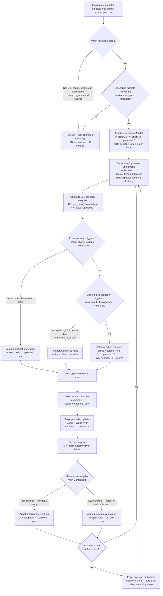

# Diagram 1: flowchart

```mermaid
flowchart TD
  A[Incoming request for expected-free-energy-action-selection] --> B{Within this skill's scope?}
  B -->|No: i.i.d. bandit, continuous state space,\nor hard regret-bound required| C[Redirect — use Thompson sampling,\nUCB, or continuous RL instead]
  B -->|Yes| D{Agent has discrete candidate\nnext-states / graph neighbors?}
  D -->|No| C
  D -->|Yes| E[Initialise GenerativeModel\nw_prag=1.0, w_epist=1.5, gamma=4.0\nBeta beliefs = Beta-1,1 per node]

  E --> F[Social learning: sense pheromone\nneighborhood → update_from_pheromone\nshifts alpha/beta before deciding]

  F --> G[Compute EFE for each neighbor\nG-n = w_prag * pragmatic-n\n+ w_epist * epistemic-n]

  G --> H{Epistemic scan triggered?\nstep > 3 AND unseen nodes exist}
  H -->|Yes — prob = len-unseen / total| I[Jump to highest-uncertainty\nunseen node — epistemic scan]
  H -->|No| J{Epistemic teleportation triggered?\nmax local EFE magnitude < threshold}
  J -->|Yes — and global best is 1.5x\nbetter than local best| K[Teleport globally to node\nwith max Var-p * novelty]
  J -->|No| L[Softmax action selection\nprobs = softmax-neg-gamma * G\nover neighbor EFE scores]

  I --> M[Move agent to selected node]
  K --> M
  L --> M

  M --> N[Execute work function\noutcome = found_something: bool]

  N --> O[Bayesian belief update\nfound → alpha += lr\nnot found → beta += lr]

  O --> P[Record surprise\nS = -log p-outcome-given-belief]

  P --> Q{Mean recent surprise\nvs ln-2 threshold}
  Q -->|High surprise — model is wrong| R[Adapt precision: w_epist up\nw_prag down — explore more]
  Q -->|Low surprise — model is well calibrated| S[Adapt precision: w_prag up\nw_epist down — exploit more]

  R --> T{All nodes visited\nat least once?}
  S --> T

  T -->|No| F
  T -->|Yes| U[Epistemic scan probability\ndecays to zero — pure EFE\ndrives remaining steps]
  U --> F
```
