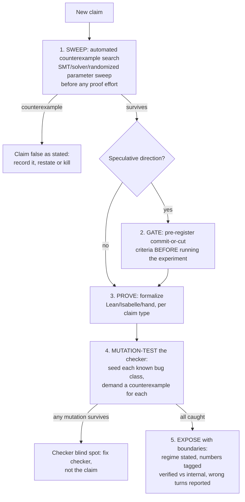

# Falsification-First: Refute Before You Prove

Every claim earns formalization by surviving an attack; every checker earns trust by catching seeded bugs; every speculative direction lives or dies by a gate registered before the experiment runs.

## When to Use
✅ Use for: a new theorem/bound/equilibrium claim about to be formalized; any simulation or experiment testing a theoretical limit; building or reviewing a model checker, invariant suite, or security verifier; a speculative direction needing a live-or-die decision; auditing why an experiment "beat" a known bound.
❌ NOT for: open-ended brainstorming (gates would strangle it), product/roadmap prioritization, exposition mechanics (harbor-exposition), or pure literature surveys.

## Core Process

## The five obligations (short form; protocols in references)
1. **Sweep first.** Randomized/solver counterexample search over the parameter space before proving. This mechanically catches what hand review catches late (a non-PD payoff matrix, a wrong discount threshold).
2. **Gate speculation.** Write the cut condition before the run: "CUT if every detection is also caught by the cheap baseline." A gate that can only confirm is not a gate.
3. **Audit the meter.** For any experiment against an information/impossibility bound: enumerate every channel by which the answer could reach the decision, and price each. Apparent bound-beating = unpriced side channel until proven otherwise.
4. **Mutation-test checkers.** A green checker is unvalidated. Seed one bug per invariant/guard; demand a (shortest) counterexample per seed; ship the suite as the checker's certificate.
5. **Report wrong turns.** Failed formulations locate boundaries — file them next to the success with what each taught. Tag every number [verified] or [internal, script+seed].

## Anti-Patterns

### Prove First
**Novice**: "Formalize the elegant claim, then test it."
**Expert**: Sweep first. Three independent reviews and a solver each caught the same false-as-stated theorems that months of prose had blessed (non-PD stage game; identity theorem's 10/2/0 counterexample). Proof effort spent on a false statement is pure loss.
**Detection**: Lean/Isabelle files exist for a claim no script has attacked.

### The Unvalidated Green Checker
**Novice**: "All invariants pass — we're safe."
**Expert**: Passing proves nothing until seeded violations fail. Every guard must be shown load-bearing (harbor-results L3 lesson 5: five guards, five shortest crimes).
**Detection**: A checker repo with no mutation/negative-case suite.

### The Confirming Gate
**Novice**: "We'll see if the experiment looks promising."
**Expert**: Pre-register the numeric cut condition and the topology/regime it must win in. The sheaf direction survived only because its gate was written first — and its two failures were what located the real boundary (cycles, not cut edges).
**Detection**: A "gate" with no falsifying outcome written down before the run.

### Trusting the Refutation
**Novice**: "The experiment beat the bound — the theorem is wrong!"
**Expert**: Audit the meter first. The floor's 8/16 "violations" were an oracle smuggling identity past a tie-breaking-only bit charge. Symmetric discipline: doubt apparent refutations of solid theory exactly as hard as apparent confirmations of your own claims.
**Detection**: Celebration before a channel-by-channel accounting of what the decision procedure could see.

## References
- `references/protocols.md` — Load when executing any obligation: concrete checklists for sweeps (tool routing by claim type), meter-integrity audits, gate design, mutation-suite design, and the wrong-turn report format.

## Scripts
- `python3 scripts/sweep.py --claim "rho*d*B >= G" --vars "rho=0:1,d=0.5:1,B=10:100,G=0:20" --trials 20000` — obligation 1 executable: randomized counterexample sweep over parameter boxes for any inequality claim (safe eval: min/max/abs/log/log2/exp/sqrt). Prints first counterexamples or "0 counterexamples in N trials"; exit 1 on any hit. Run before spending proof effort. Case-law suites for obligations 3–4 (meter audits, mutation tests) live as working code in harbor-results/scripts/.
