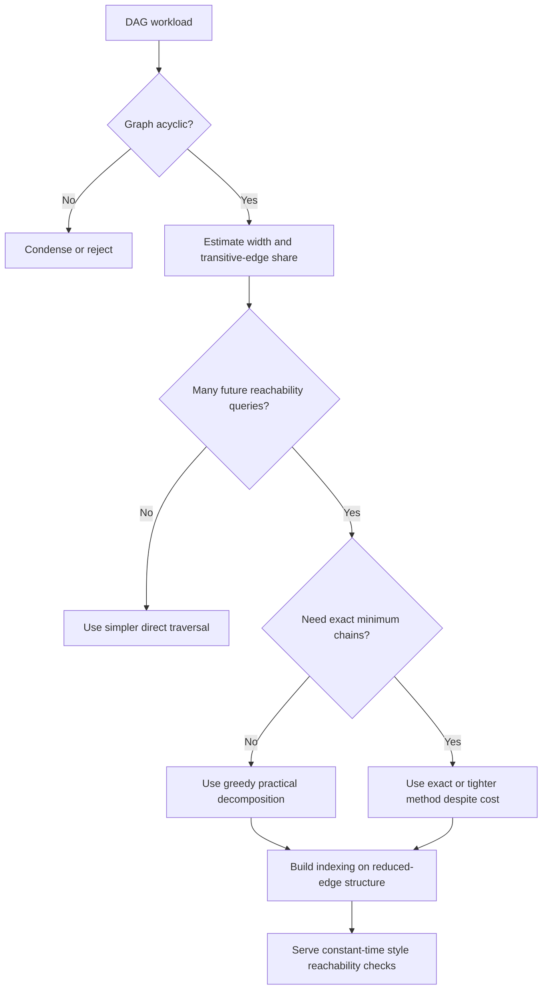

# Fast and Practical DAG Decomposition

Use this skill when the real win comes from a fast, good-enough decomposition that unlocks downstream reachability, indexing, or repeated-query performance.

## When to Use

- A DAG is dense enough that many edges may be transitive and therefore not worth treating as first-class complexity.
- You need to answer many future reachability queries and can afford preprocessing once.
- Exact minimum chain decomposition is less important than a near-optimal decomposition available quickly.
- A system bottleneck may actually be redundant graph representation rather than true structural complexity.
- You are deciding whether preprocessing and indexing will pay for themselves.

## NOT for Boundaries

This skill is not the primary tool for:
- Cyclic graphs or control systems that have not been condensed into DAG form.
- Single-query workflows where preprocessing will never amortize.
- Scientific, legal, or safety contexts that require exact minimum decompositions rather than practical heuristics.
- Problems whose central difficulty is weighted routing, timing uncertainty, or non-DAG resource scheduling.

## Core Mental Models

### Width Matters More Than Density

Dense DAGs can still be structurally simple if width stays low. True difficulty lives in irreducible independence, not just in how many arrows appear on the page.

### Transitive Edges Are Compression Opportunity

In many dense DAGs, most edges are implied by shorter paths. Treating all of them as equal work is a representation mistake.

### Fast Near-Optimal Beats Slow Optimal in Compound Workflows

If a heuristic decomposition enables indexing, caching, or repeated downstream queries, the overall system can beat a slower exact method even if the decomposition itself is slightly worse.

### Indexing Is a Bet on Future Query Volume

Preprocessing is only smart when later reachability checks are common enough to repay the up-front cost.

## Decision Points

See the Decision Points below for the broader strategy set.

### 1. Decide Whether Preprocessing Pays

- If reachability is queried repeatedly, indexing is attractive.
- If the graph will be queried once or twice, traversal is often enough.

### 2. Decide Whether Exactness Is Actually Worth It

- If chain count is itself the artifact under review, exactness may matter.
- If decomposition is merely an enabler for later work, near-optimal fast methods are usually superior.

### 3. Decide Whether the Graph Has Exploitable Structure

- If width is modest and transitive edges dominate, decomposition and indexing will likely pay.
- If width approaches node count, the graph may be too structureless for these gains.

## Failure Modes

### Exactness Fetish

**Symptoms:** the team spends more time finding the optimal decomposition than the query workload could ever justify.  
**Recovery:** compare downstream value of a fast near-optimal solution against the full pipeline cost.

### Preprocessing Without Query Demand

**Symptoms:** an expensive index is built and barely used.  
**Recovery:** estimate actual query volume before paying the preprocessing bill.

### Density Panic

**Symptoms:** a dense graph is assumed to be intrinsically hard without checking width or transitive redundancy.  
**Recovery:** measure width and reduced-edge share before choosing the algorithm.

### Using DAG Decomposition on Cyclic Structure

**Symptoms:** the decomposition logic produces nonsense or brittle chains because the input still contains feedback loops.  
**Recovery:** condense SCCs first or choose a different method.

### Reduced-Edge Blindness

**Symptoms:** indexing cost stays tied to full edge count because transitive edges were never stripped conceptually.  
**Recovery:** reason on the reduced edge set and preserve only the structure that actually changes reachability.

## Worked Examples

### Example 1: Access-Control Reachability Service

A permission graph is queried thousands of times per minute. After confirming the graph is acyclic and structurally low-width, the team accepts a near-optimal chain decomposition and builds an index over the reduced edge structure, trading one preprocessing pass for cheap runtime checks.

### Example 2: CI Dependency Explorer

A monorepo tool needs to answer "what breaks if I change X?" repeatedly. Rather than recomputing traversal against the dense full DAG every time, the system uses practical chain decomposition to compress the graph and accelerate downstream reachability queries.

## Quality Gates

- [ ] The graph has been verified acyclic before decomposition begins.
- [ ] Query volume is high enough to justify preprocessing.
- [ ] Width and transitive-edge share are measured before assuming the graph is hard.
- [ ] Exactness requirements are explicit rather than assumed.
- [ ] The reduced-edge view is used when estimating index cost and payoff.

## Reference Files

- `diagrams/01_flowchart_dag_decomposition_decision_fra.md` — Mermaid flowchart routing decomposition decisions by bottleneck type and structure. **Read when** deciding whether to apply decomposition or use standard optimization.
- `diagrams/02_mindmap_graph_decomposition_strategy_s.md` — Mind map of decomposition strategy space: width-over-density, greedy-beats-optimal, and indexing payoff. **Read when** building mental model of when decomposition wins.
- `diagrams/03_quadrantChart_optimization_strategy_selectio.md` — Quadrant chart mapping solution quality vs. query frequency to algorithm choice (heuristic, optimal, hybrid, iterative). **Read when** assessing whether preprocessing cost amortizes.
- `references/constant-time-reachability-through-indexing.md` — Reachability problem definition and naive DFS/BFS baseline. **Read when** understanding why indexing on decomposed DAGs matters.
- `references/failure-modes-and-structural-blindness.md` — Width-to-node-count ratio boundary cases and when decomposition effectiveness vanishes. **Read when** assessing whether a DAG is too wide for practical decomposition.
- `references/greedy-decomposition-and-progressive-refinement.md` — Tension between exact minimum-chain algorithms and practical greedy heuristics; why "good enough" beats slow-optimal. **Read when** deciding between exact vs. heuristic decomposition.
- `references/hierarchical-abstraction-for-scaling.md` — How chain decomposition eliminates 85–95% of transitive edges through abstraction. **Read when** understanding compression opportunity in dense DAGs.
- `references/problem-decomposition-strategies.md` — Chain-Order vs. Node-Order heuristics and their sequential vs. parallel construction philosophies. **Read when** choosing decomposition algorithm variant.
- `references/transitive-structure-as-compression-opportunity.md` — Empirical finding: 85–95% of edges are transitive in dense DAGs; implications for representation. **Read when** justifying preprocessing investment to stakeholders.
- `references/width-as-coordination-complexity.md` — Width definition (max mutually unreachable vertices) as true coordination complexity measure, not edge count. **Read when** explaining why width matters more than density.

## Anti-Patterns

- Optimizing decomposition quality in isolation from the downstream workload.
- Treating all edges as equal work when most are transitive.
- Building indexes before checking whether anyone will query them often enough.
- Applying DAG decomposition rhetoric to cyclic or nearly structureless graphs.
