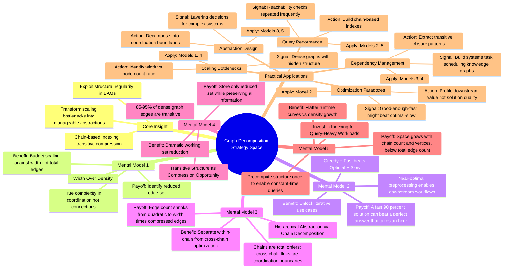

# Graph Decomposition Strategy Space

```mermaid
mindmap
  root((Graph Decomposition Strategy Space))
    Core Insight
      Exploit structural regularity in DAGs
      Transform scaling bottlenecks into manageable abstractions
      Chain-based indexing + transitive compression
    Mental Model 1
      Width Over Density
      True complexity in coordination not connections
      Payoff: Identify reduced edge set
      Benefit: Budget scaling against width not total edges
    Mental Model 2
      Greedy + Fast beats Optimal + Slow
      Near-optimal preprocessing enables downstream workflows
      Payoff: A fast 90 percent solution can beat a perfect answer that takes an hour
      Benefit: Unlock iterative use cases
    Mental Model 3
      Hierarchical Abstraction via Chain Decomposition
      Chains are total orders; cross-chain links are coordination boundaries
      Payoff: Edge count shrinks from quadratic to width times compressed edges
      Benefit: Separate within-chain from cross-chain optimization
    Mental Model 4
      Transitive Structure as Compression Opportunity
      85-95% of dense graph edges are transitive
      Payoff: Store only reduced set while preserving all information
      Benefit: Dramatic working set reduction
    Mental Model 5
      Invest in Indexing for Query-Heavy Workloads
      Precompute structure once to enable constant-time queries
      Payoff: Space grows with chain count and vertices, below total edge count
      Benefit: Flatter runtime curves vs density growth
    Practical Applications
      Scaling Bottlenecks
        Signal: Dense graphs with hidden structure
        Action: Identify width vs node count ratio
        Apply: Models 1, 4
      Dependency Management
        Signal: Build systems task scheduling knowledge graphs
        Action: Extract transitive closure patterns
        Apply: Models 3, 4
      Query Performance
        Signal: Reachability checks repeated frequently
        Action: Build chain-based indexes
        Apply: Models 2, 5
      Abstraction Design
        Signal: Layering decisions for complex systems
        Action: Decompose into coordination boundaries
        Apply: Models 3, 5
      Optimization Paradoxes
        Signal: Good-enough-fast might beat optimal-slow
        Action: Profile downstream value not solution quality
        Apply: Model 2
```
