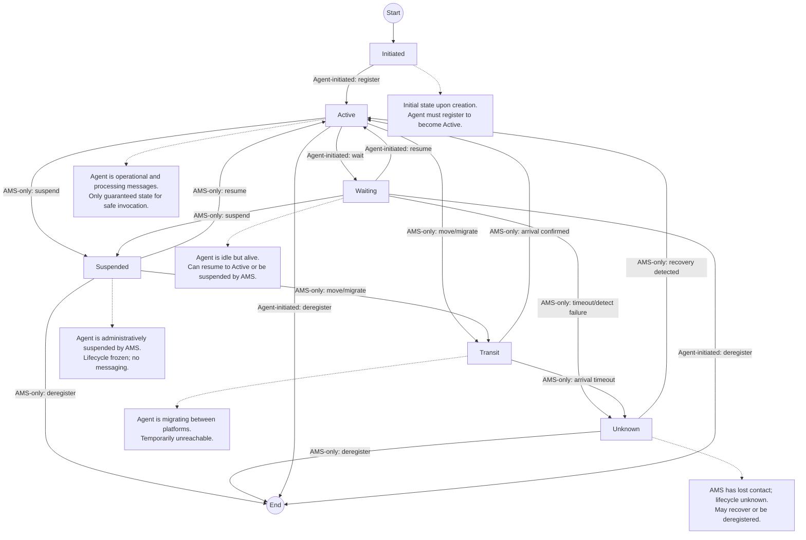

# Agent Lifecycle State Machine

```mermaid
flowchart TD
    Start((Start)) --> Initiated

    Initiated -->|Agent-initiated: register| Active

    Active -->|Agent-initiated: wait| Waiting
    Active -->|AMS-only: suspend| Suspended
    Active -->|AMS-only: move/migrate| Transit

    Waiting -->|Agent-initiated: resume| Active
    Waiting -->|AMS-only: suspend| Suspended
    Waiting -->|AMS-only: timeout/detect failure| Unknown

    Suspended -->|AMS-only: resume| Active
    Suspended -->|AMS-only: move/migrate| Transit
    Suspended -->|AMS-only: deregister| End((End))

    Transit -->|AMS-only: arrival confirmed| Active
    Transit -->|AMS-only: arrival timeout| Unknown

    Unknown -->|AMS-only: recovery detected| Active
    Unknown -->|AMS-only: deregister| End((End))

    Active -->|Agent-initiated: deregister| End((End))
    Waiting -->|Agent-initiated: deregister| End((End))

Annotation1["Initial state upon creation.<br/>Agent must register to become Active."]
Initiated -.-> Annotation1

Annotation2["Agent is operational and processing messages.<br/>Only guaranteed state for safe invocation."]
Active -.-> Annotation2

Annotation3["Agent is idle but alive.<br/>Can resume to Active or be suspended by AMS."]
Waiting -.-> Annotation3

Annotation4["Agent is administratively suspended by AMS.<br/>Lifecycle frozen; no messaging."]
Suspended -.-> Annotation4

Annotation5["Agent is migrating between platforms.<br/>Temporarily unreachable."]
Transit -.-> Annotation5

Annotation6["AMS has lost contact; lifecycle unknown.<br/>May recover or be deregistered."]
Unknown -.-> Annotation6
```
