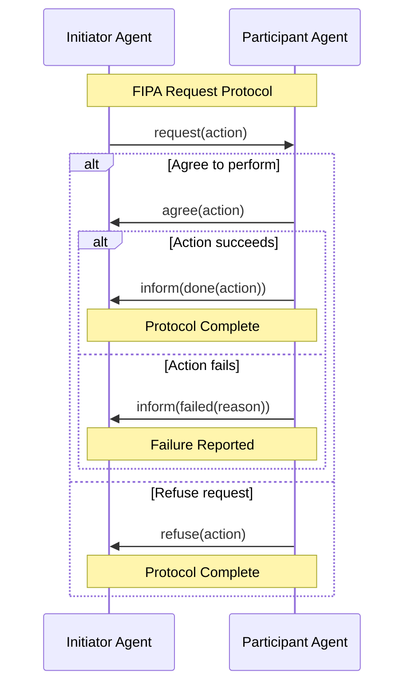
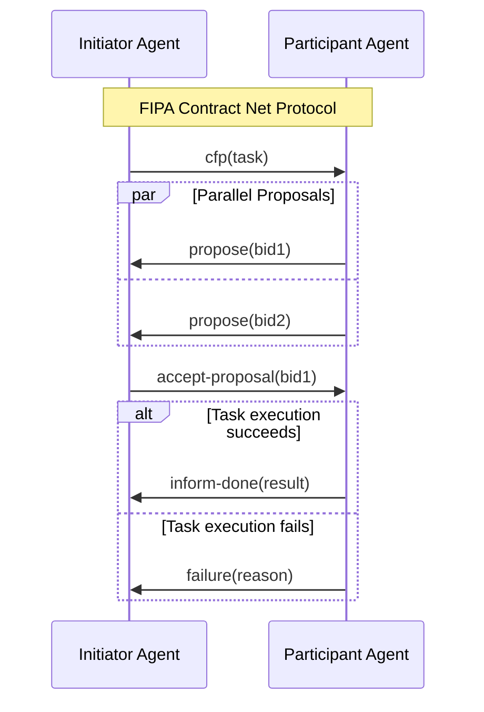
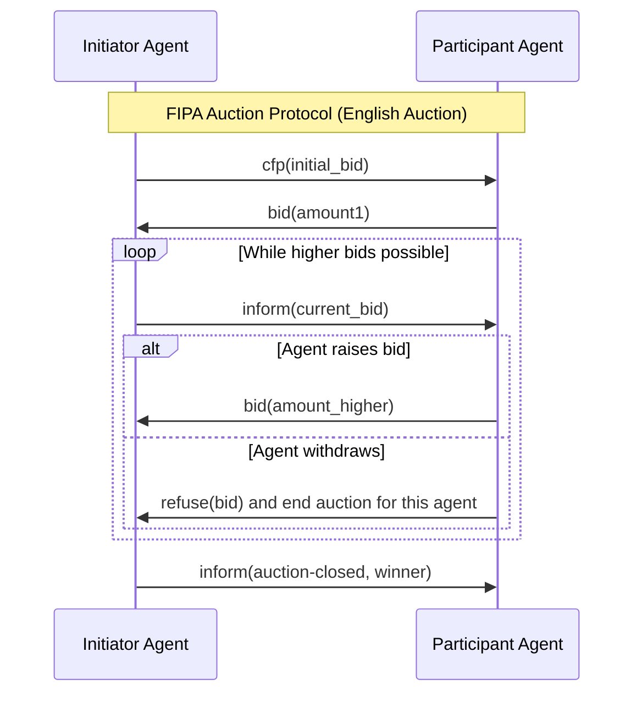

# FIPA Interaction Protocol Message Flows

## Request Protocol

```mermaid
sequenceDiagram
    participant I as Initiator Agent
    participant P as Participant Agent

    Note over I,P: FIPA Request Protocol
    I->>P: request(action)

    alt Agree to perform
        P->>I: agree(action)

        alt Action succeeds
            P->>I: inform(done(action))
            Note over I,P: Protocol Complete
        else Action fails
            P->>I: inform(failed(reason))
            Note over I,P: Failure Reported
        end
    else Refuse request
        P->>I: refuse(action)
        Note over I,P: Protocol Complete
    end
```

## Contract Net Protocol

```mermaid
sequenceDiagram
    participant I as Initiator Agent
    participant P as Participant Agent

    Note over I,P: FIPA Contract Net Protocol
    I->>P: cfp(task)

    par Parallel Proposals
        P->>I: propose(bid1)
    and
        P->>I: propose(bid2)
    end

    I->>P: accept-proposal(bid1)

    alt Task execution succeeds
        P->>I: inform-done(result)
    else Task execution fails
        P->>I: failure(reason)
    end
```

## English Auction Protocol

```mermaid
sequenceDiagram
    participant I as Initiator Agent
    participant P as Participant Agent

    Note over I,P: FIPA Auction Protocol (English Auction)
    I->>P: cfp(initial_bid)
    P->>I: bid(amount1)

    loop While higher bids possible
        I->>P: inform(current_bid)
        alt Agent raises bid
            P->>I: bid(amount_higher)
        else Agent withdraws
            P->>I: refuse(bid) and end auction for this agent
        end
    end

    I->>P: inform(auction-closed, winner)
```
