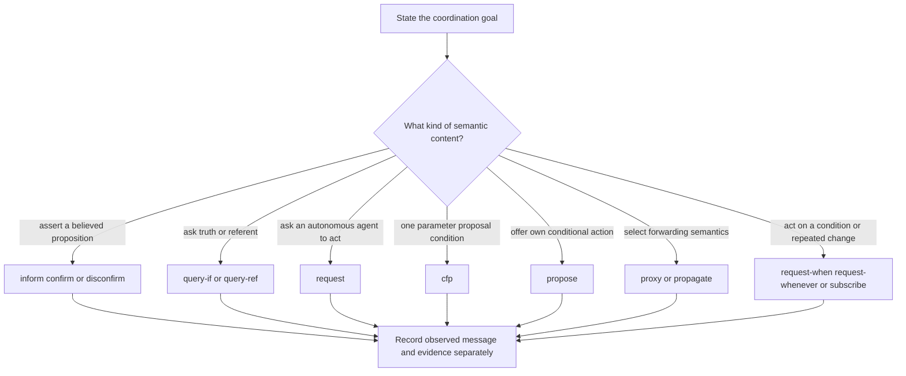
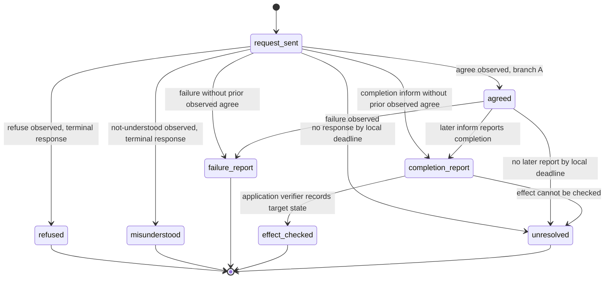

# FIPA communicative-act procedure

Use this skill when a design needs to choose, interpret, or review a FIPA CAL act among autonomous agents: an assertion, question, request, proposal, conditional request, subscription, or a response such as refusal/failure/non-understanding. It is not a transport, identity, authorization, delivery, database-query, or external-effect protocol.

## Source boundary

The primary source is FIPA *Communicative Act Library Specification* **XC00037H**, experimental, dated 2001-08-10. Its archived 44-page body was read on 2026-09-24. It models feasibility preconditions (FPs), rational effects (REs), mental attitudes, and action expressions. It does not establish an implementation's hidden state, authenticate a sender, guarantee delivery or timing, make a recipient act, or prove an external effect.

The later canonical J endpoint was unavailable in this pass. H itself contains printed normative-section and annex variants for some request-derived formulas; retain the cited form and do not assume equivalence. In the annex, `PG` is a **persistent goal**. See [source access](references/source-access.md).

## Working method

1. **Name the claim.** Is the desired result an attitude-level semantic interpretation, a received message, a local protocol disposition, or an independently checked effect? Keep those records separate.
2. **Choose the source form.** Use the act's H definition and preserve sender, receiver, content, embedded actor, content language, ontology, and any relevant quantifier/domain.
3. **Assess FP assumptions.** State which `B`, `U`, `I`, `PG`, `Feasible`, or `Done` facts are source-model assumptions. For a request, name whether the normative §3.19 or annex §5.4.2 form is being followed.
4. **Observe rather than infer.** Record actual act, correlation, message metadata, and time. Silence at a local deadline is an unresolved local outcome, not a CAL refusal/failure/non-understanding act.
5. **Apply a labelled local policy.** A retry, alternate recipient, cancellation request, escalation, sampling interval, or verification method belongs to the application contract. Bind it to an evidence source before making an effect claim.

The diagram selects a semantic family. It does not choose a wire protocol, a timeout, an authentication mechanism, or an effect verifier.

## Fit and diagnostic guide

| Situation | Read first | Diagnostic question |
| --- | --- | --- |
| A message is being treated as proof of completion or truth. | [FP and RE](references/feasibility-preconditions-rational-effects-separation.md) | Which claim is semantic, observed, and independently verified? |
| You need `B`, `U`, `C`, `I`, action sequence, or choice semantics. | [Mental attitudes](references/mental-attitudes-as-coordination-substrate.md) | Is this an SL assumption or actual implementation state? |
| A sender can act but may be redundant/irrelevant. | [Ability and context](references/ability-preconditions-vs-context-relevance.md) | Which FP conjunct is ability and which is relevance? Which H request form is cited? |
| You are deriving `query-if`, `query-ref`, or an action-expression alternative. | [Composition](references/compositional-communication-through-action-expressions.md) | Is `;` a sequence or is `\vert` a one-branch choice? |
| A message was declined, attempted unsuccessfully, or could not be interpreted. | [Failure dispositions](references/failure-modes-of-multi-agent-coordination.md) | Was `refuse`, `failure`, or `not-understood` actually observed, or only silence? |
| A referent can have many descriptions or an apparent open result space. | [Macro acts](references/macro-acts-and-infinite-disjunctions.md) | Which of `ι`, `any`, or `all` applies, and what domain/completeness boundary is stated? |
| You need a CFP, condition-triggered action, recurring trigger, or subscription. | [Conditional requests and proposal composition](references/conditional-requests-and-proposal-composition.md) | Is CFP single-parameter? What cancels it, and what monitoring/lag policy remains local? |

| You need a conditional offer or federation forwarding. | [Routing and proposal acts](references/routing-and-proposal-acts.md) | Who performs the embedded act, whose attitudes are required, and which sender/receiver fields change? |

## Request trace: alternatives, not one continued path

Use a request trace only after choosing a source form and a local terminal/unresolved policy. `agree` and `refuse` are alternatives from the same request observation; a refusal does not continue into an agreed/completion path.

`unresolved` is an explicit local-policy label, not a source-defined FIPA terminal state. A completion report is distinct from a checked effect.

## Review checklist

- [ ] The source edition and section/annex form are named; printed variants are not silently normalized.
- [ ] Each FP attitude is labelled as a source-model assumption or an application-defined, evidenced representation.
- [ ] A response trace uses mutually exclusive observed branches and contains a local unresolved policy.
- [ ] `refuse`, `failure`, `not-understood`, cancellation, and silence are not conflated.
- [ ] For `cfp`, the proposal expression has exactly one parameter or the design explicitly leaves the H formalization's scope.
- [ ] For `request-when`, `request-whenever`, and `subscribe`, cancellation, trigger condition, and persistent/one-time mode are stated; sampling frequency and action lag are separately negotiated if material.
- [ ] A consequential truth/completion claim cites an independent evidence source.

## Original-heading disposition ledger

| Original substantive heading | Retained, corrected, or removed | Destination and reason |
| --- | --- | --- |
| When to Use This Skill | Retained | opening defines the applicable coordination scope. |
| Primary Act Selection Decision Tree | Corrected and retained | working-method diagram; restores source-scoped `propose` and forwarding choices alongside conditional acts. |
| Federation Routing Decision Tree | Corrected and restored | routing-and-proposal reference and sequence diagram retain proxy/propagate selection, envelope fields, strong/weak distinction and brokering correlation; drop guaranteed-delivery claims. |
| Error Handling Strategy Decision Tree | Corrected and retained | request trace and checklist replace fixed timeout bands and automatic recovery claims. |
| Failure Modes and five anti-patterns | Corrected and retained | fit table/checklist preserve command confusion, silent absence, semantic overclaim, composition, and timeout boundaries without invented thresholds or fallbacks. |
| Worked Examples | Corrected and retained | eight references supply bounded worked cases; the original federation, size-limit, and timeout scenarios were unsourced application designs. |
| Quality Gates | Corrected and retained | review checklist names evidence, variants, alternatives, and conditional limits. |
| Bundled Assets | Retained | index and diagrams are linked below. |
| Not-for Boundaries / delegates | Corrected and retained | opening/source boundary identifies excluded protocol roles; unsourced delegate skill names are removed. |

## Assets

- [Reference index](references/INDEX.md)
- [Source access and historical identity](references/source-access.md)
- [Act semantics and evidence](diagrams/01-act-effect.md)
- [Request disposition branches](diagrams/02-request-lifecycle.md)
- [Conditional commitment scope](diagrams/03-conditional-commitment.md)

This is a constructed application observation graph, not a complete FIPA Request interaction protocol. A prior observed `agree` is optional in this graph; the allowed wire protocol must be named separately. A failure report does not establish absence of partial external effects.
