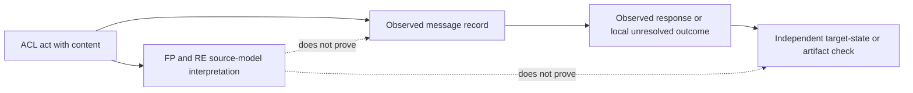

# Act semantics and external evidence

```mermaid
flowchart LR
    A[ACL act with content] --> F[FP and RE source-model interpretation]
    A --> M[Observed message record]
    M --> D[Observed response or local unresolved outcome]
    D --> V[Independent target-state or artifact check]
    F -. does not prove .-> M
    F -. does not prove .-> V
```

FP/RE concern act planning semantics. A received message is a separate observation, and an external-effect claim needs a named evidence source.
