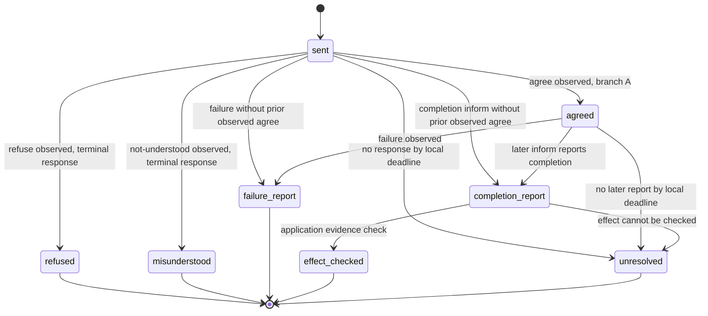

# Request disposition branches

`agree` and `refuse` are alternative observed branches. `unresolved` is a local policy state, not a FIPA-defined terminal state; a completion report remains distinct from checked effect evidence.

This is a constructed application observation graph, not a complete FIPA Request interaction protocol. A prior observed `agree` is optional in this graph; the allowed wire protocol must be named separately. A failure report does not establish absence of partial external effects.
