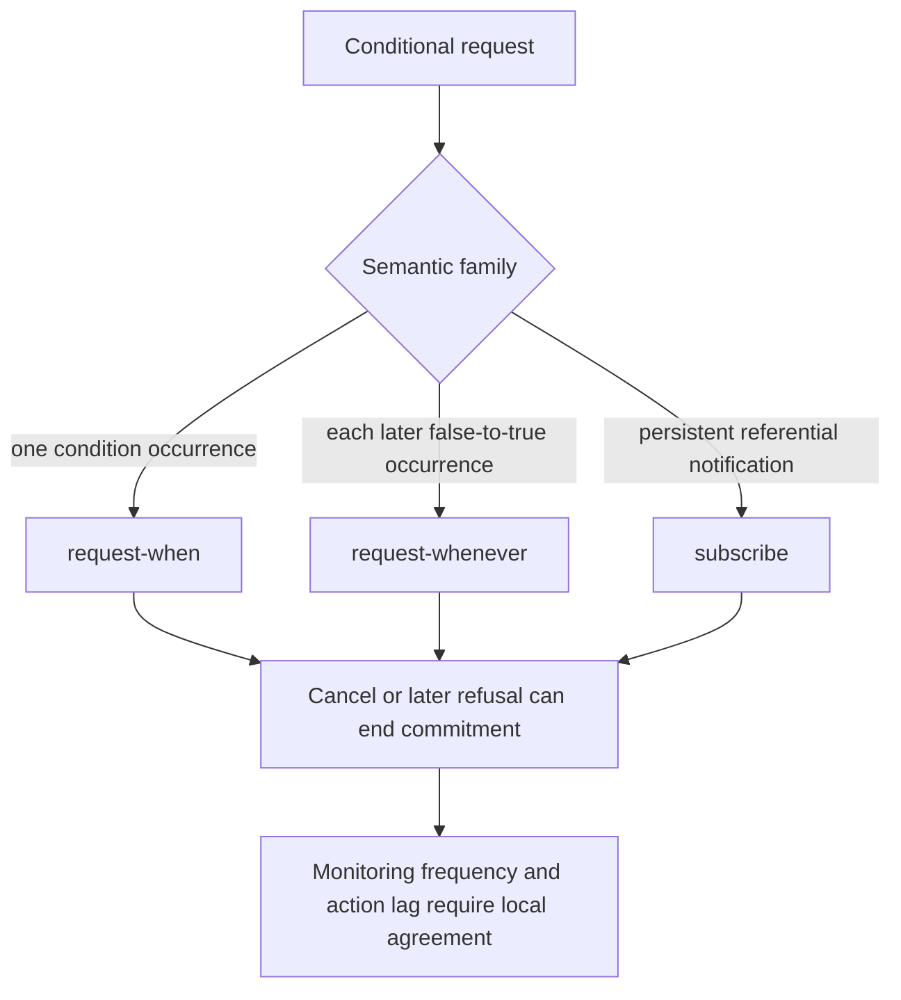

# Conditional commitment scope

XC00037H distinguishes one-time, persistent, and referential notification forms. It does not set a monitor interval, trigger-to-action lag, or cancellation-delivery guarantee.
