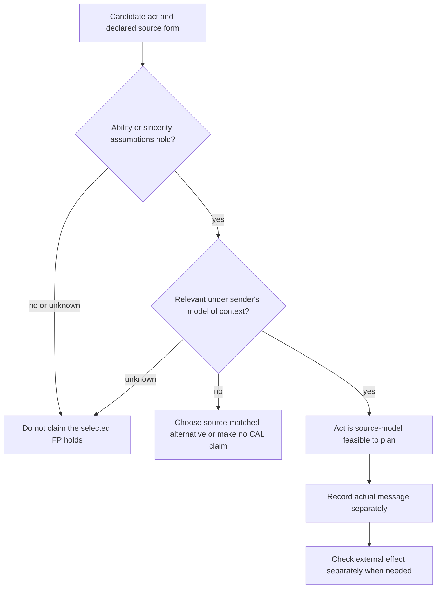

# Separate ability preconditions from context relevance

The FIPA CAL annex splits feasibility preconditions (FPs) into **ability** preconditions and **context-relevance** preconditions. Use the split to explain why an act is selected in the source's planning model. Do not turn it into a live capability registry, an authorization decision, a shared-belief protocol, or a message suppression rule. XC00037H was read in full from the archived experimental **H** PDF on 2026-09-24; the later J endpoint was unavailable.

## Operator glossary

| Term | Source-scoped meaning | Do not treat as |
| --- | --- | --- |
| `FP(a)` | The feasibility preconditions for action expression `a`. | A completed runtime check. |
| ability precondition | The part of an FP that characterises an agent's intrinsic ability to perform a CA. | Authentication, entitlement, or capacity telemetry. |
| context-relevance precondition | The part that characterises relevance in the context of performance. | A universal ban on sending a repeat message. |
| `B_i φ` | Sender `i` believes `φ`. | An externally verified fact. |
| `Bif_j φ` | `j` believes `φ` or its negation. | Delivery or an actual receiver belief. |
| `U_j φ` | `j` is uncertain about `φ`. | A numeric confidence range. |
| `FP(a)[i\backslash j]` | Portion of `a`'s FP that is a mental attitude of requester `i` in a request to `j`. | A complete feasibility test by `j`. |
| `PG_j Done(a)` | Persistent-goal notation, described in §5.2.1 and used in the annex request/query derivation. | Equivalent to the normative request's `I_j Done(a)` without a source-backed equivalence proof. |

## The source's split and the two printed request variants

The annex says that ability preconditions concern intrinsic ability and that relevance preconditions concern the context in which an act is performed. It gives the example that an agent can be intrinsically able to make a promise while believing the promised action is not needed by the addressee. It relates relevance to Gricean quantity and relation maxims.

For `inform`, the operationalised annex form is:

\[
\langle i,\operatorname{INFORM}(j,\varphi)\rangle
\quad FP:B_i\varphi\land\neg B_i(Bif_j\varphi\lor Uif_j\varphi),
\quad RE:B_j\varphi.
\]

Here `B_iφ` is the ability/sincerity portion, while the second conjunct is the context-relevance portion. The source says the sender is **not required to establish** the receiver's actual state; the condition applies only when the sender already has a model of that state.

For `request`, H prints two forms that must remain distinguished:

\[
\text{Section 3.19 normative form:}\qquad
FP(a)[i\backslash j]\land B_i\operatorname{Agent}(j,a)
\land\neg B_i I_j\operatorname{Done}(a),
\quad RE:\operatorname{Done}(a).
\]

\[
\text{Section 5.4.2 annex form:}\qquad
FP(a)[i\backslash j]\land B_i\operatorname{Agent}(j,a)
\land B_i\neg PG_j\operatorname{Done}(a),
\quad RE:\operatorname{Done}(a).
\]

The H text does not establish these as equivalent. When interpreting a specific artifact, cite which printed form it follows. The same kind of difference appears in the annex derivation of `query-if`, which uses `B_i\neg PG_j Done(...)`, while the normative §3.15 form uses `\neg B_i I_j Done(...)`.

## Procedure: classify an FP without inventing a system design

1. Copy the exact act and formula from the relevant H section; record whether it is the normative act definition or an annex derivation.
2. Partition each conjunct only where the source supports it. For `inform`, distinguish sincerity `B_iφ` from relevance about the receiver's presumed attitude.
3. Mark each attitude (`B`, `U`, `I`, `PG`) as an assumption in the semantic model unless a separately specified application representation gives it evidence.
4. If an ability conjunct is absent/unknown, do not claim the act is feasible. If only relevance is absent/unknown, do not silently recast the act as a different FIPA act; inspect the matched `confirm`, `disconfirm`, or request form.
5. Log message observation, authorization, delivery, and any world effect in separate fields. None follows merely from an FP.

## Worked cases

### Assertive act selection

Let `φ = temperature(room_2,high)`.

**Positive case.** Assume `B_sφ` and assume sender `s` has no belief that `r` has a belief or uncertainty attitude toward `φ`. The `inform` FP's ability and relevance portions both hold in the source model. A sent `inform` is then an appropriate source-model selection. If the operational claim is that the room is actually hot, obtain a sensor reading with its own authority and observation time.

**Negative relevance case.** Keep `B_sφ` but assume `B_sU_rφ`. The `inform` relevance conjunct fails; the `confirm` form is the relevant source alternative because its FP is `B_sφ\land B_sU_rφ`. A reminder may be valid product behavior, but it is not automatically one of these CAL acts with a satisfied FP.

**Negative ability case.** If `B_sφ` is unavailable, neither the `inform` nor `confirm` sincerity condition is established. A sender may ask another agent or report a different proposition; it must not assert that the original `inform` FP holds.

### Directive act selection

Let `a=\langle r,archive(record_9)\rangle`. Before describing a request as source-model feasible, retain its embedded actor and specify the H variant used.

**Positive constructed case.** Under **§3.19**, assume `FP(a)[s\backslash r]`, `B_s Agent(r,a)`, and `\neg B_sI_rDone(a)`. The normative request FP is satisfied in the model. Record a request message separately. It does not show `r` is authorized to archive, received the request, or archived `record_9`.

**Negative constructed case.** If `B_s I_rDone(a)` holds, the §3.19 final conjunct fails. Do not replace it with the annex `PG` form or claim their equivalence. A product could still issue a coordination message under its own policy, but must label that policy separately.

## Application diagnostics

| Symptom | Source-model interpretation | What must remain separate |
| --- | --- | --- |
| Sender knows `φ` but models receiver as already certain. | `inform` relevance is not met; inspect `confirm` or `disconfirm` assumptions. | Whether a message was actually delivered or the receiver's model is current. |
| Sender lacks a belief for `φ`. | Assertive sincerity/ability is not established. | Whether some external source could prove `φ`. |
| Request names the wrong embedded actor. | `B_i Agent(j,a)` is not established. | Identity authentication and authorization. |
| Requester believes recipient already intends completion under §3.19. | The normative final request conjunct fails. | Whether recipient truly intends/completes the action. |
| Refusal contains a reason `φ`. | Sender represented infeasibility and a reason in the CAL model. | Reason taxonomy, causal proof, and global capability inference. |

## Original-heading disposition ledger

| Original substantive heading | Retained, corrected, or removed | Destination and source-backed reason |
| --- | --- | --- |
| The Critical Distinction | Retained | opening, split, and classification procedure. |
| Formal Characterization / Ability Preconditions | Corrected and retained | source forms and worked cases preserve `inform` sincerity and request-side assumptions. |
| Context-Relevance Preconditions | Corrected and retained | source forms distinguish recipient-attitude relevance and the two H request variants. |
| Why This Distinction Matters / Redundant Communication | Corrected and retained | assertive negative relevance case; removes unsourced complexity/scaling and shared-tracker claims. |
| Ignoring Existing Commitments | Corrected and retained | directive negative case uses the actual §3.19 `I_j` conjunct. |
| Conversational Mismatch | Corrected and retained | application diagnostics; no automatic refusal is inferred. |
| Practical Implementation / Belief Tracking / Update Models / Refuse | Removed | the Python state store, automatic updates, and context-violation response rule are implementation inventions. |
| Cooperative Redundancy Prevention / Broadcast Awareness | Removed | shared logs and cross-agent suppression are not CAL requirements. |
| CONFIRM vs. INFORM | Retained | assertive worked cases restore source-correct act selection. |
| REQUEST-WHEN vs. Immediate REQUEST | Relocated and corrected | [Conditional requests](conditional-requests-and-proposal-composition.md) restores one-time and persistent methods with source-scoped cadence limits. |
| Gricean Maxims Formalized | Corrected and retained | source split notes the relation to quantity/relation; no manner or implementation claim is added. |
| Common Design Errors and three subheadings | Corrected and retained | procedure and diagnostics retain the useful categories without prescribing code. |
| Practical Recommendations | Removed | implementation mandates and stress-test claims are not in XC00037H. |
| The Deep Insight | Corrected and retained | closing diagnostic boundary replaces the broad social-intelligence claim. |

## Source and access boundary

- FIPA, *Communicative Act Library Specification*, **XC00037H**, experimental, 2001-08-10, archived full 44-page [PDF](https://jmvidal.cse.sc.edu/library/XC00037H.pdf), accessed 2026-09-24. Relevant §§3.5, 3.6, 3.8, 3.15, 3.19 and annex §§5.3–5.5.
- The two printed request forms are reported as distinct H text. No equivalence proof, current transport behavior, identity system, authorization rule, or live agent implementation was inspected.
