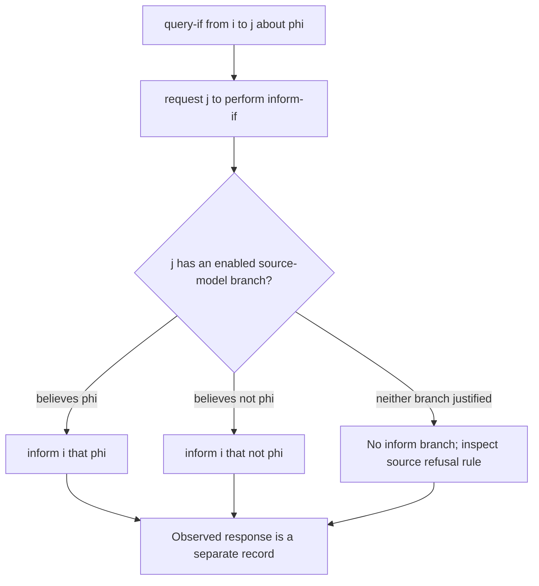

# Compose FIPA communication with action expressions

XC00037H uses action expressions to define composite and macro communicative acts. Apply this reference when interpreting or documenting CAL semantics, not when inventing runtime dispatch, retries, streaming, correlation, or cancellation rules. The source is the archived experimental **H** PDF, fully read on 2026-09-24; the later J edition was not accessible.

## Operator glossary

| Form | Meaning in the source model |
| --- | --- |
| `⟨i, act(j,C)⟩` | Agent `i` performs named act `act` toward `j` with semantic/propositional content `C`. |
| `a` | A schematic action expression that can be substituted into a directive. |
| `a_1 \| a_2` | A disjunctive action expression: when carried out, exactly one disjunctive component is performed. It is not a broadcast to both branches. |
| `a_1 ; a_2` | A sequence used in an inter-agent plan. The source calls such plans sequences of acts using the composition operators; it does not give an application scheduler. |
| `Done(a)` | A formal model predicate, not a transport-level acknowledgement or independently verified effect. |
| `inform-if` | A macro-shaped alternative between informing `φ` and informing `¬φ`. |
| `query-if` | A request that the recipient perform `inform-if`. |
| `inform-ref` | A macro-shaped alternative over `inform` acts that identify a referent. |
| `query-ref` | A request that the recipient perform `inform-ref`. |

The semantic notation needs an agreed content language and ontology in operational use. That requirement does not supply an implementation's serializer, identifier format, authorization model, or an exactly-once rule.

## Procedure: expand only one semantic layer at a time

1. Copy the outer act exactly, including sender, recipient, content, and the actor embedded in an action expression.
2. Identify whether its source definition is a primitive act, a composite act, or a macro act.
3. Expand one named definition into the action expression the source gives. Keep `|` as choice and `;` as sequence; do not translate either into a queue or callback API.
4. Check the embedded act's FP and RE under the source notation. Mark a missing mental-attitude fact as an assumption, not an observed runtime fact.
5. Stop at the first primitive act that would actually be sent. Record application-specific correlation, retries, deadlines, authority, and evidence in a separate layer.

Section 3.9 says that if the inform-if plan cannot be performed (for example, the respondent lacks the relevant belief or will not disclose it), the respondent sends `refuse`. This is source prose, separate from the successful inform-branch expansion. It does not prescribe a retry policy, authenticated transport, or proof of refusal delivery.

## Closed question method: `inform-if` and `query-if`

The annex characterises a yes/no question using an action-expression choice:

\[
\langle j,\operatorname{INFORM}(i,\varphi)\rangle
\;|\;\langle j,\operatorname{INFORM}(i,\neg\varphi)\rangle.
\]

It defines the outer question as:

\[
\langle i,\operatorname{query\hbox{-}if}(j,\varphi)\rangle
\equiv\langle i,\operatorname{request}(j,\langle j,\operatorname{inform\hbox{-}if}(i,\varphi)\rangle)\rangle.
\]

The main act definition (§3.15) gives the query-if FP as:

\[
\neg Bif_i\varphi \land \neg Uif_i\varphi
\land \neg B_i I_j\operatorname{Done}(\langle j,\operatorname{inform\hbox{-}if}(i,\varphi)\rangle).
\]

Use it as a formal check that the questioner does not already have a belief or uncertainty attitude for either truth value, and does not believe the respondent already intends to complete that macro act. The informative annex (§5.5.2) instead prints `B_i ¬PG_j Done(...)` as the last conjunct. This is a source discrepancy, also present between the main and annex request definitions; no equivalence is assumed here. The hand checks below use the §3.15 form only. It is not a generic “no information at all” predicate, an API eligibility rule, or a proof that the respondent knows the answer.

### Worked interpretation

Let `φ = registered(d1,j)`.

1. `i` sends `query-if(j, φ)`.
2. Expand it to a `request` whose embedded action is `⟨j, inform-if(i, φ)⟩`.
3. The response-side alternatives are `⟨j, inform(i, φ)⟩` and `⟨j, inform(i, ¬φ)⟩`.
4. If the observed response is `inform(i, ¬φ)`, it is one selected primitive branch. Record content, observed sender, and any correlation value separately.
5. If an operator needs to establish actual registration, query the designated registry or preserve another independent record. The CAL response does not independently establish it.

**Hand check — positive.** Assume the questioner has neither a belief nor uncertainty attitude for `φ` or `¬φ`, and does not believe `j` already intends the response. The outer query-if FP is satisfied in the model. If `j` sends `inform(i, ¬φ)`, exactly one branch was observed, matching the disjunctive form.

**Hand check — negative.** If `i` already has `B_i φ`, the first FP conjunct fails. A product may still ask the network again for freshness, but it must call that a local policy; it is not a source-supported claim that the CAL `query-if` FP held.

## Open question method: preserve referential form

For a descriptor `Ref x δ(x)`, the source defines:

\[
\langle i,\operatorname{query\hbox{-}ref}(j,Ref\ x\ \delta(x))\rangle
\equiv\langle i,\operatorname{request}(j,\langle j,\operatorname{inform\hbox{-}ref}(i,Ref\ x\ \delta(x))\rangle)\rangle.
\]

The H text says `Ref` may be a definite description `ι`, `any`, or `all`. Before expanding, write down which quantifier form is actually intended and what its domain is. A description of “all services” is set-valued; it is not a request for an unbounded stream.

The PDF's printed query-ref RE line appears directionally inconsistent with its prose and its defining request: the prose says that `i` asks `j` to inform `i`, and the definition embeds `⟨j, inform-ref(i,...)⟩`. Preserve the definition and prose when explaining the response direction; do not turn that printed line into a new normative transport rule.

### Worked interpretation

Use a bounded constructed service vocabulary:

\[
D = \{\operatorname{reserve}(train),\operatorname{reserve}(plane),\operatorname{reserve}(car)\}.
\]

`i` asks `j` for `all x available\hbox{-}service(j,x)`. A source-shaped response has content equating that descriptor with a set such as `{reserve(train), reserve(car)}`.

**Hand check — positive.** If the intended domain is exactly `D` and the reported set is `{reserve(train), reserve(car)}`, the reader can check inclusion/exclusion against all three members. The result says what `j` informed `i` about that descriptor under the chosen domain.

**Hand check — negative.** If the domain boundary is omitted, a reader cannot infer that the same set is complete across services outside `D`. Do not call it a complete database result, and do not invent paging or streaming semantics from `query-ref`.

## Composition review checklist

| Question | Required result |
| --- | --- |
| Which definition is expanded? | Name the CAL act and show the one-level expansion. |
| Is the relation choice or sequence? | State `\|` or `;`; do not silently change a choice into multiple required sends. |
| Which agent is embedded as actor? | Preserve it in every expansion. |
| Which branch was observed? | Identify the primitive act actually received, or state `none observed`. |
| What quantifier and domain apply? | State `ι`, `any`, or `all`, plus the constructed or externally governed domain. |
| What is application policy? | Put correlation, retry, deadline, authorization, and external verification in a separately labelled rule. |

## Original-heading disposition ledger

| Original substantive heading | Retained, corrected, or removed | Destination and source-backed reason |
| --- | --- | --- |
| The Compositionality Principle | Corrected and retained | glossary and expansion procedure; the old “about four primitives” count and programming-language analogy are not used as source claims. |
| The Primitive Acts / INFORM / REQUEST / CONFIRM / DISCONFIRM | Corrected and retained | inform/request are in the FP/RE reference; confirm/disconfirm selection is in the ability/context reference. Main/annex differences remain explicit. |
| Derived Acts Through Disjunction / INFORM-IF | Retained | “Closed question method”; restores disjunctive action-expression semantics. |
| QUERY-IF | Corrected and retained | “Closed question method”; restores the source query-if equivalence and FP, without claiming a successful answer. |
| Practical Implementation Pattern | Removed | Python classes were invented runtime design. The actual §3.9 inform-if refusal rule is retained above; it must not be discarded with the unsourced implementation. |
| Referential Expressions and Infinite Disjunctions / INFORM-REF | Retained | “Open question method”; quantifier and domain discipline retained. |
| QUERY-REF | Corrected and retained | “Open question method”; preserves source direction and identifies the printed RE inconsistency. |
| Practical Implementation | Removed | enumeration/lazy-compute implementation recipes are not specified by the CAL. |
| Call for Proposal | Relocated and corrected | [Conditional reference](conditional-requests-and-proposal-composition.md) restores single-parameter composition and parameter-value RE. |
| REQUEST-WHEN / REQUEST-WHENEVER / SUBSCRIBE | Relocated and corrected | [Conditional reference](conditional-requests-and-proposal-composition.md) restores formulas, triggers, cancellation and hand checks. |
| Building Interaction Protocols from Primitives | Retained | expansion procedure and review checklist; source calls interaction protocols pre-enumerated inter-agent plans. |
| Design Implications for Jury-rig and four subheadings | Removed | product-specific architecture and dynamic-generation claims are outside the historical source. |
| The Power of Composition | Retained | the closing checklist preserves the reusable method rather than the unsupported conclusion. |

## Source and access boundary

- FIPA, *Communicative Act Library Specification*, **XC00037H**, experimental, dated 2001-08-10, archived full 44-page PDF, accessed 2026-09-24: [PDF](https://jmvidal.cse.sc.edu/library/XC00037H.pdf). Relevant material: §§3.15–3.16 and annex §§5.3.6–5.6.
- No current runtime, database, message broker, or FIPA J implementation was inspected for this reference.
