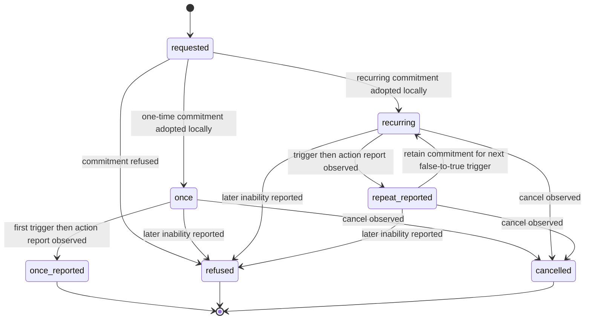

# Conditional requests, subscriptions, and call-for-proposal composition

Use XC00037H's `cfp`, `request-when`, `request-whenever`, and `subscribe` forms to state a semantic commitment shape. Do not infer polling frequency, trigger latency, cancellation delivery, a bidding protocol, or an external effect from these forms. The archived experimental **H** specification was read in full on 2026-09-24; the later J endpoint was unavailable.

## Operator glossary

| Form | Source-scoped reading | Do not read it as |
| --- | --- | --- |
| `Ref x φ(x)` | A referential expression used to identify a value for one parameter in the CFP formalization. | An arbitrary multi-field tender format. |
| `I_i Done(a,φ)` | An intention about `Done(a,φ)`: `a` has just occurred and `φ` was true immediately before it (H §5.2.1). | A recipient obligation or effect receipt. |
| `Enables(e,B_jφ)` | Source-defined relation: event `e` enables `j` to believe `φ`. | A specified sensor, schedule, or trigger implementation. |
| `Has-never-held-since(e',B_jφ)` | Source-defined history condition used by `request-when`. | A durable event-store query. |
| `request-when` | One condition-triggered intended action. | A fixed-rate job or deadline promise. |
| `request-whenever` | Persistent intended action on each later false-to-true change. | A specified monitoring interval or stream. |
| `subscribe` | Persistent `query-ref`-like notification of a referent and later changes. | A cursor, feed, or data-transfer guarantee. |
| `cancel` | A disconfirmation that the sender no longer intends an action. | A guaranteed stop signal or remote cleanup receipt. |

## CFP: request one proposal parameter, not a complete auction protocol

XC00037H describes `cfp` as a general-purpose act to initiate negotiation. Its formalization is restricted to the common case where the proposal condition has **one parameter** `x`; the source explicitly says multiple parameters, demand curves, and free-form responses are outside that formalization.

\[
\begin{aligned}
\langle i,\operatorname{cfp}(j,\langle j,act\rangle,Ref\ x\ \varphi(x))\rangle
\equiv{}&\langle i,\operatorname{query\text{-}ref}(j,Ref\ x\ \alpha(x))\rangle,\\
\alpha(x)={}&I_i\operatorname{Done}(\langle j,act\rangle,\varphi(x))
\Rightarrow I_j\operatorname{Done}(\langle j,act\rangle,\varphi(x)).
\end{aligned}
\]

The §3.4 printed FP is:

\[
\neg Bref_i(Ref\ x\ \alpha(x))\land\neg Uref_i(Ref\ x\ \alpha(x))
\land\neg B_iI_j\operatorname{Done}(\langle j,\operatorname{inform\text{-}ref}(i,Ref\ x\ \alpha(x))\rangle).
\]

Its RE is a disjunction of an informative act carrying a parameter value. The source cautions that this RE is **not itself a proposal by the recipient**; it is the value of the proposal parameter. The annex's query-ref derivation uses the distinct printed `B_i\neg PG_j Done(...)` form, where `PG` is persistent goal. Do not replace the §3.4 `I_j` FP with that annex form or claim them equivalent.

### CFP procedure and hand checks

1. Write `act` with the intended actor and define a single parameter `x` and condition `φ(x)`.
2. State the referential form (`ι`, `any`, or `all`) and the domain for `x`.
3. Record a returned value as an observed message about the parameter. Do not call it acceptance, award, capability proof, or performance.
4. If a system needs ranking, multiple terms, selection, acceptance, or settlement, declare that protocol and its evidence separately.

**Positive constructed case.** Let `act = deliver(parcel_4)` and `φ(x) = price(parcel_4)=x \land x<100`. A CFP can ask for one `x` under this condition. A response carrying `x=82` is a reported parameter value in the source shape. It does not establish a contract, selection, delivery, or payment.

**Negative case.** A request requires price, delivery window, insurance, and cancellation penalty as jointly negotiated fields. Do not present it as covered by the H CFP formalization: it exceeds the source's single-parameter restriction.

## One-time and persistent conditional requests

The H forms are:

\[
\begin{aligned}
\langle i,\operatorname{request\text{-}when}(j,\langle j,act\rangle,\varphi)\rangle
\equiv{}&\langle i,\operatorname{inform}(j,(\exists e')\operatorname{Done}(e')\land\operatorname{Unique}(e')\\
&\land I_i\operatorname{Done}(\langle j,act\rangle,(\exists e)\operatorname{Enables}(e,B_j\varphi)\\
&\land\operatorname{Has\text{-}never\text{-}held\text{-}since}(e',B_j\varphi)))\rangle;
\end{aligned}
\]

\[
\langle i,\operatorname{request\text{-}whenever}(j,\langle j,act\rangle,\varphi)\rangle
\equiv
\langle i,\operatorname{inform}(j,I_i\operatorname{Done}(\langle j,act\rangle,
(\exists e)\operatorname{Enables}(e,B_j\varphi)))\rangle.
\]

Read `request-when` as the one-time case: the intended action is tied to the first relevant becoming-true condition. Read `request-whenever` as the persistent case: when the proposition later becomes false and true again, the action is repeated. The source says the receiving agent should either refuse the commitment or arrange that the action occurs when the condition holds; it also allows a later refusal if it can no longer honor the commitment.

The two reported states cannot cross from one-time to recurring mode. Returning to `recurring` retains the commitment; it does not consume another trigger. Each action-report edge combines a triggering condition with a later observed report; if no report arrives, the application must retain an unresolved record rather than infer performance. The state diagram labels an application observation of a report; it does not assert a standardized transport lifecycle. In particular, XC00037H specifies neither how frequently a condition is re-evaluated nor the lag from condition to enacted action. If either bound matters, negotiate and record it outside these semantic forms.

### Conditional-request hand checks

**Positive one-time case.** `i` uses `request-when(j, ⟨j,inform(i,alarm)⟩, alarm)` to express the intended notification when `j` comes to believe `alarm`. The trace must distinguish: request observed; whether `j` refuses or accepts locally; later notification observed; and any independent alarm evidence. No monitoring interval follows from the CAL act.

**Positive persistent case.** `i` uses `request-whenever(j, ⟨j,inform-ref(i,ιx price(widget)=x)⟩, price(widget)>50)`. A later false-to-true transition may yield another informative act under the source's persistent description. It does not license “send on every sample,” a polling rate, or a bounded-lag alert.

**Negative case.** A system treats one missed notification as proof that `j` never checked the condition. The source leaves evaluation frequency and action lag unspecified; that conclusion requires separate monitoring evidence.

## Subscribe: persistent referential notification

The H form makes `subscribe` a persistent `query-ref` form:

\[
\langle i,\operatorname{subscribe}(j,Ref\ x\ \delta(x))\rangle
\equiv
\langle i,\operatorname{request\text{-}whenever}(j,
\langle j,\operatorname{inform\text{-}ref}(i,Ref\ x\ \delta(x))\rangle,
(\exists y)B_j(Ref\ x\ \delta(x)=y))\rangle.
\]

The source says that a subscription is terminated by `cancel`. It does not say that cancel was delivered, that the recipient stopped checking, that every change was seen, or that values are complete/fresh. Keep those as local evidence questions.

**Positive constructed case.** Let `Ref x δ(x)=ιx(x=exchange-rate(FFR,USD))`. A received informative value is an observed referential response. If an application claims an exchange-rate change, it needs a separately defined source/timestamp check.

**Negative case.** Treating a subscription as a stream with cursor, pagination, exactly-once change delivery, or automatic cleanup adds behavior that XC00037H does not specify.

## Original-material disposition ledger

| Original substantive heading/material | Retained, corrected, or removed | Destination and source-backed reason |
| --- | --- | --- |
| Compositional reference: Call for Proposal | Corrected and restored | CFP section restores the one-parameter condition, query-ref composition, and parameter-value RE boundary. |
| Compositional reference: Request-When | Corrected and restored | one-time formula, trigger, cancellation, and unspecified cadence/lag boundary. |
| Compositional reference: Request-Whenever | Corrected and restored | persistent formula and false-to-true repetition distinction. |
| Compositional reference: Subscribe | Corrected and restored | persistent query-ref composition and cancel boundary. |
| Compositional reference: Building Interaction Protocols | Corrected and restored | CFP procedure names the source boundary; no invented Contract Net execution sequence is retained. |
| Macro reference: Subscribe / CFP | Corrected and restored | subscribe and CFP sections retain semantic composition while removing streaming/auction implementation claims. |
| Macro reference: Implementation patterns and failure handling | Removed | lazy evaluation, streaming, automatic replies, and result policies are not prescribed by XC00037H. |

## Source and access boundary

- FIPA, *Communicative Act Library Specification*, **XC00037H**, experimental, 2001-08-10, archived full 44-page [PDF](https://jmvidal.cse.sc.edu/library/XC00037H.pdf), accessed 2026-09-24. Relevant §§3.3–3.4, 3.20–3.22, and annex §§5.2–5.5.
- No auction protocol, scheduler, monitor, transport, subscription store, identity layer, or external effect system was inspected.
