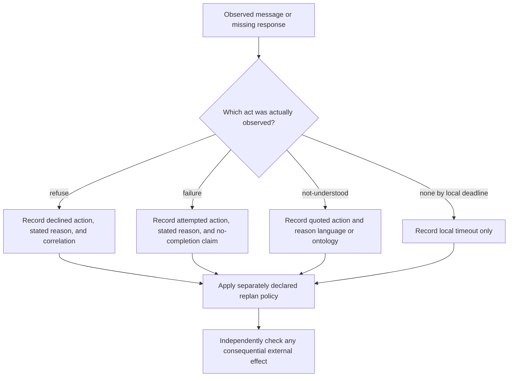

# Diagnose refusal, failure, and non-understanding in FIPA CAL

XC00037H gives three different ways to communicate a coordination problem. Use their distinct semantic content before applying an application retry, replan, or escalation rule. This is a source-bounded reading of the archived experimental **H** specification, fully read on 2026-09-24; the later J endpoint was unavailable.

## Operator glossary

| Form | Meaning in this source model | Do not infer |
| --- | --- | --- |
| `Feasible(a)` | The action expression `a` is feasible under the model. | An observed capability, authorization, or available resource. |
| `Done(a)` | The action predicate used by the formal semantics. | A target-system receipt or irreversible external effect. |
| `Single(e)` | `e` is a single event in the attempted-action account. | A durable trace identifier. |
| `Agent(e,i)` | Event-first notation printed in §3.11; §5.2.1 instead defines actor-first `Agent(i,a)`. Preserve the section-specific ordering. | Authenticated network identity. |
| `φ` | A proposition used as a refusal/failure/understanding reason. | A machine-readable or independently verified cause. |
| `;` | Sequence: the right component follows the left. | Transactional atomicity. |

## Diagnose the observed act before choosing a local policy

The diagram deliberately keeps silence out of the three CAL acts. A deadline is a local policy; it does not turn an absent message into a refusal, an attempted failure, or a parsing result.

## `refuse`: declined before the requested action is done

XC00037H defines refusal as a sequence of a disconfirmation of feasibility and an informative reason:

\[
\begin{aligned}
\langle i,\operatorname{refuse}(j,\langle i,act\rangle,\varphi)\rangle
\equiv {}&\langle i,\operatorname{disconfirm}(j,\operatorname{Feasible}(\langle i,act\rangle))\rangle;\\
&\langle i,\operatorname{inform}(j,\varphi\land\neg\operatorname{Done}(\langle i,act\rangle)
\land\neg I_i\operatorname{Done}(\langle i,act\rangle))\rangle.
\end{aligned}
\]

Its FP and RE are:

\[
\begin{aligned}
FP={}&B_i\neg\operatorname{Feasible}(\langle i,act\rangle)
\land B_i(B_j\operatorname{Feasible}(\langle i,act\rangle)
\lor U_j\operatorname{Feasible}(\langle i,act\rangle))\\
&\land B_i\alpha\land\neg B_i(Bif_j\alpha\lor Uif_j\alpha),\\
RE={}&B_j\neg\operatorname{Feasible}(\langle i,act\rangle)\land B_j\alpha,\\
\alpha={}&\varphi\land\neg\operatorname{Done}(\langle i,act\rangle)
\land\neg I_i\operatorname{Done}(\langle i,act\rangle).
\end{aligned}
\]

### Procedure and hand checks

1. Quote the requested action expression, including its actor. Do not substitute a broad task label.
2. Preserve the stated reason `φ` as message content and record the content language/ontology needed to interpret it.
3. Record that the sender represented the action as infeasible and not done, with no present intention to do it. These are source-model claims, not proof that a real capability or permission is absent.
4. If selecting another recipient is a local policy, re-evaluate the new recipient and create a new request record. Do not reuse a refusal as a universal capability classification.

**Positive constructed case.** Let `a = ⟨r,reserve(ticket_7)⟩` and let `φ = insufficient-funds(account_3)`. A received refusal from `r` whose content quotes `a` and `φ` is correctly classified as a decline before completion. A separate account check may corroborate the reason only if it is authorized and bound to account 3.

**Negative case.** A worker sends `failure(r,a,φ)` after starting the action. Do not relabel it `refuse`: the failure model contains an attempted event. Conversely, a missing response by the caller's deadline does not satisfy the refusal formula.

## `failure`: an attempted action whose requested completion is reported absent

The source defines:

\[
\begin{aligned}
\langle i,\operatorname{failure}(j,a,\varphi)\rangle\equiv
\langle i,\operatorname{inform}(j,\alpha)\rangle,\\
\alpha=(\exists e)\operatorname{Single}(e)\land
\operatorname{Done}(e,\operatorname{Feasible}(a)\land I_i\operatorname{Done}(a))
\land\varphi\land\neg\operatorname{Done}(a)\land\neg I_i\operatorname{Done}(a).
\end{aligned}
\]

Thus the source model says an attempt event occurred while the action was feasible and intended, that `a` is now not done, and that the sender no longer intends `a`. XC00037H calls `φ` the causal reason informally, while explicitly noting that the formal semantics do not express that causality.

### Procedure and hand checks

1. Bind `a` to the exact requested action, and keep any attempt record separate from the CAL formula.
2. Record `φ` verbatim/as structured content according to the content language; label it a *reported reason* unless a causal investigation proves more.
3. Treat partial side effects as unknown until the named target state is independently checked. `¬Done(a)` does not prove that no subevent occurred.
4. Select retry, alternate action, compensation, or escalation only through an explicit application policy keyed to independently gathered evidence.

**Positive constructed case.** Let `a = open(file_7)` and `φ = missing(file_7)`. A failure message whose content identifies `a` and `φ` is an informative report that an attempt occurred and the requested action was not completed in the model. An authorized filesystem readback could establish whether `file_7` exists at its observation time; it cannot retroactively prove the exact attempt event from the CAL message alone.

**Negative case.** A sender says “I cannot open file 7” before attempting it. That may be an appropriate reason for `refuse`; it is not enough to assert the existential attempt event required by `failure`.

## `not-understood`: report an interpretation failure without promising shared understanding

The source defines:

\[
\langle i,\operatorname{not\hbox{-}understood}(j,a,\varphi)\rangle
\equiv\langle i,\operatorname{inform}(j,\alpha)\rangle,
\]

with the ordinary informative FP/RE and

\[
\alpha=\varphi\land(\exists x)B_i\bigl((\iota e\ \operatorname{Done}(e)
\land\operatorname{Agent}(e,j)\land B_j(\operatorname{Done}(e)
\land\operatorname{Agent}(e,j)\land(a=e)))=x\bigr).
\]

The printed `Agent(e,j)` ordering here differs from the actor-first `Agent(j,a)` definition in §5.2.1. This transcription preserves §3.11 rather than silently repairing the source.

The H text says the model cannot fully capture the intended semantics of an action not being understood. It also warns that the reason `φ` is not guaranteed to be represented in a way the original sender will understand.

### Procedure and hand checks

1. Preserve the received/quoted action `a` rather than replacing it with an exception class.
2. Identify whether the stated reason is about the content language, ontology, or another interpretation condition. The source example uses an unknown ontology.
3. State the language in which `φ` is expressed. A bare text reason still must be a propositional assertive statement that its sender can understand and evaluate.
4. If an application tries a different representation, record that as a new local communication policy. It is not a CAL-mandated fallback ladder.

**Positive constructed case.** `j` sends a `query-if` carrying ontology `weather-v3`; `i` recognizes the message event but cannot interpret that ontology. A `not-understood` that quotes the action and uses `unknown(ontology,weather-v3)` as its reason matches the source's form.

**Negative case.** A response arrived late but was interpreted normally. Lateness alone does not establish non-understanding. Section 3.11 does, however, explicitly allow an unexpected message in a predefined protocol as a reason for not understanding; distinguish that case from an understood message that merely missed a deadline.

## Cancellation boundary

`cancel` communicates that the sender no longer intends another agent's action:

\[
\langle i,\operatorname{cancel}(j,a)\rangle
\equiv\langle i,\operatorname{disconfirm}(j,I_i\operatorname{Done}(a))\rangle.
\]

It is not a request to stop and does not guarantee that the recipient stops an ongoing action. If a system needs a stop effect, it needs a separately observed request/response/effect procedure.

## Original-heading disposition ledger

| Original substantive heading | Retained, corrected, or removed | Destination and source-backed reason |
| --- | --- | --- |
| The Explicit Failure Vocabulary | Retained | diagnosis diagram and three act sections. |
| REFUSE / Formal Definition / Translation | Corrected and retained | `refuse` section restores sequential formal definition and sender-scoped feasibility. |
| Practical Example / Why Refuse is Critical | Corrected and retained | procedure and positive/negative checks replace invented Python policy and product claims. |
| FAILURE / Formal Definition / Translation | Corrected and retained | `failure` section restores attempt-event content and formal causality boundary. |
| Practical Example / Why Failure is Critical | Corrected and retained | hand checks and effect check replace retry taxonomy claims. |
| NOT-UNDERSTOOD / Formal Definition / Translation | Corrected and retained | `not-understood` section restores the source limitation and reason-language condition. |
| Practical Example / Why Not-Understood is Critical | Corrected and retained | ontology case and local-policy boundary replace an invented fallback implementation. |
| Compositional Failure Handling / Cancel: Retracting Intentions | Corrected and retained | cancellation boundary restores the source's limited disconfirmation semantics. |

## Source and access boundary

- FIPA, *Communicative Act Library Specification*, **XC00037H**, experimental, 2001-08-10, archived full 44-page [PDF](https://jmvidal.cse.sc.edu/library/XC00037H.pdf), accessed 2026-09-24. Relevant §§3.3, 3.7, 3.11, 3.17 and annex §§5.2–5.4.
- No current FIPA implementation, transport, identity layer, retry policy, or effect store was inspected.
