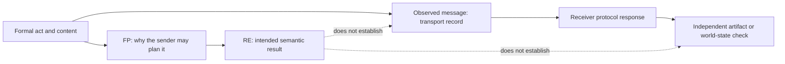

# Separating feasibility preconditions, rational effects, and observed outcomes

Use the FIPA Communicative Act Library (CAL) model to make a *semantic* claim about an act, then record protocol and world evidence separately. XC00037H is an experimental historical specification, read in full from the archived **H** PDF on 2026-09-24; the later canonical J endpoint was not accessible. This reference does not claim conformance by a current transport or agent runtime.

## Operator glossary

The notation below is the CAL's formal-language notation, not a wire receipt.

| Term | Use in the reviewed H source | Do not read it as |
| --- | --- | --- |
| `B_i φ` | Agent `i` believes proposition `φ`. | An independently verified fact about the world. |
| `I_i φ` | Agent `i` intends `φ`. | A command that another agent must carry out. |
| `U_i φ` | Agent `i` is uncertain about `φ`. | A measured probability or confidence score. |
| `Bif_i φ` | `B_i φ ∨ B_i ¬φ`: `i` believes one truth value. | “`φ` is true.” |
| `Uif_i φ` | `U_i φ ∨ U_i ¬φ`: uncertainty about one truth value. | A delivery status. |
| `Done(a)` | The source's action-completion predicate in its semantic model. | A database readback, physical effect, or audit event. |
| `FP(a)[i\j]` | The part of action `a`'s feasibility preconditions that concerns `i` when `j` is the requested actor. | A capability check performed by a particular implementation. |
| `Agent(j,a)` | `j` is the actor of action expression `a`. | Authentication or authorization of a network principal. |
| `PG_j Done(a)` | Persistent goal that action a be done; §5.2.1 distinguishes persistent goals from intentions. | Evidence that `j` will or did complete `a`. |

The source divides FPs into **ability** preconditions (for example, sincere belief before an assertive) and **context-relevance** preconditions (for example, not needlessly repeating information). That distinction is useful during interpretation: it says why an act is a candidate in the model; it does not decide whether a receiver accepts it.

## Read an act in four ledgers

For every act, write one row in each ledger before treating it as a meaningful result.

1. **CAL semantics.** Preserve the act, its content, FP, and RE exactly enough to inspect the intended interpretation.
2. **Message observation.** Record the actual message identifier, sender/receiver names as asserted by the transport, and receive time. This is evidence that a message was observed, subject to the transport's own rules.
3. **Protocol disposition.** Record an `agree`, `refuse`, `failure`, `inform`, or no response as a message-level event. A local timeout means only that this observer did not receive the expected response within its policy window.
4. **Effect evidence.** For a consequential claim, read an appropriate target state or obtain an independently specified receipt. Bind it to the requested object, version, authority, and observation time.

This procedure makes the uncertainty inspectable without turning the CAL into a modern delivery, identity, or storage standard.

## Source-correct core forms

The H annex gives the operationalised `inform` model as:

\[
\langle i, \operatorname{INFORM}(j,\varphi)\rangle
\quad FP: B_i\varphi \land \neg B_i(Bif_j\varphi \lor Uif_j\varphi)
\quad RE: B_j\varphi.
\]

Read it in two passes. The ability condition is that `i` believes `φ`. The relevance condition says `i` does not believe `j` already has a belief or uncertainty attitude about `φ`. Its `RE` is a receiver belief attitude in the model. It is not a claim that `φ` is true, that `j` received a packet, or that a service changed state.

The H informative annex (§5.4.2) prints this directive `request` model; the main §3.19 form differs as noted below:

\[
\langle i, \operatorname{REQUEST}(j,a)\rangle
\quad FP: FP(a)[i\backslash j] \land B_i\operatorname{Agent}(j,a)
       \land B_i\neg PG_j\operatorname{Done}(a)
\quad RE: \operatorname{Done}(a).
\]

Here `a` is an action expression. The H document prints two different request forms: the main act definition in §3.19 uses `¬B_i I_j Done(a)`, while this informative annex (§5.4.2) uses `B_i ¬PG_j Done(a)`. Both are present in the reviewed source. Do not silently substitute one for the other or claim they are equivalent: their operators and placement of negation differ. Section 5.2.1 defines `PG` as persistent goal and intention as a persistent goal imposing action; that prose alone is not a proof that the two full FP expressions are equivalent. Neither RE is an observed external completion. The source says that a directive's content can itself be an action expression; it does not assign a transport acknowledgement, deadline, authentication rule, or effect receipt.

## Procedure: interpret an `inform` and test the evidence boundary

Suppose dispatcher `d` tells monitor `m` that a job record has status `ready`.

1. Set `φ = ready(job_17)` and write the CAL row as `⟨d, INFORM(m, φ)⟩`.
2. Ask the **semantic** questions: does `d` model `B_d φ`? Does `d` model the relevance condition? If either answer is unavailable, mark the FP assessment `unknown`; do not manufacture a belief state from a log line.
3. Record the message observation separately, for example `acl-184 received by m at T1`. This establishes only the stated observation.
4. If `m` replies, record its actual act and content. A returned `inform` can report `B_m φ` under the model; it is still not a target-system readback.
5. If the claim is “job 17 is ready in the scheduler,” query the scheduler's designated state interface and retain the returned version/receipt as the effect-evidence row.

**Hand check — positive semantic case.** Assume `B_d ready(job_17)` and `¬B_d(Bif_m ready(job_17) ∨ Uif_m ready(job_17))`. The two conjuncts satisfy this *operationalised* `inform` FP, so `inform` is the source-selected assertive model. If the scheduler readback at `T2` says `ready`, the final claim may say: “the dispatcher sent the act, and the scheduler was observed ready at `T2`.” It may not collapse those two observations into proof that `m` adopted the belief.

**Hand check — negative relevance case.** Keep `B_d ready(job_17)` but assume `B_d B_m ready(job_17)`. The source's relevance conjunct fails. Sending a message may still be possible in an application, but this reference must not label that send as satisfying the CAL `inform` FP. If a transport retries it, that is a local transport policy, not a repaired FIPA formula.

## Procedure: interpret a request without treating it as a command

For `⟨d, REQUEST(r, deliver(parcel_4))⟩`:

1. Preserve the requested action expression, including its actor: `a = ⟨r, deliver(parcel_4)⟩`.
2. Evaluate only the request formula's sender-side conditions as formal assumptions: `FP(a)[d\r]`, `B_d Agent(r,a)`, and `B_d ¬PG_r Done(a)`.
3. Store a distinct application authorization decision if the transport needs one. `Agent(r,a)` is not that decision.
4. Await actual subsequent acts. `agree` communicates an intention about an action under a stated condition; `refuse` communicates a refusal with a reason; neither is a parcel-delivery receipt.
5. For delivery, examine the designated custody or destination record. If it cannot be observed, report the effect as `unverified`.

| Observed trace | What can be said | What remains unlicensed |
| --- | --- | --- |
| `request` sent | The sender emitted a request message. | `r` accepted, received, or performed it. |
| `agree` received | `r` communicated the agreement's semantic content. | The action is complete. |
| `failure` received | `r` reported the failure content. | The external action never partially occurred. |
| no reply by local deadline | The observer's deadline passed without the expected reply. | `r` refused, crashed, or never received the request. |
| target-state receipt | The named evidence source observed its claimed state. | Any broader state not covered by that source. |

## How to state a result

Use a layered sentence: “At `T1`, monitor `m` observed an ACL `inform` from `d` with content `ready(job_17)`; at `T2`, the scheduler's state readback reported version `v9` as ready.” This preserves the model's mental-attitude claim, the message observation, and the independently observed target state.

Do not state “FIPA guarantees delivery,” “an `inform` proves `φ`,” “an `agree` completes the action,” or “a timeout proves refusal.” XC00037H itself treats rational effects as planning semantics and says some operational uses fall outside that formal semantics.

## Original-heading disposition ledger

| Original substantive heading | Retained, corrected, or removed | Destination and reason |
| --- | --- | --- |
| Core Principle | Corrected and retained | “Read an act in four ledgers”; replaced universal outcome prose with source-scoped semantic/evidence separation. |
| The Formal Structure | Corrected and retained | “Source-correct core forms”; preserves the operationalised `inform` and distinguishes the main/annex `request` formulas. |
| Why the Gap Exists | Retained | “Read an act in four ledgers”; autonomy/observation distinction is reframed without unsupported timing claims. |
| Implications for Agent System Design / Never Assume Compliance | Retained | “Procedure: interpret a request”; replaces invented request formula and command language with a hand-checkable trace. |
| Design for Explicit Rejection | Retained | request outcome table; keeps `refuse` as a message disposition, not proof about a world effect. |
| Model Intentions, Not Commands | Corrected and retained | request procedure and result wording; source form is a directive with `RE: Done(a)`, so it is not paraphrased as a mere sender inform. |
| Use Agree/Refuse to Model Commitment | Corrected and retained | request procedure and outcome table; agreement/refusal are distinguished from effect evidence. |
| The Alternative: Synchronized Distributed Systems | Removed | The source reviewed does not establish the asserted comparison, blocking behavior, or scaling claim. |
| Practical Design Pattern: Request-Agree-Inform | Retained | request procedure and trace table; the pattern is now labelled an interpretation workflow, not a required protocol. |
| When Does This Matter Most and four subheadings | Removed | The domain-specific trust, scale, and robot claims were not sourced by XC00037H. |
| The Deep Lesson | Removed | Replaced by source-bounded reporting guidance; the original universal conclusion was not a formal or empirical result of the reviewed PDF. |

## Source and access boundary

- FIPA, *Communicative Act Library Specification*, **XC00037H**, experimental, dated 2001-08-10, archived full 44-page PDF, accessed 2026-09-24: [PDF](https://jmvidal.cse.sc.edu/library/XC00037H.pdf). Relevant material: annex §§5.3–5.4, especially the abbreviations, FP/RE explanation, `inform`, and `request`.
- The canonical J endpoint was unavailable in this research pass. No current implementation, transport, identity system, or effect-verification behavior is attributed to FIPA.
