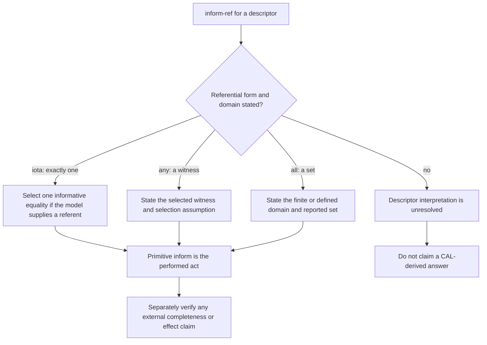

# Macro acts, referential expressions, and infinite disjunctions

Use a FIPA CAL macro act to express a family of possible informative acts without pretending that the family is a message queue, query engine, or streaming contract. This is an interpretation method for archived experimental XC00037H, read in full on 2026-09-24. The accessible source is H, not the later canonical J edition.

## What the macro form says

The source presents `inform-ref` as:

\[
\langle i,\operatorname{INFORM\hbox{-}REF}(j,\iota x\ \delta(x))\rangle
\equiv
\langle i,\operatorname{INFORM}(j,\iota x\ \delta(x)=r_1)\rangle
\;|\;\ldots\;|\;
\langle i,\operatorname{INFORM}(j,\iota x\ \delta(x)=r_n)\rangle,
\]

where the source explicitly allows `n` to be infinite. Section 3.10 says the agent may elect to send `refuse` if it cannot establish the act’s preconditions; this discretionary wording differs from the inform-if refusal wording in §3.9. The formalism makes it possible to plan or request the macro act. When it is carried out, the source says that **an `inform` act is what is sent and what can be said to be `Done`**. It does not say that an implementation should enumerate `r_1, r_2, …`, compute lazily, keep a subscription, or return database pages.

## Operator glossary

| Form | Source-scoped meaning | Required interpretation discipline |
| --- | --- | --- |
| `ιx δ(x)` | The definite description “the `x` which is `δ`.” | State what establishes uniqueness; do not silently choose among multiple candidates. |
| `any x δ(x)` | A referential form allowed by `Ref`. | State the domain and what counts as an acceptable witness. |
| `all x δ(x)` | A referential form allowed by `Ref`; may denote a set of objects. | State the completeness boundary for the set. |
| `Bref_i Ref x δ(x)` | A belief-attitude abbreviation for knowing a referent; the source spells it out for `ι`. | Do not translate it into a database lookup or identity proof. |
| `Uref_i Ref x δ(x)` | The analogous uncertainty-attitude form. | Do not replace it with a numeric confidence threshold. |
| `r_1 … r_n` | Candidate referents in the macro's disjunctive schema. | Do not allocate, enumerate, or transmit them merely because the notation contains them. |
| `\|` | Non-deterministic choice of one component when carried out. | Do not read as “return every candidate.” |

The H appendix defines `Bref_i ιxδ(x)` as `(∃y) B_i(ιxδ(x)=y)`. It also says that “knowledge” in its formal text abbreviates “believes or is uncertain of.” Keep that historical attitude vocabulary separate from an application's proof, authorization, or retrieval schema.

## Procedure: make a referential request inspectable

1. Write the descriptor and choose the actual form: `ι`, `any`, or `all`.
2. Declare the domain. It may be a constructed finite set for an example or an externally governed vocabulary; never leave “all” unbounded by accident.
3. Expand a `query-ref` only to its source definition: a `request` that `j` perform `inform-ref` to `i`.
4. Record the source-model assumptions: requester lacks the referent/has no uncertainty attitude as required by the query-ref FP; respondent is believed able to inform the requester. Mark unobserved attitudes as assumptions.
5. At performance time, identify the one primitive `inform` act actually observed and its equality content.
6. Perform a separate completeness, truth, or effect check if the consuming claim needs one. Its procedure comes from the relevant system, not the macro-act definition.

## Bounded constructed example

Let the agreed, constructed domain be

\[
D=\{\operatorname{reserve}(train),\operatorname{reserve}(plane),\operatorname{reserve}(car)\}.
\]

Let `δ(x) = available-service(j,x)`. Agent `i` sends:

\[
\langle i,\operatorname{query\hbox{-}ref}(j, all\ x\ \delta(x))\rangle.
\]

By the source definition this requests:

\[
\langle j,\operatorname{inform\hbox{-}ref}(i, all\ x\ \delta(x))\rangle.
\]

Assume `j` sends a primitive informative response whose content equates the descriptor with

\[
\{\operatorname{reserve}(train),\operatorname{reserve}(car)\}.
\]

**Positive hand check.** With the declared domain `D`, check all three members: train and car are present; plane is absent. The response is an observed `inform` about this descriptor and set. If an independently controlled service catalogue for exactly `D` agrees at a recorded time, that catalogue check supports a bounded completeness statement.

**Negative hand check.** Remove the domain declaration. The same set no longer supports “these are all services,” because there may be services outside the implicit vocabulary. Also, it does not license an assertion that `j` searched a database, that no service will appear later, or that a response stream is complete.

## Quantification cases that must stay distinct

| Form | Bounded example | Valid statement | Invalid shortcut |
| --- | --- | --- | --- |
| `ιx δ(x)` | `ιx primary-contact(x)` in a catalogue whose invariant names exactly one primary contact. | “The source-model response names the unique referent under the stated invariant.” | Pick the first of two contacts and call it the definite description. |
| `any x δ(x)` | `any x reserve-option(x)` over `D`. | “The response supplies this witness under the stated domain and selection assumption.” | Treat one witness as the best, only, or complete answer. |
| `all x δ(x)` | all available services over `D`. | “The response reports this set for the declared domain.” | Treat a finite message as a universal, future-proof listing. |

For `ι`, a zero- or multi-candidate result fails the example's uniqueness assumption. For `any`, a witness can be adequate without uniqueness. For `all`, the operative question is the declared domain and its completeness authority. These are semantic and evidence distinctions, not algorithm choices supplied by the CAL.

## What macro acts do and do not license

| Source-supported semantic claim | Not licensed by XC00037H alone |
| --- | --- |
| A macro may be planned or requested as a disjunction of informative acts. | An implementation strategy such as lazy evaluation or finite pre-enumeration. |
| A disjunctive macro selects one component when carried out. | That each candidate is sent, tried, or returned. |
| `inform-ref` can express a potentially infinite family (`n` may be infinite). | An infinite result stream, cursor, pagination protocol, or termination rule. |
| `query-ref` asks another agent for an object or set described by a referential expression. | A SQL/database query, authenticated data source, freshness guarantee, or complete search. |
| The performed act is an `inform` according to the source model. | Truth of the reported equality or a verified external side effect. |

## Original-heading disposition ledger

| Original substantive heading | Retained, corrected, or removed | Destination and source-backed reason |
| --- | --- | --- |
| The Challenge of Unbounded Information Spaces | Corrected and retained | opening and bounded example; open-ended possibilities are expressed semantically, without claiming particular domains are infinite. |
| Primitive Acts vs. Macro Acts / Primitive Acts / Macro Acts | Corrected and retained | “What the macro form says”; preserves the source distinction between planned macro and performed `inform`. |
| The Inform-Ref Macro Act / Definition / Formal FPs and RE | Corrected and retained | opening, glossary, and procedure; restores formal disjunction and avoids invented implementation behavior. |
| Example: Stock Price Query | Removed | The decimal enumeration and “lazy” execution asserted an implementation method absent from the CAL. |
| Query-Ref / Definition / FPs | Retained | “Procedure: make a referential request inspectable”; preserves query-ref as request for inform-ref. |
| Example: Database Query | Corrected and retained | bounded constructed service example; avoids calling a referential act a database result guarantee. |
| Implementation Patterns / Lazy Evaluation / Set-Valued / Ambiguity / Streaming | Removed | These were unsourced runtime APIs, refusal/failure rules, and streaming claims. The quantifier table retains the useful semantic distinction. |
| Composition with Other Macro Acts / Subscribe / Call for Proposal | Relocated and corrected | [Conditional reference](conditional-requests-and-proposal-composition.md) restores these methods and their limits. |
| Handling Failure Cases / FP Violations / Partial Knowledge | Corrected and retained | procedure marks source-model assumptions unknown; no automatic response behavior is inferred. |
| Referential Operators: iota, any, all and three subheadings | Retained | “Quantification cases that must stay distinct”; restores domain, uniqueness, witness, and set-completeness method. |
| Design Implications for Jury-rig and five subheadings | Removed | pre-enumeration, lazy resolution, streaming, and degradation rules were product implementation claims, not CAL semantics. |
| When to Use Macro Acts | Retained | source-supported/not-licensed table gives the selection boundary. |
| The Deep Lesson | Corrected and retained | closing boundary table replaces broad implementation conclusion with explicit source scope. |

## Source and access boundary

- FIPA, *Communicative Act Library Specification*, **XC00037H**, experimental, dated 2001-08-10, archived full 44-page PDF, accessed 2026-09-24: [PDF](https://jmvidal.cse.sc.edu/library/XC00037H.pdf). Relevant material: §§3.10, 3.16 and annex §§5.3.8 and 5.5.
- The canonical J endpoint was unavailable. This document does not assert a contemporary FIPA implementation, query interface, result-size behavior, or transport guarantee.
