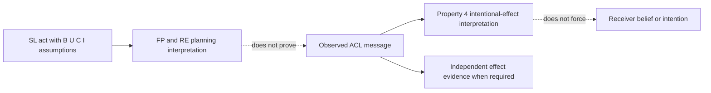

# Use mental-attitude semantics without claiming hidden agent state

XC00037H's Semantic Language (SL) is a first-order modal language with identity for describing communicative-act semantics. It is a planning model: it supplies formal attitudes and action expressions used to select and interpret acts. It does not expose a running agent's private state, prescribe a particular BDI data structure, or establish an external effect. The archived experimental **H** PDF was fully read on 2026-09-24; the later J endpoint was unavailable.

## Operator glossary

| Operator or form | Source-scoped reading | Do not read it as |
| --- | --- | --- |
| `B_i p` | `i` implicitly believes `p`. The H source gives `B` a KD45 possible-worlds semantics with a fixed-domain principle. | A database row or a proof that `p` is true. |
| `U_i p` | `i` is uncertain of `p` while regarding `p` as more likely than `¬p`. | A portable probability or numeric confidence band. |
| `C_i p` | `i` currently desires that `p` holds. | An authorization grant or an execution command. |
| `I_i p` | An intention form used in the act/planning properties. | A receipt that `p` will occur. |
| `Bif_i p` | `B_i p \lor B_i\neg p`: `i` believes one truth value. | Knowledge established to another observer. |
| `Uif_i p` | `U_i p \lor U_i\neg p`: uncertainty about one truth value. | Ignorance, delivery loss, or a numeric score. |
| `a_1 ; a_2` | Action sequence where `a_2` follows `a_1`. | Atomic transaction. |
| `a_1 \vert a_2` | Non-deterministic choice: either component occurs, not both. | A parallel fan-out. |

The H annex explicitly says that its mental model does **not** entail a particular design: goals and intentions may be explicit BDI structures or implicit in a call stack/programming assumptions. Use that statement to avoid claiming introspection into a remote implementation.

## Procedure: separate formal attitude, observed message, and effect evidence

1. State the act in SL notation and list its FP/RE attitudes.
2. Mark each `B`, `U`, `C`, or `I` fact as a source-model assumption unless an application has an explicit, authoritative representation for it.
3. Record the observed message separately: asserted sender/receiver, content, language/ontology, correlation, and time.
4. Interpret the receiving act as an entitlement within the model: an observed act supports a belief about the performer's intention to achieve its RE (Property 4). It does not force the receiver to adopt the RE.
5. If the conclusion concerns the external world, obtain a separately defined state readback or artifact receipt.

## Source-correct act selection from recipient attitude assumptions

For an assertive content `φ`, the operationalised source forms are:

\[
\begin{aligned}
\langle i,\operatorname{INFORM}(j,\varphi)\rangle&:
FP=B_i\varphi\land\neg B_i(Bif_j\varphi\lor Uif_j\varphi),\quad RE=B_j\varphi;\\
\langle i,\operatorname{CONFIRM}(j,\varphi)\rangle&:
FP=B_i\varphi\land B_iU_j\varphi,\quad RE=B_j\varphi;\\
\langle i,\operatorname{DISCONFIRM}(j,\varphi)\rangle&:
FP=B_i\neg\varphi\land B_i(U_j\varphi\lor B_j\varphi),\quad RE=B_j\neg\varphi.
\end{aligned}
\]

Use the following hand procedure.

1. Declare `φ` and the sender's assumed attitude about it.
2. Declare the sender's assumption about the receiver: no known attitude, uncertainty, or belief/uncertainty in the opposite direction.
3. Select the formula whose FP matches those assumptions; if no source-model FP matches, do not silently choose a synonym.
4. Keep the result as a semantic act selection. The H source says the receiver's actual attitude change depends on its trust in the sender's sincerity and reliability.

**Positive constructed case.** Let `φ = ready(job_8)`. If `B_s φ` and the sender has no belief that receiver `r` has a belief or uncertainty attitude about `φ`, the `inform` FP is the source-matched selection. If instead the sender assumes `B_s U_r φ`, `confirm` is the matched assertive. In either case, a scheduler readback is needed to establish an actual job state.

**Negative constructed case.** Assume `B_s φ` and `B_s B_r φ`. The `inform` relevance conjunct fails. An application may still send a reminder, but calling that message a CAL `inform` with satisfied FP would require a different, sourced argument. Similarly, do not map `U_r φ` to “confidence 0.6–0.9”: XC00037H supplies no such threshold.

## Planning properties: what they say and where they stop

The H annex connects intention and act planning under source-model conditions. In simplified notation, Property 1 says that if `p` is an RE of known act type `a_k` and the source’s goal condition `¬C_i ¬Possible(Done(a_k))` holds, then an intention for `p` leads to an intention that one of the acts `a_1\vert\ldots\vert a_n` is done. Property 2 requires either believing feasibility or intending to establish that belief when intending `Done(a)`; it is not a claim that every intention triggers a new feasibility action. Property 3 states:

\[
I_i\operatorname{Done}(a)\Rightarrow I_i\operatorname{RE}(a).
\]

Property 4 gives the consuming-side intentional-effect interpretation:

\[
B_i\bigl(\operatorname{Done}(a)\land\operatorname{Agent}(j,a)
\Rightarrow I_j\operatorname{RE}(a)\bigr).
\]

The outer observer belief `B_i` is essential: this formula describes the observer’s interpretation, not an unqualified fact about the performer. The source also gives a more precise nested consequent `I_j B_i I_j RE(a)`; that variant is not silently substituted here.

These properties make a disciplined *planning interpretation*. They do not establish that the RE follows merely because the message was sent: the source uses an independent-agent example to say exactly that the requested party may be busy and not act.

## Application diagnostic: avoid three category errors

| Observation or implementation claim | Correct status |
| --- | --- |
| A message carries performative `inform`. | Observed message syntax; record it. |
| The sender satisfies `B_s φ`. | Semantic-model assumption unless a defined state representation establishes it. |
| The receiver is forced to believe `φ`. | Not licensed; trust/reliability affect actual adoption in the source prose. |
| A worker has an `I_w Done(a)` field in memory. | Implementation-specific state; not a universal FIPA representation. |
| A target record shows `a` completed. | Independent effect evidence, scoped to the authority and time of that record. |

## Original-heading disposition ledger

| Original substantive heading | Retained, corrected, or removed | Destination and source-backed reason |
| --- | --- | --- |
| The Core Insight | Corrected and retained | opening and separation procedure; removes the unsupported contrast with all distributed-system coordination. |
| The Formal Primitives | Corrected and retained | operator glossary restores `B`, `U`, `C`, `I`, KD45 scope, and action expression meanings. |
| Why Mental Attitudes, Not Message Types / Traditional Approach | Removed | broad claims about other system designs are not established by XC00037H. |
| FIPA Approach: Mental-Attitude Coordination | Retained | act-selection method and planning/effect boundary. |
| Practical Implications / Agents Must Model Others | Corrected and retained | recipient-attitude assumptions are required to select a source-model FP; no remote-state implementation is prescribed. |
| Message Redundancy is Irrational | Corrected and retained | negative `inform` hand check preserves relevance without inventing shared trackers or scaling results. |
| Confirmation vs. Information | Retained | source-correct inform/confirm/disconfirm table and procedure. |
| Uncertainty as a First-Class State | Corrected and retained | glossary preserves qualitative `U`; removes invented confidence thresholds. |
| Intention Drives Planning | Retained | source-scoped Properties 1–3. |
| The Deep Coordination Mechanism | Corrected and retained | diagram and Property 4 distinguish intentional interpretation from actual adoption. |
| When This Model Fails | Removed | external trust/implementation claims were not source-bounded procedures. |
| Design Recommendations | Corrected and retained | application diagnostic preserves the useful separation rather than mandating a design. |

## Source and access boundary

- FIPA, *Communicative Act Library Specification*, **XC00037H**, experimental, 2001-08-10, archived full 44-page [PDF](https://jmvidal.cse.sc.edu/library/XC00037H.pdf), accessed 2026-09-24. Relevant annex §§5.1–5.4 and §§5.3.1–5.3.4.
- No current agent framework, remote state store, authentication layer, or hidden-model introspection interface was inspected.
