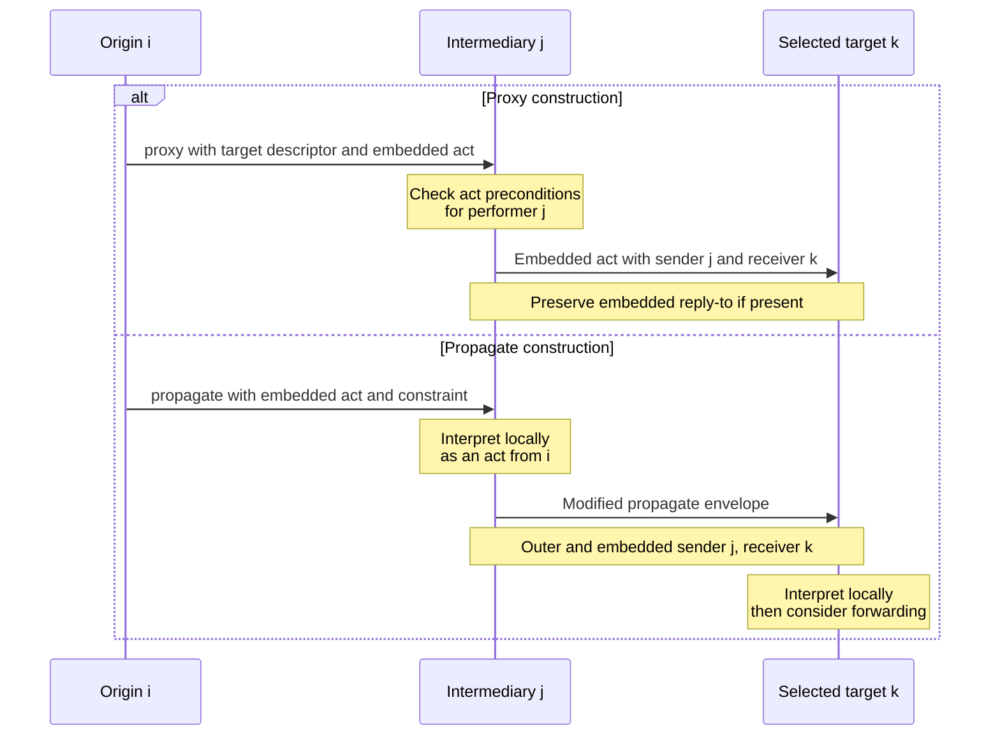

# Proposals and federation forwarding

Use this method to distinguish an agent offering its own action from an agent asking another agent to relay an act. The primary basis is archived [XC00037H](https://jmvidal.cse.sc.edu/library/XC00037H.pdf), experimental 2001-08-10, §§3.12–3.14. These are historical act semantics; delivery, authorization and successful performance require separate evidence.

## Choose the act and preserve the roles

| Intent | Act | Role check |
| --- | --- | --- |
| Sender offers to perform an action subject to conditions. | `propose` | The proposer is the proposed actor. The recipient's notified intention and established preconditions precede the proposer's adoption of the action intention. |
| Ask an intermediary to identify targets and perform an embedded act to them. | `proxy` | The intermediary becomes the sender of that embedded act; target selection follows the descriptor and content constraint. |
| Let the recipient interpret the embedded act locally and continue a federation chain/tree. | `propagate` | The recipient treats the embedded act as received directly, then forwards a modified `propagate` envelope to selected agents. |

A proposal is an informative conditional intention. For example, a constructed courier offer names `deliver(parcel_4)`, the courier as actor, and price/availability conditions. A quoted price alone does not establish the recipient's notified intention, satisfied conditions, a selected contract, or parcel delivery. H §3.13 specifies the negotiation protocol through prior agreement or the `:protocol` field; this act alone supplies no auction algorithm.

## Proxy procedure

1. Record origin `i`, intermediary `j`, target descriptor, embedded act and content constraint. Select the descriptor's `ι`, `any` or `all` meaning explicitly.
2. On the embedded act performed to a selected target `k`, record `:sender=j` and `:receiver=k`. Preserve an embedded `:reply-to` value.
3. In H's brokering case, retain the originating conversation and reply correlation fields, including `:conversation-id`, `:reply-with` and original `:sender`, so a reply can be associated with the requester.
4. Check the embedded act's feasibility preconditions for its actual performer `j`. In the strong-proxy discussion, forwarding `inform(ψ)` requires `j` to believe `ψ`.
5. If `j` can report only what `i` wants, use the source's weak-proxy construction: communicate the proposition about `i`'s intention rather than asserting `ψ`. This is a different semantic content, not a separate wire performative called `weak-proxy`.

**Constructed counterexample.** `i` wants a registry intermediary to tell `k` that stock is available. `j` has only a message from `i`, without adopting that belief. Rewriting `:sender` and sending the original `inform(stock-available)` does not discharge the sincerity condition. A proposition about `i`'s intention is different from a stock assertion; any stock-based action still needs its own evidence.

## Propagate procedure and trace

1. Interpret the embedded act at the recipient as if sent directly from the origin.
2. Resolve the given descriptor under the content constraint. H's worked example includes a hop-count condition; the specification does not supply a universal hop budget.
3. Forward the **propagate envelope**, changing outer sender/receiver to the current forwarder and selected target. Change the embedded sender/receiver correspondingly.
4. At each hop, retain observed-message and effect records separately. This semantic construction describes a chain/tree but does not establish reachability, loop freedom, delivery, or completion.

These are alternative source-shaped constructions, not a claim that an observed first message forces subsequent messages. Record an unresolved local outcome if later evidence is missing. The diagram omits replies: in brokering they need correlation retained at `j`; a recruiting reply-to route may differ.

## Hand checks and retained material

- **Positive proxy case:** `i` asks `j` to select catalog agents and send a query. Inspect the actual query's sender `j`, selected receiver `k`, preserved reply-to if supplied, and any brokering correlation. Receiving the proxy alone is insufficient.
- **Positive propagate case:** a constructed federation request reaches `j`, is interpreted there, and a modified propagate reaches `k`. The second observed envelope has sender `j` at both levels. An ordinary embedded-act-only message to `k` is the proxy-shaped branch, not this propagate trace.
- **Negative identity case:** an observer attributes every forwarded assertion directly to original `i`. The rewritten sender fields and embedded performer's preconditions make that interpretation wrong; origin provenance requires an additional explicit record.
- **Retention:** this reference replaces the original entrypoint federation decision tree with the concrete semantic choice, field transformation and counterexample. Original unconditional routing/delivery claims are removed. It also restores the entrypoint's `propose` selection branch without confusing a CFP parameter value with a proposal or award.
