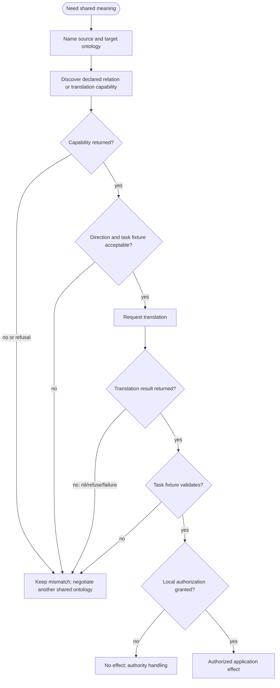

# FIPA ontology-service design

Use this skill when agents must select a shared ontology, query a declared ontology relation, or request an expression translation. It does not establish provider availability, application suitability, or shared conceptualization.

## Source and version boundary

The accessible predecessor body is FIPA **XC00086C**, Experimental, 2000-06-15: <https://www.fipa.org/specs/fipa00086/XC00086C.html>. The catalog identifies **XC00086D**, Experimental, 2001-08-15: <https://www.fipa.org/specs/fipa00086/index.html>; D's body remains unread. A contemporaneous implementer paper reports no functional change between the then-latest experimental service specification and FIPA 98 Part 12; that supports using C to recover methods, not treating C and D as textually or normatively identical. See [source access](references/source-access.md).

## Working method

1. Name source and target ontology identifiers exactly as they will appear on the message. Record `source -> target`; reverse direction is a separate claim.
2. Separate four questions: does syntax parse; what vocabulary/axioms are declared; what intended model is relied on; and is an application effect authorized. A yes at one layer is not a yes at another.
3. Discover an OA or translation service through the Directory Facilitator only when needed. Registration is advertisement, not validation.
4. Ask for the declared relation or translation capability. Preserve who asserted it, names, version/revision identifiers if available, and the response or refusal.
5. Before using translation, test a task-essential expression against a local fixture. Record unmapped terms, changed constraints, and result. This receipt is local practice, not a FIPA requirement.
6. Apply explicit local policy to loss or possible inconsistency. FIPA does not supply a command-permission matrix, mandatory confirmation loop, or safety classification.



## Relationship facts are not a ladder

| Relation | C-body semantics | Engineering check |
|---|---|---|
| Extension | Directional preservation of base vocabulary and properties | Use named shared vocabulary; do not infer reverse |
| Identical | Vocabulary, axiomatization, representation language physically identical | Does not prove shared conceptualization |
| Equivalent | Same vocabulary and logical axiomatization; representation may differ | Server deductions can differ by implementation |
| Strong | Total source vocabulary translation; source axioms hold; no loss/inconsistency in that direction | Test exact direction |
| Weak | Translation can lose information but should not add inconsistency | Check whether loss defeats task |
| Approx | Weak translation with possible inconsistency | Treat as candidate under local validation |

Only these implications are stated: Strong => Weak => Approx; Equivalent implies Strong both directions; Identical implies Equivalent. Extension is not another rung. Relation determination can be difficult or undecidable, so record provenance and allow manual review.

## Source-shaped interaction patterns

These are illustrative summaries of XC00086C, not wire captures. For `assert`, `retract`, and domain `query-if`/`query-ref`, ACL `:ontology` names the service ontology and affected domain ontology. For `translate`, ACL `:ontology` names the service ontology; the source and target ontologies are `translation-description :from` and `:to`.

```lisp
(query-ref
  :ontology FIPA-Ontol-Service-Ontology
  :content (iota ?level (ontol-relationship source-ontology target-ontology ?level)))

(request
  :ontology FIPA-Ontol-Service-Ontology
  :content (action ontology-agent
    (translate source-expression
      (translation-description :from source-ontology :to target-ontology))))
```

In C §5.2.6, `nil` illustrates an OA unable to provide **any translation between the two ontologies**. It is not the generic result for unknown relationships or individual unmapped expressions. `not-understood`, `failure`, and `refuse` remain distinct conversational outcomes; `READ-ONLY` and `INCONSISTENT` are modification-refusal reasons. Preserve the actual response rather than relabeling every absence as semantic failure.

## Shared-ontology routes (C §5.3)

Choose a route whose prerequisite is actually met: (1) request B's service under O1; `not-understood` shows B does not understand O1; (2) ask the DF for a provider supporting O1; (3) ask an OA for an `ontol-relationship` to a differently named Identical/Equivalent ontology or a usable sub-ontology; (4) ask the DF for a translation service and use that service as proxy. These are alternatives, not a mandatory protocol. See [translation routing](references/translation-hierarchy-as-coordination-strategy.md).

## Hand checks

Positive: for task-essential terms covered by a declared `Strongly-Translatable(source,target)` relation, confirm the result satisfies a target-vocabulary fixture. This validates the fixture, not all expressions.

Negative: reverse the direction or add an extension-only term. If no relation/capability covers it, retain the unknown relation or unmapped term as a local unresolved outcome; do not silently make the relation bidirectional or drop the term. Record `nil` only when actually returned for the source-described no-translation-between-pair case.

## Read next

- [Conceptualization and ontology](references/conceptualization-vs-ontology-for-coordination.md)
- [Relationship and translation procedure](references/translation-hierarchy-as-coordination-strategy.md)
- [OA discovery and boundary](references/ontology-agent-as-coordination-infrastructure.md)
- [OKBC operation vocabulary](references/okbc-knowledge-model-as-interlingua.md)
- [Failure diagnosis](references/failure-modes-semantic-interoperability.md)
- [Optional Annex B authoring method](references/ontology-authoring-guidelines.md)
- [Historical provenance](historical-provenance.md)
