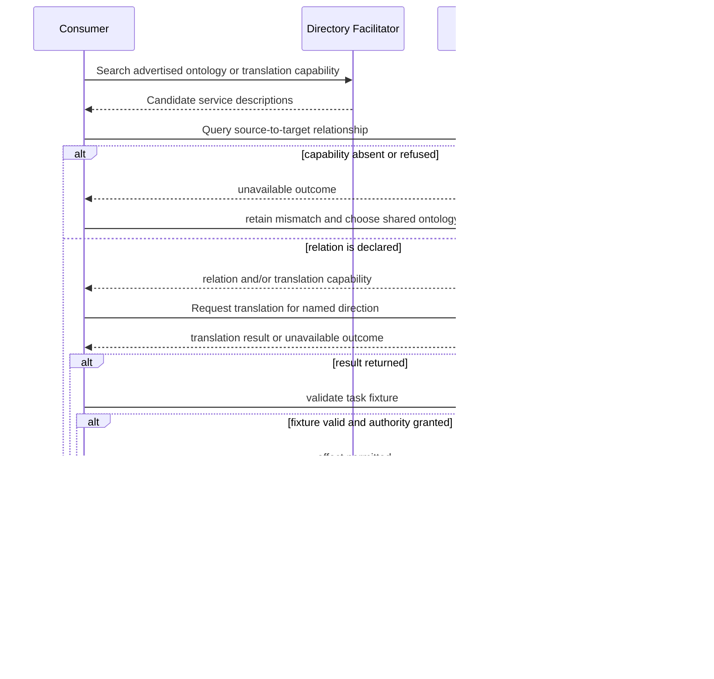

# Directed translation check

This local procedure follows the C-body directionality and translation semantics. It does not claim every OA implements every action.

```mermaid
sequenceDiagram
    participant C as Consumer
    participant DF as Directory Facilitator
    participant OA as Selected OA
    participant P as Local policy
    C->>DF: Search advertised ontology or translation capability
    DF-->>C: Candidate service descriptions
    C->>OA: Query source-to-target relationship
    alt capability absent or refused
        OA-->>C: unavailable outcome
        C->>P: retain mismatch and choose shared ontology
    else relation is declared
        OA-->>C: relation and/or translation capability
        C->>OA: Request translation for named direction
        OA-->>C: translation result or unavailable outcome
        alt result returned
            C->>P: validate task fixture
            alt fixture valid and authority granted
                P-->>C: effect permitted
            else fixture fails or authority denied
                P-->>C: no effect and retain mismatch
            end
        else no result
            C->>P: retain mismatch and no effect
        end
    end
```
