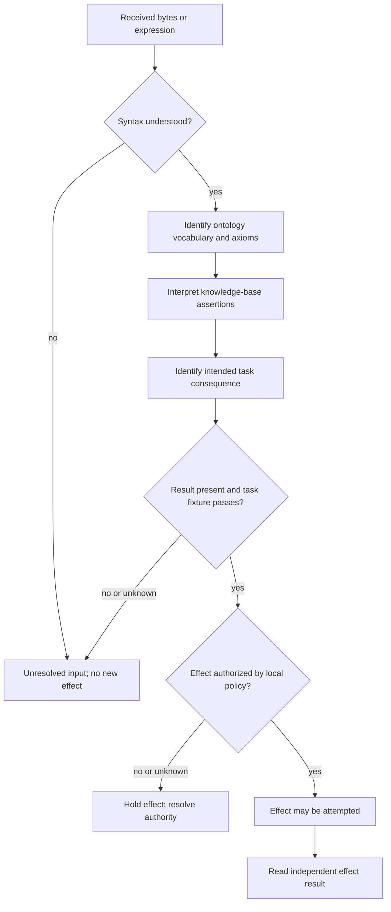

# Meaning and effect boundaries

The C body distinguishes ontology vocabulary/axioms, knowledge-base assertions and intended interpretations. The validation and authorization choices below are local application policy; a layer's output does not prove the next layer's claim.

An authorized attempt is not an observed success. Missing response or a failed semantic fixture does not prove that a previously attempted external effect was rolled back; reconcile that earlier attempt separately.
