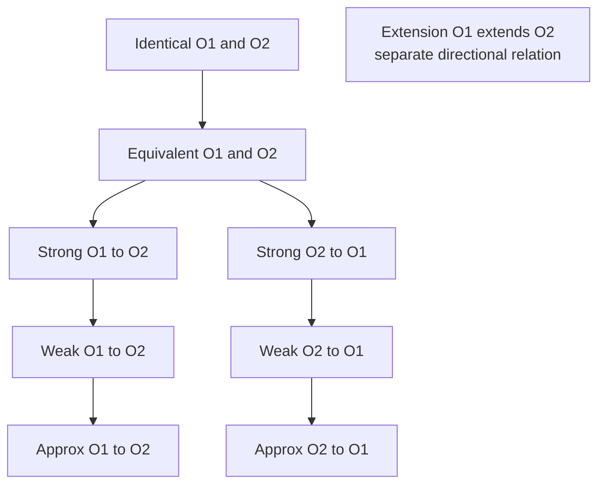

# Six ontology relationships and direction

## Exact semantic boundary

XC00086C defines Extension, Identical, Equivalent, Strongly-Translatable, Weakly-Translatable, and Approx-Translatable. Extension is directional. Strong translation is directional total vocabulary translation with source axiomatization preserved, no loss, and no introduced inconsistency. Weak translation may lose information but should not introduce inconsistency; approximate translation may introduce inconsistency. Identical and Equivalent are distinct, and their relationship implications do not make a total order.

The C body states Strong => Weak => Approx, Equivalent => Strong in both directions, and Identical => Equivalent. It does not define which application actions a level permits. An action matrix is a local policy, never a FIPA consequence.

## Relation record and checks

Record relation label, `from`, `to`, assertion authority, date/revision, and the exact fixture used to evaluate it. Positive: a declared strong source-to-target mapping preserves a task assertion in that direction. Negative: do not infer target-to-source strength; retain an unknown reverse relation and query it separately.

Treat source-body relations as declared provider information, not runtime guarantees. **Identical** means vocabulary, axiomatization, and representation language are physically identical, even when logical names differ. **Equivalent** retains vocabulary and logical axiomatization across possible representation languages. **Extension(O1,O2)** is directional: O1 includes O2's vocabulary/properties while adding commitments. **Strong(Osource,Odest)** preserves the stated source conditions in that direction. Weak translation can lose information; Approx can also introduce inconsistency.

Concrete C fixtures: Extension inserts `Citrus` between `Fruit` and `Lemon`/`Orange`; communicate with the base vocabulary unless a mapping covers `Citrus`. French fruit -> English fruit is weakly translatable where source distinctions may be lost. Chinese-cooking Coriander (leaves) -> European-cooking Coriander (seeds) is approximate because properties can cease to hold. These do not prescribe applications actions.

Arrows are the C-body relation implications, not calls or verified provider outcomes. Extension has no edge into this implication chain. Using a declared relation still requires the entrypoint's result, fixture and authorization checks.

