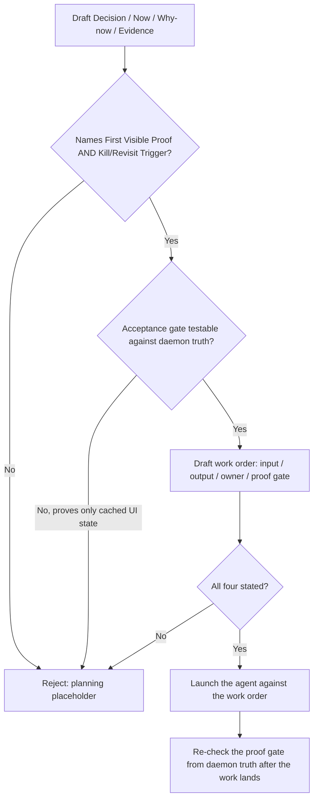

# Focus Receipt & Proof Gate

Decide whether a stated "focus" is a real, testable decision with a real agent launch behind it — or a planning placeholder dressed up as one.

## Use This For

- Auditing a milestone's "current product focus receipt" before agents are launched against it.
- Checking a work order states real input, output, owner, and proof gate before calling it an agent launch.
- Catching an acceptance gate that would only prove a cached UI state instead of daemon/event truth after a restart.
- Verifying a focus receipt names an exit condition (Kill/Revisit Trigger) as explicitly as it names its entry condition (First Visible Proof).
- Gatekeeping the transition from binder prose to agent work order at any milestone boundary.

## Do Not Use This For

- Deciding whether the wider roadmap should treat an item as planned work or an energy-driven sidequest (`legible-roadmap-with-sidequests`).
- Reviewing a PRD, prototype, or vibe-coded concept for missing product fundamentals like cold start or pricing (`product-reality-reviewer`).
- Accepting or blocking already-finished work against a personal acceptance bar (`port-daddy-user-surrogate-pm-review`).

## Decision Model

1. **Write the Decision/Now/Why-now/Evidence quartet before naming any agent.** `now` is the narrow slice, not the whole milestone; `whyNow` must beat every other candidate; `evidence` is an observed fact, not an assertion — see `references/focus-receipt-schema.md` for the full field-by-field contract from the binder's build-prescription chapter.
2. **Name the First Visible Proof.** The exact observable artifact — a screen, a saved event, a passing probe — that proves the decision produced something real, not a vibe.
3. **Name the Kill/Revisit Trigger.** The exact condition under which the decision pauses and gets re-litigated. A receipt with an entry condition and no exit condition is half a decision.
4. **Write the acceptance gate as a claim rebuildable from daemon/event truth**, per the binder's own rule that a proof "must survive relaunch from daemon truth, not from a cached UI model." Mark `testableAgainstDaemonTruth: true` only when that is actually possible — see `references/proof-gate-vs-cached-state.md`.
5. **Convert the receipt into a work order** stating `input`, `output`, `owner`, and `proofGate` explicitly. The binder's own gate: "if a proposed chain cannot state its input, output, owner, and proof gate, it is a planning placeholder, not an agent launch."
6. **Audit both together** with `scripts/focus_receipt_audit.mjs` before spawning any agent against the receipt.
7. **Re-run the audit after the work lands.** The proof gate must still hold from daemon truth, not from the receipt's original prose.

## Output Contract

A launch-ready focus receipt carries:

- `receipt`: `decision`, `now`, `whyNow`, `evidence`, `firstVisibleProof`, `acceptanceGate.{statement,testableAgainstDaemonTruth}`, `killRevisitTrigger`, `owner`, `reviewDate` — all stated, none implied.
- `workOrder`: `input`, `output`, `owner`, `proofGate` — all stated for every chain the receipt launches.

Use `scripts/focus_receipt_audit.mjs` to audit a spec matching `schemas/focus-receipt.schema.json` and return `{ pass, score, findings, recommendations }`.

## Anti-Patterns

### Decision Without Entry Or Exit Criteria

**Novice**: Writes a confident Decision/Now/Why-now, then leaves First Visible Proof and Kill/Revisit Trigger implicit — "we'll know it's working when we see it, and we'll know to stop when it's clearly not."
**Expert**: A real focus receipt names the exact observable artifact that proves entry (First Visible Proof) and the exact condition that ends or re-litigates the decision (Kill/Revisit Trigger) in the receipt itself, not in someone's head.
**Detection**: `focus_receipt_audit.mjs` fires `no-first-visible-proof` (critical) when `receipt.firstVisibleProof` is empty/absent, `no-kill-trigger` (critical) when `receipt.killRevisitTrigger` is empty/absent, and `receipt-missing-required-field` (critical) for any other missing required field (`decision`, `now`, `whyNow`, `evidence`, `owner`, `reviewDate`, or `acceptanceGate.statement`).

### Acceptance Gate Tests The UI, Not The Daemon

**Novice**: Treats "the panel shows the agent as compliant" as proof — a claim a stale cache or an optimistic UI update can satisfy without anything real having happened on the backend.
**Expert**: An acceptance gate must be restated as a claim that survives relaunch from daemon truth — rebuildable from backend/event state after a restart or reconnect, never from what is currently painted on screen.
**Detection**: `focus_receipt_audit.mjs` fires `acceptance-gate-not-daemon-testable` (critical) whenever `receipt.acceptanceGate.testableAgainstDaemonTruth` is not exactly `true` (fails closed on missing, `false`, or any other value), and `review-date-elapsed` (high) when `receipt.reviewDate` has already passed without the receipt being revisited.

### Planning Placeholder Masquerading As An Agent Launch

**Novice**: "Launch an agent for governance work" — no stated input, no stated output, no accountable owner, no proof gate. Sounds like an assignment; is actually a wish.
**Expert**: Per the binder's own rule, a chain that cannot state its input, output, owner, and proof gate is a planning placeholder, not an agent launch — do not spawn it.
**Detection**: `focus_receipt_audit.mjs` fires `placeholder-not-launch` (critical), naming exactly which of `workOrder.input` / `workOrder.output` / `workOrder.owner` / `workOrder.proofGate` is missing or empty.

## References

| File | Load When |
| --- | --- |
| `references/focus-receipt-schema.md` | Drafting or reviewing a focus receipt's twelve fields, or checking a milestone chapter's Goal/Tasks/Gate structure and the Agent count rule. |
| `references/proof-gate-vs-cached-state.md` | Writing or trusting an acceptance gate, or deciding whether a proposed chain is a real work order or a planning placeholder. |
| `examples/expected-output.md` | Need to see a placeholder-dressed-as-a-decision receipt audited, then the same receipt fixed and passing. |
| `templates/output-template.md` | Need a fill-in-the-blank focus receipt and work order template. |
| `schemas/focus-receipt.schema.json` | Need to validate a focus-receipt JSON payload's structure before auditing it. |
| `scripts/focus_receipt_audit.mjs` | Need deterministic scoring of a focus receipt and its work order. |
| `agents/openai.yaml` | Need a subagent descriptor for delegated focus-receipt/proof-gate review. |

<!-- BEGIN BUNDLE INDEX (auto: index_references.py) -->

## Skill Bundle Index

*Every file in this skill, and when to open it. Auto-generated; run `scripts/index_references.py --fix`.*

**root**
- [`CHANGELOG.md`](CHANGELOG.md) — Focus Receipt & Proof Gate — Changelog — - Initial skill creation - Core process defined - Reference files and deterministic focus_receipt_audit script added
- [`README.md`](README.md) — Focus Receipt & Proof Gate — Audit whether a "current product focus receipt" and the work order it gates state a real decision with real entry/exit criteria, a daemon-te

**`agents/`**
- [`agents/openai.yaml`](agents/openai.yaml) — openai (data/schema)

**`examples/`**
- [`examples/expected-output.md`](examples/expected-output.md) — Example Output: Focus Receipt & Proof Gate — Scenario: an agent wants to launch three GPUI agents on the Harbor Editor collaborative pane this week.
- [`examples/sample-input.json`](examples/sample-input.json) — sample input (data/schema)
- [`examples/weak-input.json`](examples/weak-input.json) — weak input (data/schema)

**`references/`**
- [`references/focus-receipt-schema.md`](references/focus-receipt-schema.md) — Focus Receipt Schema — Use this when drafting or reviewing a "current product focus receipt," or when checking a milestone chapter's Goal/Tasks/Gate structure befo
- [`references/proof-gate-vs-cached-state.md`](references/proof-gate-vs-cached-state.md) — Proof Gate vs. Cached State — Use this when writing or trusting an acceptance gate, or when deciding whether a proposed agent chain is a real work order or a planning pla

**`schemas/`**
- [`schemas/focus-receipt.schema.json`](schemas/focus-receipt.schema.json) — focus receipt.schema (data/schema)

**`scripts/`**
- [`scripts/focus_receipt_audit.mjs`](scripts/focus_receipt_audit.mjs)

**`templates/`**
- [`templates/output-template.md`](templates/output-template.md) — Focus Receipt Template — Fill in every field before treating this as a real decision.

<!-- END BUNDLE INDEX -->
