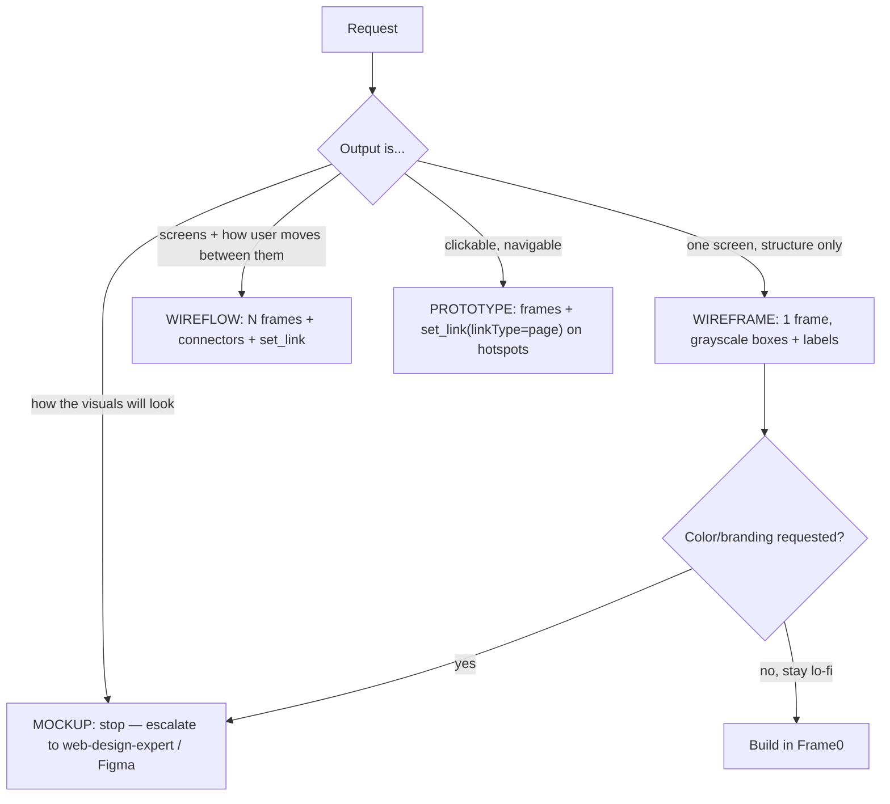
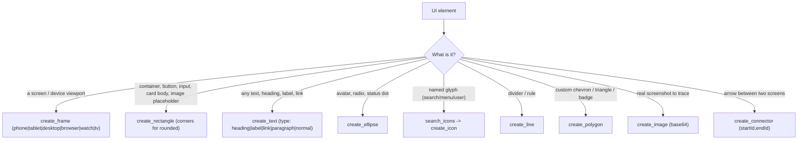
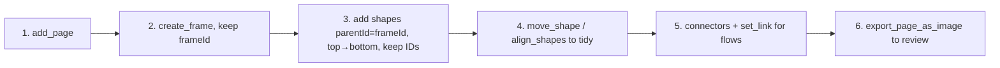

# Frame0 Wireframing

Drive the **Frame0** MCP server to produce low-fidelity wireframes and wireflows. Frame0 is a
hand-drawn (sketch-style) wireframing tool — the rough aesthetic is a *feature*: it tells stakeholders
"this is a thinking artifact, not a finished design," which keeps feedback on structure and flow instead
of pixel colors. Your job is to translate a screen or flow description into the **right Frame0 tool calls
with the right parameters on the first try**.

## When to Use

✅ **Use for**:
- Wireframing one screen (login, dashboard, settings, checkout) as boxes-and-labels
- Sketching a multi-screen **user flow / wireflow** with connectors and clickable `set_link` hotspots
- Roughing out layout and information hierarchy before any visual design exists
- Building a low-fi prototype to validate navigation and core assumptions cheaply
- Exporting a page or shape as an image to share for feedback

❌ **NOT for**:
- High-fidelity visual design, brand identity, color palettes, real typography → `web-design-expert` / Figma
- Production UI code (React/SwiftUI/etc.) → frontend skills (`frontend-architect`, `nextjs-app-router-expert`)
- Deep UX heuristic critique of an existing product → `ux-friction-analyzer` / `ui-ux-pro-max`
- Pure data/architecture diagrams with no UI → `diagramming-expert` / `mermaid-graph-writer`

## Decision Points

### What am I actually being asked to make?



Fidelity discipline: stay grayscale (`#FFFFFF` fill, `#000000`/`#777777` stroke). Color and real type are a
*mockup* concern — jumping there early is the #1 wireframing failure (see Anti-Patterns).

### Which Frame0 primitive for which UI element?



## Core Capabilities — UI element → Frame0 tool calls

Every screen is **a frame**; everything inside it passes `parentId: <frameId>` so it belongs to the frame
and moves with it. Capture the `id` returned by each create call — connectors, links, grouping, alignment,
and moves all reference shapes by ID.

| UI element | How to build it in Frame0 |
|---|---|
| **Screen** | `create_frame` with `frameType` (`phone`/`tablet`/`desktop`/`browser`/`watch`/`tv`). **Must `add_page` first.** |
| **Button** | `create_rectangle` (`corners:[6,6,6,6]`) + `create_text` (`type:"label"`) centered on it, both `parentId:frame` |
| **Text input / field** | `create_rectangle` (thin, `corners:[4,4,4,4]`) + `create_text` placeholder (`fontColor:"#999999"`) |
| **Card** | `create_rectangle` (`corners:[8,8,8,8]`) container + heading text + body `paragraph` text + optional `create_icon` |
| **Navbar / header** | full-width `create_rectangle` (short height) + brand `create_text` + right-aligned `create_icon`s |
| **List row** | `create_rectangle` row + leading `create_icon` + `create_text` + trailing chevron icon; `duplicate_shape` (dy) to repeat |
| **Avatar** | `create_ellipse` (square w==h) or `create_icon "user"` |
| **Icon** | `search_icons` to find a valid name, then `create_icon` (`size:"small"`=16 / `medium`=24 / `large`=32 / `extra-large`=48) |
| **Modal / dialog** | dimming `create_rectangle` over the frame (`fillColor` grey) + smaller `create_rectangle` panel + content |
| **Empty state** | centered `create_icon` (`extra-large`) + `create_text` heading + `paragraph` subtext + a CTA button |
| **Divider** | `create_line` spanning the content width |
| **Tab bar** | row of `create_text` labels + a `create_line` under the active one |
| **Screen-to-screen arrow** | `create_connector` with `startId`/`endId` = the two frame (or hotspot) IDs, `endArrowhead:"arrow"` |
| **Clickable hotspot** | the button/row rectangle → `set_link` (`linkType:"page"`, `pageId:<targetPage>`) |

Detailed per-tool parameter contracts (required vs optional, gotchas, the relative-`move_shape` model):
**`references/01-frame0-mcp-tool-reference.md`** — read before your first build of a session or when a call
errors. UI-pattern build recipes (card, form, list, modal, empty state): **`references/02-wireframing-patterns.md`**.
Connectors, links, multi-page navigation, export: **`references/03-flows-and-prototyping.md`**.

## Build Order (the loop that avoids rework)



1. **`add_page`** (a frame cannot be created on no page; the new page becomes current).
2. **`create_frame`** — pick the device; save the returned `id` as `frameId`.
3. **Add children top-to-bottom**, every one with `parentId: frameId`. Save each `id`.
4. **Tidy** with `align_shapes` (e.g. `align-horizontal-center` a button label over its rectangle) and
   `move_shape` (relative `dx`/`dy`) rather than re-creating.
5. **Wire flows**: `create_connector` between frames; `set_link` on hotspots for clickable prototypes.
6. **`export_page_as_image`** and show the user.

## Anti-Patterns

### Jumping to high fidelity inside a wireframe
**Novice**: Starts adding brand colors, real fonts, drop-shadow hex fills, and exact spacing on the first pass.
**Expert**: Keeps it grayscale boxes-and-labels. Frame0's hand-drawn look *exists* to suppress this — color and
type are a **mockup** decision made after the structure is approved. Adding them early reframes the review from
"is this the right flow?" to "I don't like that blue," which is the wrong conversation to have on a sketch.
**Detection**: non-grayscale `fillColor`/`fontColor`, `fontSize` fiddling, pixel-nudging before the layout is agreed.

### Absolute-positioning everything by hand instead of frames + alignment
**Novice**: Computes every shape's absolute `left`/`top` and never uses a parent frame or `align_shapes`.
**Expert**: Creates a `frame`, parents shapes to it (`parentId`), and uses `align_shapes`
(`align-horizontal-center`, `distribute-vertically`) + relative `move_shape`. The whole screen then moves as a
unit and stays aligned. Note `move_shape` takes **deltas (`dx`/`dy`)**, not absolute coordinates — a frequent
first-call mistake.
**Detection**: no `parentId` on child shapes; manual coordinate math where one `align_shapes` call would do.

### Guessing tool parameters (especially icons and text)
**Novice**: Calls `create_icon` with an invented `name`, or puts `\n` / HTML in `create_text`.
**Expert**: Runs **`search_icons`** first to get a real icon name (Frame0's set is ~1,500 Lucide-derived
glyphs). For `create_text`: uses a real newline character (0x0A), never the literal `\n` or HTML/CSS; for a
`paragraph` block, sets `width` (via `update_shape`) so it wraps; expects text to auto-size so positions it,
then nudges with `move_shape`.
**Detection**: `create_icon` errors / empty glyph; `\n` rendered literally; paragraph text not wrapping.
**Note**: the `create_icon` schema text mentions a `get_available_icons` tool — the actual discovery tool
exposed over MCP is **`search_icons`**. Use `search_icons`.

### Connecting screens before the shapes exist
**Novice**: Calls `create_connector` with IDs it hasn't captured, or links to a page that isn't created yet.
**Expert**: Creates both endpoints first, captures their `id`s, *then* connects. For `set_link`
(`linkType:"page"`), the target page must already exist so you have its `pageId`. Build all pages, then wire links.
**Detection**: connector/link calls failing with unknown-ID errors.

## Quality Gates

```
□ One frame per screen; every child shape has parentId set to its frame
□ Grayscale only — no brand color, no real type sizing (it's a wireframe, not a mockup)
□ Icons came from search_icons (valid names), not guessed; sized via the small/medium/large/extra-large enum
□ Text uses real newlines (0x0A), no \n or HTML; paragraphs have a width so they wrap
□ Shapes aligned via align_shapes; positions adjusted with move_shape deltas, not re-creation
□ Multi-screen: pages created before set_link wires them; connectors reference real captured IDs
□ A "back" affordance uses set_link linkType "action:backward" where appropriate
□ export_page_as_image produced and shown for review
□ If the ask was really visual design, it was redirected to web-design-expert / Figma, not faked in lo-fi
```

## Worked Example

A complete step-by-step recipe — a **login screen**, a **home screen**, a connector + clickable `set_link`
between them, and `export_page_as_image` — with the exact tool calls and parameters, lives in
**`examples/login-flow-recipe.md`**. Read it when you want a copy-adaptable build to follow.

## Reference Files

- `references/01-frame0-mcp-tool-reference.md` — Accurate per-tool parameter contract for every Frame0 MCP
  tool (shapes, pages, edit ops, links, export), the coordinate/positioning model, and the verified gotchas.
  **Read when** making your first calls of a session or when a call errors.
- `references/02-wireframing-patterns.md` — UI-element cookbook: exact shape recipes for buttons, inputs,
  cards, navbars, lists, modals, empty states, tab bars, plus grayscale/8pt layout discipline. **Read when**
  building a specific screen and you want the canonical recipe for an element.
- `references/03-flows-and-prototyping.md` — Connectors, `set_link`, multi-page navigation, wireflows, the
  wireframe→mockup→prototype progression, and export. **Read when** the deliverable involves more than one screen.
- `references/04-when-wireframe-vs-mockup.md` — Fidelity decision guide: low-fi vs high-fi, when to stay in
  Frame0 vs escalate, and how to hand off. **Read when** unsure whether to wireframe at all or jump to design.
- `references/INDEX.md` — Routing table for the four references above.
- `examples/login-flow-recipe.md` — End-to-end, copy-adaptable build: login + home + connector + link + export.
  **Read when** you want a concrete worked recipe to mirror.
