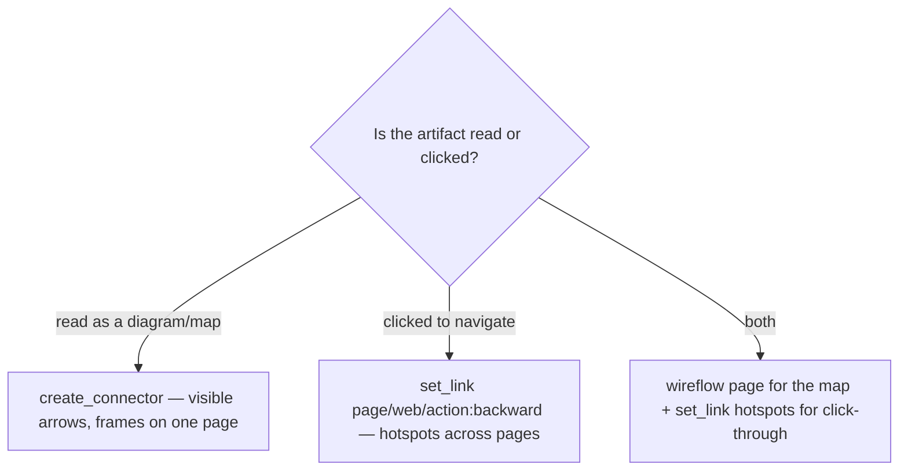

# Flows & Prototyping — Connectors, Links, Multi-Page

When the deliverable is more than one screen — how a user moves through the product — you're building a
**wireflow** (wireframes + flow) or a clickable **prototype**. Two distinct Frame0 mechanisms do this:

- **`create_connector`** draws a visible **arrow** between two shapes/frames. Use it for a *flow diagram* that a
  human reads — "from Login you land on Home; tapping a row opens Detail." Several frames laid out on one page,
  arrows between them.
- **`set_link`** attaches an **invisible navigation behavior** to a shape, making the wireframe *clickable* in
  Frame0's preview. Use it for an *interactive prototype* — clicking the login button actually navigates to the
  Home page.

You often want both: a wireflow page that documents the map, and `set_link`ed hotspots for click-through testing.

## The fidelity progression

| Stage | What it shows | Frame0 mechanism |
|---|---|---|
| **Wireframe** | Layout/structure of one screen | frame + grayscale shapes |
| **Wireflow** | Screens + how they connect | multiple frames + `create_connector` arrows |
| **Prototype** | Clickable navigation | frames on separate pages + `set_link(linkType:"page")` |
| **Mockup** (leave Frame0) | Real visuals/branding | → `web-design-expert` / Figma |

Wireframes are the blueprint (no color/branding); mockups add visuals; prototypes simulate interaction
([Visual Paradigm](https://www.visual-paradigm.com/guide/ux-design/wireframe-vs-storyboard-vs-wireflow-vs-mockup-vs-prototyping/),
[CareerFoundry](https://careerfoundry.com/en/blog/ux-design/user-flows-vs-wireframes/)). A **wireflow** combines
wireframes with the user-flow arrows so structure and navigation are reviewed together
([Balsamiq](https://balsamiq.com/blog/wireflows/), [Visily](https://www.visily.ai/blog/wireflow-streamline-design-process/)).

## Pattern A — Wireflow on one page (arrows you can see)

Good when the *map* is the point (stakeholder walkthrough, documenting a journey).

1. `add_page "User Flow"`.
2. Create each screen as its own **frame** on that page, spaced left-to-right in journey order. Keep each `frameId`.
   (Keep them lightweight — a title + a couple of key elements is enough at flow altitude.)
3. For each transition, `create_connector` with `startId`/`endId` = the source and target `frameId` (or the
   specific button's id for precision), `endArrowhead:"arrow"`, and a `name` describing the trigger
   (e.g. `"tap Login -> Home"`).
4. `export_page_as_image` to share the whole map.

For branching flows (success vs error), fan multiple connectors out of one frame; arrowheads/labels carry the
condition.

## Pattern B — Clickable prototype across pages (`set_link`)

Good when you want to *click through* it to test navigation.

1. Put **each screen on its own page** (`add_page` per screen, one frame per page). Build all pages **first** so
   every target `pageId` exists.
2. On the source screen, take the hotspot shape (the button/row rectangle's `id`) and call:
   - `set_link` `shapeId:<hotspot>`, `linkType:"page"`, `pageId:<targetPageId>` → navigates to that screen.
   - For a "Back" control: `set_link` `linkType:"action:backward"` (no `pageId` needed).
   - For an external link (e.g. "Terms"): `set_link` `linkType:"web"`, `url:"https://…"`.
3. Get target page IDs from `get_all_pages` (or remember them as you `add_page`).
4. Preview/click-through in Frame0; `export_page_as_image` per page for a static record.

### Ordering rule
`set_link(linkType:"page")` needs the target's `pageId`, and `create_connector` needs both endpoint `id`s —
so **create the shapes/pages before you wire them**. Build everything, then link. Wiring first fails with
unknown-ID errors.

## Choosing connector vs link

## Export & handoff

- `export_page_as_image` — whole page (a screen or a wireflow), `format` png/jpeg/webp. The default share artifact.
- `export_shape_as_image` — a single frame or component in isolation.
- Share the export for async feedback; iterate on the Frame0 doc (the sketch look keeps comments on
  structure). When structure is approved and visuals are needed, hand off to a hi-fi tool — see
  `04-when-wireframe-vs-mockup.md`.
