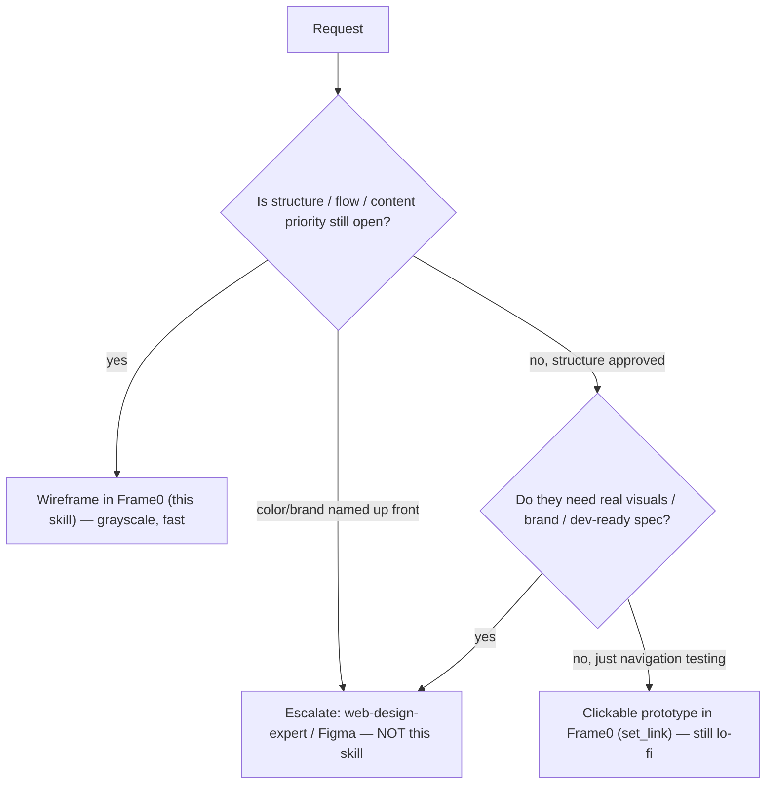

# When to Wireframe vs Mockup (Fidelity Decision)

The single most consequential call is **fidelity**: stay in low-fi Frame0, or escalate to a high-fidelity
visual-design tool. Getting this wrong wastes hours (over-polishing a throwaway) or invites the wrong feedback
(arguing colors on a structural sketch).

## The spectrum

| | Low-fidelity wireframe (Frame0) | High-fidelity mockup (Figma / web-design-expert) |
|---|---|---|
| **Shows** | Structure, layout, hierarchy, flow | Final look: color, type, imagery, branding |
| **Looks like** | Grayscale boxes, labels, hand-drawn sketch | Near-final UI |
| **Speed to make/change** | Minutes; cheap to throw away | Slow; expensive to change |
| **Best for** | Brainstorming, early iteration, testing core assumptions, getting non-designers to contribute | Stakeholder sign-off, dev handoff specs, detailed interaction/visual testing |
| **Feedback it invites** | "Is this the right flow / content / priority?" | "Is this the right blue / spacing / brand feel?" |

Low-fi is fast and flexible — ideal for early ideation and broad feedback; high-fi communicates exactly what
users will see and what developers must build. Most teams move **low → high**, not pick one forever
([Magic Patterns](https://www.magicpatterns.com/blog/low-fidelity-vs-high-fidelity-wireframes),
[Moqups](https://moqups.com/blog/low-fidelity-vs-high-fidelity-wireframes/),
[The Designership](https://www.thedesignership.com/blog/low-vs-high-fidelity-wireframes)).

## Decision

Why Frame0 specifically: it's a **hand-drawn / sketch-style** tool. The rough look is a deliberate signal that
"this is a prototype, not final design," which keeps reviewers focused on structure and invites changes
([Frame0](https://frame0.app/), [Frame0 wireframing](https://frame0.app/wireframing/)). If you find yourself
fighting the sketch aesthetic to make something look polished, that's the signal you've outgrown the wireframe —
escalate.

## Stay in Frame0 (this skill) when…
- The user says "wireframe", "low-fi", "rough out", "sketch", "just the layout", "user flow".
- Structure, content, or navigation is still being decided.
- You need something to react to in minutes, cheap to discard.
- You want non-designers to weigh in without color/brand bias.

## Escalate to hi-fi (NOT this skill) when…
- The user asks for brand identity, color palettes, real typography, polished visuals → `web-design-expert`.
- It's a Figma file / design-system / component-library task → Figma MCP.
- It's production UI code → frontend skills.
- The wireframe is approved and the next artifact is a dev-ready visual spec.

## Handoff
When escalating: export the approved Frame0 wireframes (`export_page_as_image`), and hand the structure +
flow as the brief for the hi-fi pass. The wireframe becomes the blueprint the mockup renders — don't re-litigate
layout in hi-fi; carry the agreed structure forward and spend the expensive hi-fi effort on visuals.
