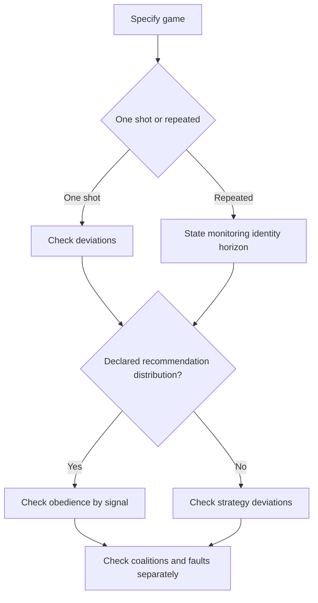
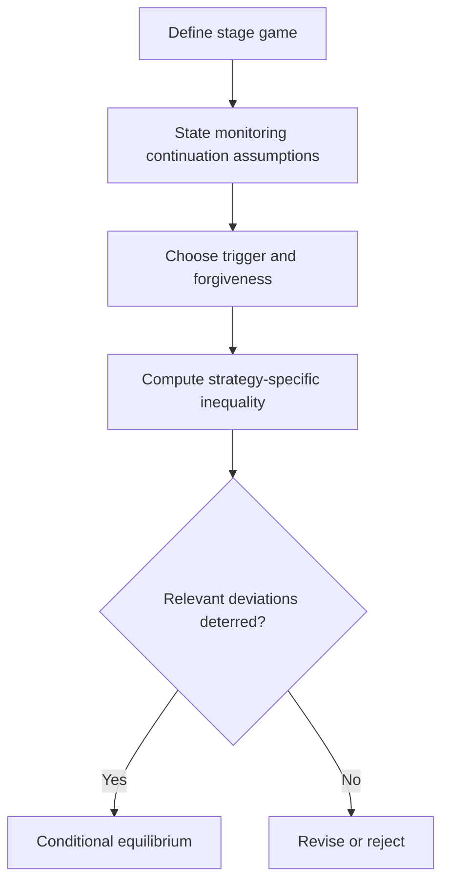
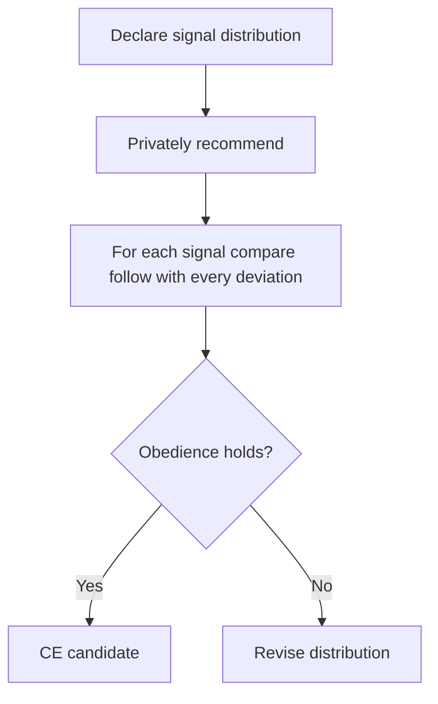
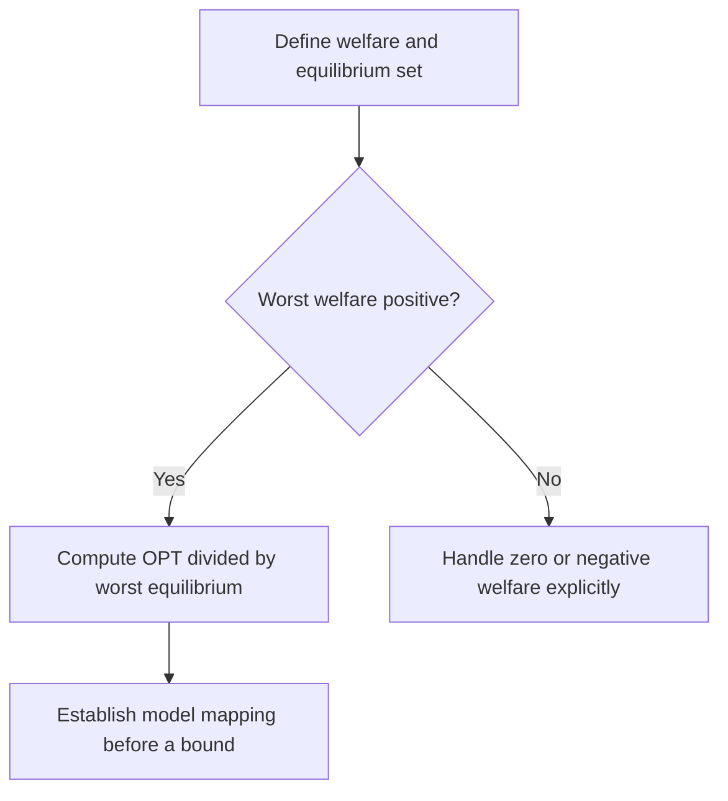
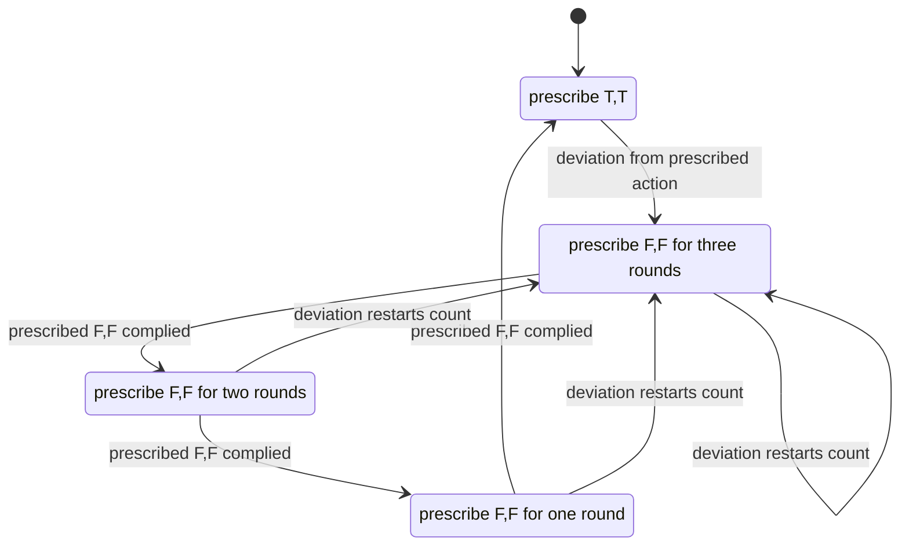

# Game-Theoretic Agent Incentives

Use a stated game to analyze strategic coordination. Advisory signals can help aligned participants without punishments; when interests conflict, compute incentives rather than assuming credibility. Keep equilibrium existence, learning/convergence, welfare, authorization, and fault tolerance as separate questions.

## When to Use

- Proving that truthful file claim signaling is incentive-compatible
- Analyzing whether cooperation survives in repeated agent interactions
- Designing daemon-mediated coordination as a correlated equilibrium
- Bounding efficiency loss when claims are advisory (not enforced)
- Auditing whether a protocol's punishment mechanism actually deters deviation
- Determining if an agent population will converge to truthful reporting

**NOT for:** Evolutionary game theory in biology. Poker strategy or card game analysis. Sports analytics or competitive gaming. General microeconomics, supply/demand, or market equilibrium outside agent coordination.

## Primary Decision Tree: Classifying the Game

## Decision Tree: Folk Theorem Application

Folk theorems characterize sustainable **feasible** payoffs in repeated games under particular monitoring, patience, rationality and game assumptions. Strict individual rationality and additional conditions vary with the theorem and equilibrium concept. Choose an exact theorem before using it; a long task or an audit log alone does not establish its premises. The finite-punishment calculation below is a direct strategy check, not an application of every folk-theorem variant.

Use this workflow before selecting punishment:

1. Define the stage game, feasible payoffs, each player's information, and outside options.
2. Specify horizon, monitoring errors, identity reset cost and who observes which history.
3. Compare candidate strategies: grim trigger has no recovery; tit-for-tat can cycle under noisy observations; finite triggers forgive but weaken deterrence. None is universally recommended.
4. Check credible continuation in every state. A severe punishment that other players want to abandon is not justified by its severity.
5. Compute the strategy-specific deviation inequality. The grim-trigger condition `(d-c) <= delta*(c-p)/(1-delta)` does not equal a finite three-round loss.
6. Evaluate false accusations, missed deviations and recovery separately before proposing an implementation.

## Decision Tree: Correlated Equilibrium (Daemon as Correlating Device)

A correlated equilibrium uses a trusted third party (the daemon) to send private recommendations to agents. Each agent's best response is to follow the recommendation, given that others follow theirs.

## Decision Tree: Price of Anarchy Analysis

For a specified welfare-maximization game and equilibrium class, PoA compares optimal feasible welfare with the worst equilibrium welfare. It does not measure enforcement versus advice in general. The ordinary welfare ratio needs a meaningful common payoff scale and positive denominator; a cost-minimization convention instead divides worst equilibrium cost by optimal cost.

For a welfare analysis, first enumerate feasible outcomes, then the named equilibrium class, then the worst equilibrium. State whether optima and extrema are attained. Report instance calculations separately from bounds over a class of games. Adding information, recommendation, penalties or commitment changes the game; recompute equilibria rather than assuming each intervention lowers PoA.

## Worked Example: Truthful File Claim Signaling as Nash Equilibrium

### Setup

Consider two agents with advisory claims on `src/auth.ts`. The claim is a message in this model, with no assumed enforcement. The constructed payoffs are chosen to illustrate a repeated Prisoner's Dilemma; they are not measured Port Daddy utilities or proof of any runtime capability.

### Step 1: Define the Stage Game

**Players:** Two agents, A and B, working on the same project.

**Actions for each agent on each file:**
- T (Truthful): Claim files you intend to edit, do not claim files you will not edit
- F (False): Claim files you do not intend to edit (to block others) or fail to claim files you do edit (to avoid scrutiny)

**Stage game payoff matrix (per round):**

| A / B | T | F |
|---|---:|---:|
| T | (3, 3) | (0, 4) |
| F | (4, 0) | (1, 1) |

- (T, T) = 3 each: Both claim truthfully, no conflicts, efficient parallel work
- (T, F) = (0, 4): the prescribed cooperative player loses while the deviator gains
- (F, F) = 1 each: mutual non-cooperation is worse than T,T but is the one-shot equilibrium

This is a Prisoner's Dilemma. In the one-shot game, F strictly dominates T. Truthful signaling is NOT a one-shot Nash equilibrium.

### Step 2: Move to the Repeated Game

Assume agents interact again, actions are publicly and correctly observed, continuation is known, and identities cannot cheaply evade the consequence. These are model premises; verify them for any system before applying the result.

Assume an infinite discounted interaction with bounded stage payoffs, a common discount factor `0 <= delta < 1`, and perfect public monitoring. Use `delta = 0.9` as an illustrative parameter, not an estimate inferred from agent longevity.

### Step 3: Construct the Strategy Profile

**Strategy (finite trigger):**
1. Start in the cooperative state, prescribing `(T,T)`.
2. After a deviation from the currently prescribed action, enter a three-round punishment state prescribing `(F,F)`.
3. Each compliant punishment round reduces the remaining count; after three, return to cooperation. A deviation from prescribed F restarts the count at three.
4. F is an action label, not always a deviation. Noisy or inconclusive observations need a separately analyzed policy; this calculation assumes neither.

### Step 4: Deviation Analysis

**Can Agent A profit by deviating (playing F when the strategy says T)?**

Immediate gain from deviation: 4 - 3 = 1 (one extra unit this round)

Cost relative to T,T is 2 per punishment round. Discounted cost is
`2(delta + delta^2 + delta^3)=2(.9+.81+.729)=4.878`.

**Net payoff from deviation: 1 - 4.878 = -3.878**

This deviation from cooperation is strictly unprofitable at delta=.9. During punishment, changing F to T against F lowers the current payoff from 1 to 0 and restarts punishment, delaying the return to payoff 3. Thus that deviation is also unprofitable. Under the stated discounted, bounded-payoff, perfect-monitoring model, the one-shot-deviation principle reduces the strategy check to these states. This conditional equilibrium argument does not establish learning convergence, strategic robustness to coalitions, or product behavior.

### Step 5: Why Observable History Is Critical

If monitoring cannot distinguish the relevant deviation, this trigger cannot be applied. That does not prove all repeated coordination collapses; it limits this strategy.

A note can record a report; it does not by itself establish which action occurred, whether reports were omitted, or whether observation was correct. Bind observations to the relevant action and independently assess monitoring accuracy before using them as this game's public history.

### Step 6: Why Persistent Identity Is Critical

If agents can re-register, punishment may fail to reach the decision-maker. The effective future consequence may shrink; it is not automatically zero without a model of re-entry and alternative identity cost.

**Candidate mitigations:** Analyze registration cost, authenticated principal continuity, admission rules and appeal/recovery. A worktree path is not a hard-to-forge identity; possession of a replaceable key alone does not prevent Sybils. Include re-entry and honest recovery costs in the model.

### Equilibrium Proof Summary

| Component | Value |
|-----------|-------|
| Strategy profile | Graduated trigger: cooperate, punish for 3 rounds on observed defection |
| Deviation analysis | Gain = 1, discounted loss = 4.878 at delta=.9, net = -3.878 |
| Conditions | public correct monitoring, continuation, identity continuity, and strategy adherence |
| Result | illustrative one-shot-deviation condition; not product evidence |

For this finite trigger, `2(delta + delta^2 + delta^3)>1` gives delta > .342508. Grim trigger for this table gives delta >= 1/3. Neither is a portable threshold.

## Failure Modes

### Failure Mode 1: Identity Sybil Attack

**What happens:** A decision-maker may escape a reputation consequence by re-entering under another identity. Whether this eliminates or only reduces the consequence depends on admission cost, linking, future access and the decision-maker's utility. Recompute continuation incentives; do not declare the discount factor zero by inspection.

**Detection:**
- Spike in new agent registrations correlated with salvage events
- Short-lived agent IDs that never accumulate history
- Shared worktree or registration patterns, treated as investigation leads rather than identity or malice proof

**Fix:**
- Registration cost: require a bond or approval for new identities
- Identity continuity: use an authenticated principal and explicit key replacement/admission rules; a stable-looking path alone is insufficient
- Cool-down periods: new agents get lower priority in claim conflicts
- History migration: allow re-registration but carry forward reputation score

### Failure Mode 2: Punishment Cascade (Grim Trigger Doom Loop)

**What happens:** A noisy observation can send a grim-trigger strategy into its permanent punishment state. That model has no recovery transition. Real participants may appeal, leave or change policy; evaluate those responses instead of asserting inevitable permanent defection in every system.

**Detection:**
- Sudden transition from mutual cooperation to mutual defection
- Agent A's "defection" correlates with infrastructure events (heartbeat timeout, daemon restart)
- No recovery to cooperation even after extended time

**Fix:**
- Use graduated punishment, not grim trigger (forgive after N rounds)
- Separate confirmed actions, ambiguous outcomes and suspected crashes. A timeout or active session alone cannot establish intent; reconcile before attributing blame.
- Allow an explanation and evidence-based review. Whether an unverifiable explanation is informative depends on incentives; repetition alone does not make false explanations detectable.
- Compare candidate noise-tolerance policies, such as K confirmed violations in N observations, under a stated error and adversary model; choose and validate parameters rather than treating them as a guarantee.

### Failure Mode 3: Collusion (Coalition Deviation)

**What happens:** Two or more agents coordinate to monopolize files. Agent A claims files it will not use, blocking others. Agent B (A's collaborator) gets exclusive access to remaining files. They split the benefit. A profile can deter each unilateral deviation while remaining vulnerable to a jointly profitable coalition deviation.

**Investigation signals, not collusion findings:**
- Repeated complementary claims after controlling for legitimate task specialization
- One agent consistently claims files it never modifies
- Correlated timing after controlling for shared schedules and dependencies

**Fix:**
- Audit unexplained claim-to-work gaps; review, testing and investigation may legitimately produce no edit
- Implement claim expiration: unused claims auto-release after a timeout
- Cross-reference claim patterns: statistical anomaly detection on claim co-occurrence
- Analyze randomized admission or allocation against the explicit coalition model. Random priority alone does not prove collusion resistance or fair long-run access.

### Failure Mode 4: Race to the Bottom (Price of Anarchy Blow-Up)

**What happens:** A chosen payoff model may reward hoarding or neglect necessary low-reward tasks. This can produce inefficient equilibria. Derive or measure the effect for the specified game; a larger team or scarce files alone does not prove welfare approaches zero.

**Detection:**
- High claim collision rate on a small subset of files
- Large number of unclaimed files that need work
- Increasing merge conflict rate despite claim system being in place

**Fix:**
- Compute a feasible recommendation distribution, check obedience, and compare welfare with the named baseline equilibria
- Priority scoring: agents with domain expertise on a file get higher claim priority
- Bundling: claim a "task" (set of related files) rather than individual files, making cherry-picking harder
- Publish scoped efficiency evidence, then test how behavior changes; more information can change incentives without necessarily improving welfare

## Quality Gates

### Gate: Equilibrium Proof

An equilibrium proof is complete ONLY when it specifies ALL of:

1. **Strategy profile**: The exact strategy for every player (not just "cooperate"). Must specify: initial action, response to each observable history, punishment duration, forgiveness conditions.

2. **Deviation analysis**: For EACH player, cover all relevant histories and unilateral alternative strategies. When a one-shot-deviation principle applies, state its assumptions and check every relevant continuation state. Otherwise do not infer a full equilibrium from one cooperative-state deviation.

3. **Conditions**: The exact parameter ranges under which the equilibrium holds. At minimum: discount factor threshold, observability requirements, identity persistence requirements. State what breaks when each condition is violated.

If any of these three components is missing, the proof is incomplete. Do not present it as a result.

### Gate: Price of Anarchy Bound

A PoA analysis is complete ONLY when it includes:

1. **Optimal welfare computation**: What is the best feasible welfare under the same resource and information constraints? An imaginary omniscient assignment is a different benchmark.
2. **Equilibrium identification**: Which equilibria exist? Which is worst?
3. **Bound**: The ratio OPT / EQ_worst with positive denominator, declared welfare scale and equilibrium concept. Handle zero/negative welfare explicitly; do not manufacture a finite bound.
4. **Tightness**: Is the bound tight (achieved by some game instance) or loose?

### Gate: Correlated Equilibrium Design

A correlated-equilibrium claim needs the first two conditions. Welfare improvement is a separate claim:

1. **Correlation device specified**: What signal does the daemon send, to whom, drawn from what distribution?
2. **Obedience constraints verified**: For each agent and each possible signal, following the signal is at least as good as any deviation.
3. **If improvement is claimed**: Identify the comparison equilibrium and compute welfare or each player's payoff. A CE need not strictly improve either; every Nash distribution is also a CE.

## Anti-Patterns

### Anti-Pattern: "Just Add Enforcement"

**Symptom:** When advisory claims fail, the instinct is to make them mandatory (lock files, block edits, reject conflicting claims).

**Risk:** A lock or admission mechanism needs failure detection, fencing and recovery. That does not make enforcement inherently wrong: protected effects may require it. Advisory coordination and enforced authority solve different problems, and neither establishes the other's resilience or welfare.

**Instead:** Define the invariant and threat model, select the enforcement boundary it needs, and separately analyze incentives. Compare recovery cost and welfare rather than presuming advice always wins or that its PoA is small.

### Anti-Pattern: "One-Shot Reasoning for Repeated Games"

**Symptom:** Analyzing a repeated interaction as if it were one-shot. Concluding "agents will always defect" because defection dominates in the stage game.

**Risk:** The stage game alone does not determine incentives in a repeated game. Equally, repetition does not guarantee that participants learn or select a cooperative equilibrium. Monitoring, horizon, continuation credibility and reset options matter.

**Instead:** Specify the repeated game and strategy, choose an applicable result or direct proof, and check deviations after cooperation and punishment. A known finite horizon or imperfect monitoring can require a different analysis.

### Anti-Pattern: "Trusting Cheap Talk"

**Symptom:** Treating agent claims as credible without any verification mechanism. "Agent A said it would only edit `README.md`, so we planned around that."

**Risk:** Costless nonbinding messages are cheap talk, but they can convey information when preferences and equilibrium behavior support it. Conflicting interests can also produce uninformative messages. Neither credibility nor zero information follows merely from the term.

**Instead:** Model sender information, incentives, receiver responses and any verification mechanism. A correlating device recommends actions; it does not automatically verify compliance. Keep claimed intent, observed action and binding authority distinct.

### Anti-Pattern: "Symmetric Analysis of Asymmetric Games"

**Symptom:** Analyzing all agents as identical when they have different roles, capabilities, or stakes. Using a single payoff matrix for a game where principals and agents face fundamentally different incentives.

**Why it is wrong:** A principal who delegates work has different deviation incentives than the agent doing the work. The principal might overstate urgency to get priority; the agent might understate difficulty to win the assignment. Symmetric analysis misses both.

**Instead:** Model each role's payoff function separately. Check deviation incentives for each role independently. The equilibrium must be robust to deviation by any player type, not just a generic "player."

### Anti-Pattern: "Infinite Punishment for Finite Deviation"

**Symptom:** Using grim trigger (permanent punishment) for minor infractions. A single false claim results in permanent exclusion from the coordination system.

**Why it is wrong:** Disproportionate punishment makes the system fragile to noise (false positives), discourages participation (risk of accidental exclusion is too high), and wastes resources (permanently excluding a productive agent over one mistake).

**Instead:** Use graduated punishment proportional to the deviation severity. Reserve permanent exclusion for repeated, deliberate sabotage. Allow agents to rebuild reputation after serving a punishment period.

## Reference: Key Theorems (Informal Statements)

**Nash existence:** A finite normal-form game has a mixed-strategy Nash equilibrium. This does not ensure a pure equilibrium, efficient computation, convergence of a chosen learning rule, or existence for every infinite/discontinuous game used to approximate a system.

**Folk theorems:** Choose the exact theorem and equilibrium concept, including feasible payoffs, individual-rationality requirements, monitoring, discounting and any dimensionality assumptions. Existence of sustaining strategies is not a learning or implementation theorem. See the Fudenberg–Maskin source in the linked reference.

**Correlated equilibrium:** A Nash distribution satisfies correlated-equilibrium obedience inequalities. This inclusion does not mean an arbitrary chosen mediator distribution improves welfare or obeys incentives. Compute both properties for the selected distribution.

**Price of anarchy:** Routing/congestion bounds depend on assumptions such as atomic versus nonatomic players, weights, latency class and equilibrium concept. Do not transfer a numerical routing bound to file claims without an explicit model mapping and proof of its assumptions.

## Bundled Assets

**Skill Evaluations:** See [`evals/evals.json`](evals/evals.json) for benchmark prompts and expected outputs used to validate this skill across typical game-theoretic agent coordination problems.

## Corrected analysis limits and references

F is an action label; deviating means choosing an action different from the one prescribed in that continuation state. Nash existence does not imply best-response convergence, implementation
reachability, coalition resistance, authorization, or fault tolerance. A PoA
ratio requires positive equilibrium welfare and a demonstrated mapping to its
model; zero worst welfare with positive OPT gives an unbounded ratio, while 0/0 is undefined. Negative welfare requires reconsidering the metric rather than silently reporting the usual efficiency ratio.

For a constructed two-agent allocation game, W means work and Q means wait:

| A / B | W | Q |
|---|---:|---:|
| W | (-1,-1) | (3,2) |
| Q | (2,3) | (0,0) |

A device selects `(W,Q)` or `(Q,W)` with probability 1/2 each and privately recommends the selected action. Given W, working returns 3 versus 0 from waiting. Given Q, waiting returns 2 versus -1 from racing. Both conditional obedience inequalities hold. Each participant's ex ante payoff is 2.5 and total welfare is 5. Each of the two pure Nash equilibria also has welfare 5, so this CE does **not** strictly improve total welfare over either. It randomizes access fairly in this symmetric model; implementation fairness and strategic coalition behavior need separate analysis.

In general, for every player i, recommended action a and alternative b:

`sum over a_-i of mu(a,a_-i) * [u_i(a,a_-i) - u_i(b,a_-i)] >= 0`.

This unconditional form handles zero-probability recommendations without dividing by zero. Check that mu is a probability distribution over feasible joint actions. A public signal reveals different information from private recommendations; recheck incentives under what participants actually observe.

See [incentive-foundations.md](references/incentive-foundations.md) for source
links and theorem limits. Monitoring noise, identity exit, and coalitions require
separate models.
