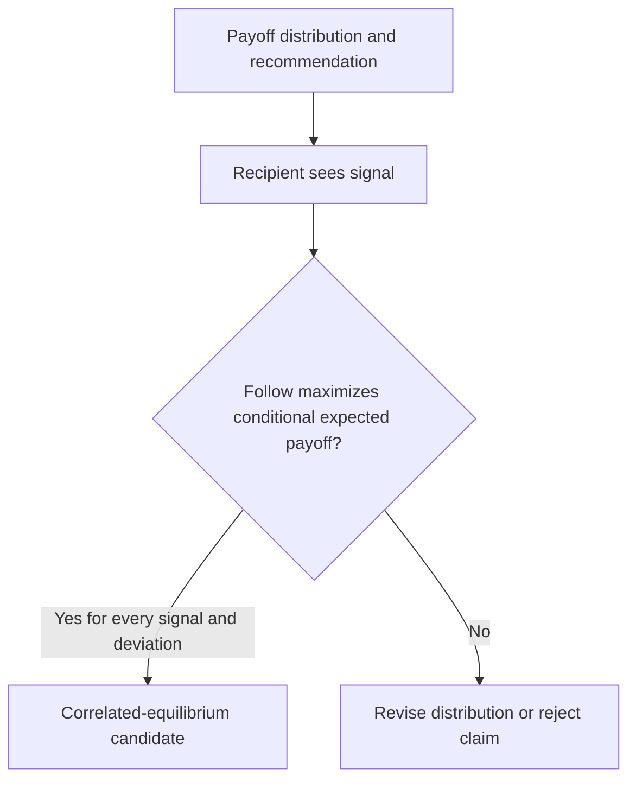
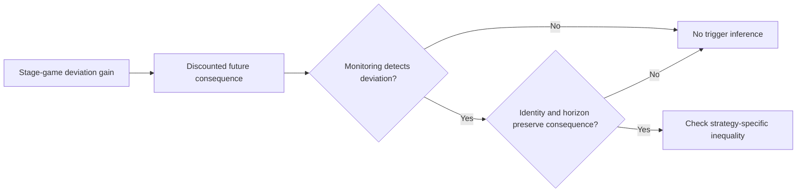

# Incentive Foundations

The main skill uses a concrete illustrative matrix and finite trigger calculation. This reference separates textbook definitions from product claims.

Primary and authoritative references:

- Robert Aumann, “Subjectivity and Correlation in Randomized Strategies,” [Journal of Mathematical Economics 1974](https://doi.org/10.1016/0304-4068(74)90037-8).
- Drew Fudenberg and Eric Maskin, “The Folk Theorem in Repeated Games with Discounting or with Incomplete Information,” [Econometrica 1986](https://doi.org/10.2307/1911307).

The cited papers establish results under stated mathematical assumptions. They do not show that claims are cheap talk in every protocol, that a daemon is a valid mediator, that a particular price-of-anarchy bound applies to files, or that identity persistence is implemented. No PoA theorem is cited here because no formal file-claim mapping was supplied.
