---

name: generative-music-audio
description: 'Generate music, sound effects, voice/TTS, and full songs across hosted APIs (Suno, Udio, ElevenLabs Music, Lyria, Cartesia, Hume) and open-weights models (ACE-Step, MusicGen, Stable Audio, YuE, DiffRhythm, Chatterbox, F5-TTS). Activate on: AI music, generate song, text to music, MusicGen, Suno, Udio, Stable Audio, ElevenLabs music, voice clone, TTS, sound effects, foley, mastering, stem separation, lip-sync audio. NOT for: voice in finished video (use generative-video-2026 lip-sync), audio post for film, DSP plugin design, or microphone hardware.'
allowed-tools: Read,Write,Edit,Bash(python:*,uv:*,pip:*,curl:*,ffmpeg:*),WebFetch,mcp__ElevenLabs__text_to_sound_effects
license: Apache-2.0
metadata:
  category: Video & Audio
  tags:
    - music-generation
    - tts
    - sound-effects
    - voice-cloning
    - audio
    - mastering
  pairs-with:
    - skill: voice-audio-engineer
      reason: Deep voice synthesis / cloning expertise complements this skill's hosted-API focus
    - skill: sound-engineer
      reason: Mixing, spatial audio, and middleware integration for generated assets
    - skill: ai-video-production-master
      reason: Music + voiceover are inputs to script-to-video pipelines
    - skill: media-gen-deployment
      reason: Hosting and serving music/audio models in production
    - skill: comfyui-mastery
      reason: ACE-Step, F5-TTS, and Stable Audio run as ComfyUI workflows
  recognition-cues: []
  expectancies: []
  decision-cues: []
  adaptive-workarounds: []
  execution-pattern: sequential
  needs-cdm: true
io-contract:
  kind: deliverable
  produces:
    - kind: code
      description: Audio generation API integration patterns and hosted/local model invocation examples
    - kind: documentation
      description: Tool selection decision trees and licensing/commercial rights matrices
    - kind: report
      description: Cost analysis and performance comparison matrices for hosted vs open-weights options
---

# Generative Music & Audio (May 2026)

You are an expert practitioner of the 2026 generative-audio stack: full-song models, voice/TTS, sound effects, mastering, stem separation, and the legal/licensing minefield around them. You know which hosted APIs deliver, which open weights are commercially safe, and which "AI music" tools are background-loop generators in disguise.

## When to Use

✅ Use for:
- Generating songs (with vocals or instrumental) — Suno, Udio, ElevenLabs Music, Riffusion, Lyria, Stable Audio
- Generating sound effects, foley, ambience — ElevenLabs SFX, Stable Audio, AudioGen
- Voice synthesis or cloning — ElevenLabs v3, Cartesia, Hume, OpenAI realtime, PlayHT, Chatterbox, F5-TTS, Higgs Audio
- Stem separation, mastering, audio cleanup — Demucs, LALAL.AI, LANDR, Matchering
- Choosing between hosted vs open-weights for music/audio
- Commercial-rights and licensing questions for AI-generated audio
- Local audio gen on M-series Mac or single-GPU rigs

❌ NOT for:
- Lip-syncing voice to video (that's `generative-video-2026` / Hedra / Sync.so / LatentSync)
- Audio post-production for finished film (linear-media DAW work, not gen)
- Mixing/mastering as creative engineering (that's `sound-engineer`)
- Speech-to-text transcription (that's `audio-transcription-pipeline`)
- Music theory tutoring or composition pedagogy

## Decision Tree — Pick the Right Tool

```mermaid
flowchart TD
  Start[What audio do you need?] --> Type{Type?}
  Type -->|Full song with vocals| Song
  Type -->|Instrumental loop / bed| Bed
  Type -->|Sound effect / foley| SFX
  Type -->|Voice / narration| Voice
  Type -->|Process existing audio| Process

  Song --> SongCommercial{Commercial use?}
  SongCommercial -->|Yes, paid plan OK| Suno[Suno v5 Pro<br/>$10/mo, commercial rights]
  SongCommercial -->|Yes, cleanest legal| EL11[ElevenLabs Music<br/>broad rights ex film/TV]
  SongCommercial -->|Yes, open + local| ACE[ACE-Step XL-turbo<br/>Apache-2.0, runs on 4090/M-Max]
  SongCommercial -->|No, just experimenting| Udio[Udio<br/>but downloads disabled since Oct 2025]

  Bed --> BedHosted{Hosted or local?}
  BedHosted -->|Hosted, clean rights| StableAudio[Stable Audio 2.5<br/>licensed training data]
  BedHosted -->|Local, free| StableAudioOpen[Stable Audio Open<br/>CC-licensed training set]
  BedHosted -->|Realtime jamming| Lyria[Lyria RealTime<br/>Gemini API WebSocket]

  SFX --> SFXHosted{Hosted?}
  SFXHosted -->|Yes, polished| EL11SFX[ElevenLabs SFX<br/>40 credits/sec, 30s max]
  SFXHosted -->|Yes, beds + loops| StableAudio
  SFXHosted -->|No, local + free| AudioGen[AudioGen<br/>but non-commercial license]

  Voice --> VoiceLatency{Latency-critical?}
  VoiceLatency -->|Yes, realtime agent| Realtime[OpenAI gpt-realtime<br/>OR Cartesia Sonic 3 ~40ms TTFB]
  VoiceLatency -->|No, expressive read| EL11Voice[ElevenLabs v3<br/>audio tags + voice clone]
  VoiceLatency -->|No, emotional| Hume[Hume Octave 2<br/>$7.60 / 1M chars]
  VoiceLatency -->|No, local + free| Chatterbox[Chatterbox<br/>Resemble open, beats EL11 in 63% blind tests]

  Process --> ProcessKind{What process?}
  ProcessKind -->|Stems| Demucs[Demucs v4 free<br/>OR LALAL.AI hosted up to 10 sources]
  ProcessKind -->|Master| LANDR[LANDR / eMastered<br/>OR Matchering open for batch matching]
  ProcessKind -->|Extend song| SunoExtend[Suno Extend with timestamp]
```

## The 2026 Honest Quality Ranking

For full songs with vocals (the hardest job):
1. **Suno v5 Pro** — best vocals, structure, hooks. Commercial rights persist past cancellation.
2. **Udio v4** — comparable musical quality, but **downloads disabled since Oct 2025**; you can listen, you cannot ship.
3. **ElevenLabs Music** — closing the gap; cleanest commercial story.
4. **Riffusion FUZZ-1.1 Pro** — solid; vocal/instrument swap is a real differentiator.
5. **ACE-Step XL-turbo** (open) — Apache-2.0, runs locally, surprisingly close on instrumentals.

For instrumental beds / SFX / loops:
1. **Stable Audio 2.5** (hosted) or **Stable Audio Open** (local). Defensible training data either way.
2. **ElevenLabs SFX** for short specific sounds.
3. **Lyria 2 / Lyria RealTime** for high-fidelity instrumental + realtime jamming.

For voice/TTS:
1. **ElevenLabs v3** for expressive reads with audio tags (`[laughs]`, `[whispers]`).
2. **Hume Octave 2** for emotional fidelity at the cheapest top-tier price.
3. **Cartesia Sonic 3** for sub-100ms realtime.
4. **Chatterbox** (open) for fiction/dialogue — beats ElevenLabs in 63.75% of blind tests per Resemble's benchmark.

## Anti-Patterns

### Anti-Pattern: "MusicGen is open and on GitHub so I can ship it commercially"
**Novice**: "The MusicGen repo is MIT-licensed; I'll bundle it in my product."
**Expert**: The **code is MIT, the weights are CC-BY-NC 4.0** — non-commercial. Self-hosting MusicGen in a paid product violates Meta's weights license regardless of where you run inference. ACE-Step (Apache-2.0) is the right swap.
**Timeline**: 2024: MusicGen release with NC weights. 2025: ACE-Step v1 lands as the permissive alternative. Jan 2026: ACE-Step v1.5; April 2026: ACE-Step XL series.
**Detection**: Grep `requirements*.txt` and `Dockerfile` for `audiocraft`. If present in a commercial product, file a license issue.

### Anti-Pattern: "Udio sounds great, ship it"
**Novice**: "Udio's quality matches Suno; let me use it for the soundtrack."
**Expert**: **Udio disabled all downloads in October 2025** as part of the UMG settlement. You can generate; you cannot export. Sharing outside the platform violates current ToS. The Udio you remember from earlier 2025 is no longer a distribution-viable product. UMG + Udio's co-launched 2026 platform is the path forward.
**Timeline**: Oct 2025: UMG settlement, downloads disabled. 2026: new licensed platform announced.
**Detection**: Any pipeline with a step labeled "download from Udio" is broken since Oct 2025.

### Anti-Pattern: "Suno API just like OpenAI"
**Novice**: Building against `api.suno.ai/v1/generate`.
**Expert**: **There is no official public Suno API** as of May 2026. Partner-only. What exists are third-party scrapers (PiAPI, EvoLink, sunoapi.org, AI/ML API) — ~$0.111/song. Grey legal status, can break overnight. Plan a fallback (ElevenLabs Music or ACE-Step) before betting product on a Suno wrapper.
**Detection**: Any code referencing `suno.com/api` or unofficial Suno endpoints is on borrowed time.

### Anti-Pattern: "TangoFlux is open and fast, let's use it"
**Novice**: "TangoFlux: 30s of 44.1kHz audio in 3.7s on A40. I'll ship it."
**Expert**: **TangoFlux is research/non-commercial.** Commercial use requires Stability AI registration. The "free open audio model" instinct is wrong — verify the weights license per release, not the repo license.
**Detection**: Any HF model card for declare-lab/* — read the license box, not the README.

### Anti-Pattern: "Voice clone, no consent flow"
**Novice**: Build a "clone any voice" feature with file upload only.
**Expert**: ElevenLabs Pro Voice Clone requires a recorded verbal consent statement from the source speaker. Replicate that flow — written consent, scope-limited license, deepfake disclosure, watermark + C2PA, revocation mechanism. Tennessee ELVIS Act + EU AI Act (Aug 2026 watermark mandate) make this non-negotiable.
**Timeline**: 2024: Tennessee ELVIS Act. 2025: ISO/IEC 22144 ratification of C2PA. **Aug 2026: EU AI Act machine-readable watermark mandate.**
**Detection**: A clone form with no consent recording step is a lawsuit waiting to happen.

### Anti-Pattern: "ElevenLabs charges per character so audio is cheap"
**Novice**: Estimating cost from Multilingual v2 ($0.12/1k chars) for music API.
**Expert**: **Music API is billed per generation, not per character.** TTS pricing does not transfer. Sound Effects: 100 credits flat for AI-decided duration; **40 credits/sec** for user-set duration. Multilingual v2 at $0.12/1k chars vs Flash/Turbo at $0.06/1k chars; Music is its own pricing track.
**Detection**: Any cost model that treats music + TTS + SFX as one billing unit is wrong.

## The Commercial-Rights Matrix (Quick Reference)

| Service | Free tier commercial? | Paid commercial? | Critical caveat |
|---|---|---|---|
| Suno | No | Yes (Pro/Premier) | Persists past cancellation |
| Udio | No | Yes on platform — **no downloads since Oct 2025** | Practically unshippable |
| ElevenLabs Music | No | Yes (Self-Serve excludes film/TV/AAA games) | Cleanest legal story |
| Riffusion | Yes | Yes | All output licensed |
| Lyria 2 (Vertex) | N/A | Yes | **SynthID watermark mandatory** |
| Stable Audio 2.5 | Community License | Community (<$1M ARR) / Enterprise above | Defensible training |
| Stable Audio Open | Community License | Same | CC-licensed training data |
| MusicGen | No | **No** (CC-BY-NC weights) | Code MIT ≠ weights free |
| ACE-Step | Yes (Apache-2.0) | Yes | Most permissive open |
| TangoFlux / Tango 2 | No | Stability registration required | Research-only by default |
| YuE | Verify per release | Verify | Weights license is moving target |

Full lawsuit / watermarking / EU AI Act detail in `references/commercial-rights.md`.

## Pipeline Recipes (See Reference Files)

| Job | Reference |
|---|---|
| Suno custom-mode prompt with proper tag structure | `references/prompt-engineering.md` |
| ElevenLabs v3 voiceover with audio tags | `references/voice-and-tts.md` |
| Run ACE-Step XL-turbo locally on a 4090 / M-Max | `references/open-weights.md` |
| Stable Audio Open SFX batch generation | `references/sfx-and-foley.md` |
| Demucs v4 + LALAL.AI stem-separation pipeline | `references/specialty-audio.md` |
| Suno → Demucs → re-master → distribute | `references/specialty-audio.md` |

## Ship-Hardening Checklist

- [ ] Commercial rights verified for **every** model in the pipeline (matrix above + `references/commercial-rights.md`)
- [ ] Voice cloning has consent capture + scope-limited license + revocation path
- [ ] Output watermarked (SynthID, AudioSeal, or audible disclosure) — required by EU AI Act Aug 2026
- [ ] C2PA Content Credentials manifest attached for any user-facing AI-audio
- [ ] Fallback for Suno wrappers (third-party access can vanish overnight)
- [ ] Pricing model accounts for per-generation vs per-character billing differences
- [ ] Local stack (ACE-Step + Chatterbox + Stable Audio Open + Demucs) tested as failover

## References

| File | Consult when |
|---|---|
| `references/full-song-models.md` | Choosing between Suno / Udio / ElevenLabs Music / Lyria / Riffusion / Stable Audio for a song or bed |
| `references/open-weights.md` | Running ACE-Step / MusicGen / Stable Audio Open / YuE / DiffRhythm locally |
| `references/voice-and-tts.md` | Picking a TTS provider, voice cloning, realtime voice agents |
| `references/sfx-and-foley.md` | Generating sound effects + foley + ambience with prompt patterns that work |
| `references/prompt-engineering.md` | Writing Suno custom-mode style/lyrics, Udio sections, ElevenLabs audio tags |
| `references/commercial-rights.md` | Lawsuits, watermarking, EU AI Act, license matrix detail |
| `references/specialty-audio.md` | Mastering (LANDR, Matchering), stems (Demucs, LALAL.AI), lip-sync chains |

## Aggregator + Cost Notes

- **fal.ai**: broadest hosted catalog (Suno-alikes, MiniMax Music 2.5 at **$0.035/track**, MusicGen, Stable Audio).
- **Replicate**: open-weights catalog (MusicGen, YuE via cog-yue, Stable Audio Open, ACE-Step).
- **ElevenLabs MCP**: tool-calling integration — single API for voice + SFX + music + speech-to-speech.

Cost ballpark per finished minute (May 2026):
- Suno Pro plan amortized: ~$0.004/min · MiniMax via fal: ~$0.012/min · ElevenLabs Music: $0.10–$0.30/min · Self-hosted ACE-Step on rented 4090: ~$0.005/min.

For deployment / serving these models, see the `media-gen-deployment` skill.
