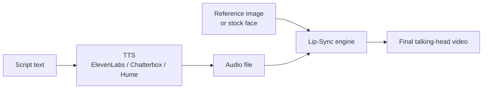

# Specialty Audio — Mastering, Stem Separation, Lip-Sync Chains

The pipelines around generation: cleaning up the output, separating stems, and getting it to sit alongside other audio.

---

## Mastering

### LANDR
- Best default for working artists releasing consistently.
- **Album-level consistency mode** — masters multiple tracks to match.
- Subscription-based; per-track also available.

### eMastered
- Wins on **warmth-dependent material** (R&B, soul).
- Slightly less aggressive than LANDR.

### CloudBounce
- Cheapest, fastest (**<10 min**).
- Good for electronic / hip-hop dense mixes.
- Struggles with acoustic / orchestral wide dynamic range.

### BandLab Mastering
- Free.
- Lower ceiling than LANDR/eMastered.
- Fine for non-commercial / preview masters.

### Matchering (open source)
- **Free Python library**, GitHub.
- Masters file A to **match the loudness/spectral profile of reference file B**.
- Headless, scriptable — perfect for batch pipelines.
- Not a creative mastering engine — a matching engine.
- Use for: "make this AI-generated track match the loudness/EQ of this reference song."

```python
import matchering as mg

mg.process(
    target='generated_song.wav',
    reference='reference_master.wav',
    results=[
        mg.pcm16('mastered_16bit.wav'),
        mg.pcm24('mastered_24bit.wav'),
    ]
)
```

### Decision

| Need | Pick |
|---|---|
| Commercial release, single track | LANDR |
| Album consistency | LANDR album mode |
| Warmth-critical genre | eMastered |
| Speed/cost matters | CloudBounce |
| Free preview | BandLab |
| Match a reference style at scale | **Matchering** (in your pipeline) |

---

## Stem Separation

### Demucs v4 (hybrid)
- **Free, Meta open-weights.**
- **10–15% higher quality** on benchmarks than older spectral-only models, especially on reverb-tail vocals + bright-transient bass.
- The right default for free, scriptable stem splitting.

```bash
uv pip install demucs

# Default 4-stem (vocals, drums, bass, other)
python -m demucs --two-stems=vocals song.mp3

# 6-stem with finer breakdown
python -m demucs -n htdemucs_6s song.mp3
```

### LALAL.AI
- **Cleanest hosted vocal isolation.**
- **Up to 10 source types** in 2026 (vocals, drums, bass, electric guitar, acoustic guitar, piano, synth, strings, winds, electric piano).
- Best consumer API.
- $10–$100 credit packs.
- Use Phoenix or Orion engines for highest quality.

### AudioShake
- Enterprise tier.
- **Dolby Atmos / karaoke / dialogue+music+effects** separation at scale.
- Custom contracts.
- Use when broadcast/film studios are the customer.

### Moises Pro / RipX
- Best **ensemble engines** for prosumer use.
- Combine multiple separation models + heuristics.

### Spleeter
- Still around. Mostly outclassed by Demucs v4. Don't use for new work.

### Decision

| Need | Pick |
|---|---|
| Free, scriptable, batch | **Demucs v4** |
| Hosted, best vocal isolation | **LALAL.AI** |
| Enterprise broadcast | **AudioShake** |
| Prosumer DAW workflow | Moises Pro / RipX |

---

## Lip-Sync Chains (audio → video)

The standard pipeline:



For talking-head from image:

| Service | Tier | Notes |
|---|---|---|
| **Hedra Character-3 / Omnia** | Hosted | Polished, Creator $24/mo (~11 min of 720p Character-3 / month). Ships an actual API. **Best end-to-end product** for "image + audio → talking character." |
| **Sync.so** | Hosted | Hobbyist $5/mo. **Strongest pure lip-sync API.** Pick this if embedding into a product pipeline. |
| **HeyGen** | Hosted | Avatar-led, captions in 120+ languages. Best for talking-head training video at scale. Subscription-only. |
| **Argil** | Hosted | Personal-avatar replicas from a 2-min selfie video. Best for "make me look like I posted today" social workflows. |
| **LatentSync** | Open | Wav2Lip-style. Cleanest in ComfyUI. Lower quality than Hedra/Sync at the high end. |
| **MuseTalk / EchoMimic / Sonic / Hallo** | Open | Specialized variants. Use for keep-it-local pipelines. |

### Local lip-sync chain (ComfyUI)

1. Generate audio: Chatterbox or F5-TTS (see `voice-and-tts.md`).
2. Run **LatentSync** on a still image + the audio in ComfyUI (HF Space / wrapper available).
3. Output: lip-synced video.

For more, see the `comfyui-mastery` and `generative-video-2026` skills.

### Hosted lip-sync chain (production)

1. Generate audio: ElevenLabs v3 with Pro voice clone.
2. POST audio + reference image to **Hedra Character-3** API.
3. Webhook returns finished video.
4. Concat into final cut via FFmpeg / Auto-Editor / Captions.

---

## Pitch / Timing Correction

True AutoTune-equivalent for AI workflows is still **DSP-driven**. Riffusion's vocal swap is the closest hosted analog. For pipeline use:

- Generate vocals (Suno / ElevenLabs / Chatterbox).
- Route through DSP pitch corrector post-generation: Auto-Tune Pro, Melodyne, GSnap (free), or pyrubberband (Python).
- For batch automation, `pyrubberband` + `librosa` for pitch detection works well in scripts.

```python
import librosa
import pyrubberband as pyrb
import soundfile as sf

audio, sr = librosa.load('vocals.wav', sr=44100)
# Pitch up by 2 semitones
shifted = pyrb.pitch_shift(audio, sr, n_steps=2)
sf.write('vocals_up2.wav', shifted, sr)
```

---

## Quick Pipeline Recipes

### Recipe 1: Suno song → mastered + distributed
```
1. Suno Pro: generate song with custom prompt
2. Download stems (12 stems on Pro/Premier)
3. Light mix in DAW (Reaper / Ableton / Logic)
4. Master: LANDR or Matchering against reference track
5. Distribute via DistroKid / TuneCore (commercial rights from Pro plan persist)
```

### Recipe 2: Voice clone narration → video
```
1. ElevenLabs v3: clone voice with consent + recorded statement
2. Generate narration with audio tags ([pauses], [excited]) for emotional range
3. Hedra Character-3: image + narration → lip-synced video
4. Concat in FFmpeg with B-roll
5. Watermark + C2PA on output
```

### Recipe 3: Stem-swap a track
```
1. Demucs v4: separate vocals, drums, bass, other
2. Replace vocal stem: Riffusion vocal swap or Suno cover mode
3. Re-combine in DAW
4. Master against original reference (Matchering)
```

### Recipe 4: Game audio asset run
```
1. Event list: 200 atomic SFX prompts
2. Batch via ElevenLabs SFX API + ElevenLabs MCP
3. Tag (event, perspective, length) → asset library
4. Wwise / FMOD integration (see sound-engineer skill)
```

---

## Cost Math (per finished minute)

| Stack | $/min |
|---|---|
| Suno Pro amortized (max credits use) | ~$0.004 |
| MiniMax via fal | ~$0.012 |
| Self-hosted ACE-Step on rented 4090 | ~$0.005 + $0.30/hr GPU |
| ElevenLabs Music | $0.10–$0.30 |
| Suno via PiAPI third-party | ~$0.03 |
| MusicGen self-hosted (NC weights — research only) | ~$0.006 |

For deployment patterns (job queues, GPU rental, ComfyUI bridging), see the `media-gen-deployment` skill.
