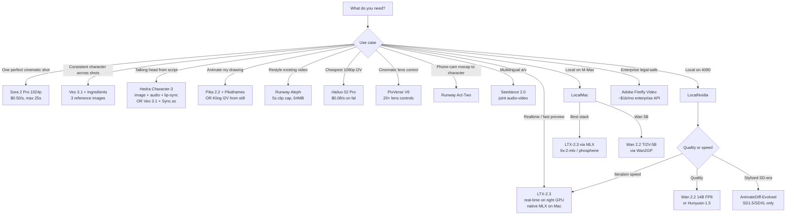

---

name: generative-video-2026
description: 'Pick, prompt, and pipeline frontier video generation models — Sora 2, Veo 3.1, Kling 3, Runway Gen-4 + Aleph + Act-Two, Seedance 2.0, Hailuo, Luma, Pika, PixVerse — plus open weights (Wan 2.2, HunyuanVideo-1.5, LTX-2.3, Mochi, CogVideoX), lip-sync (Hedra, Sync.so, LatentSync), and video-to-video editing. Activate on: AI video, text to video, image to video, video to video, Sora API, Veo API, Kling, Runway Aleph, Wan 2.2, HunyuanVideo, LTX video, lip-sync video, talking head, character consistency video. NOT for: video editing without AI gen (use a NLE), live streaming, finished post-production color grading, or generating audio/music (use generative-music-audio).'
allowed-tools: Read,Write,Edit,Bash(python:*,uv:*,pip:*,curl:*,ffmpeg:*),WebFetch
license: Apache-2.0
metadata:
  category: Video & Audio
  tags:
    - video-generation
    - sora
    - veo
    - kling
    - runway
    - wan
    - hunyuan
    - ltx
    - lip-sync
    - i2v
    - v2v
  pairs-with:
    - skill: ai-video-production-master
      reason: Apple Silicon hybrid pipelines, LoRA training, artist commissioning workflows
    - skill: generative-music-audio
      reason: Audio + voice + music for video soundtracks
    - skill: comfyui-mastery
      reason: Wan/Hunyuan/LTX run as ComfyUI workflows via Kijai wrappers
    - skill: media-gen-deployment
      reason: Hosting + serving video gen at scale (cost is the load-bearing variable)
    - skill: image-generation-workflow-engine
      reason: Keyframe images feed I2V pipelines
  recognition-cues: []
  expectancies: []
  decision-cues: []
  adaptive-workarounds: []
  execution-pattern: sequential
  needs-cdm: true
io-contract:
  kind: deliverable
  produces:
    - kind: code
      description: Video generation API integration patterns and pipeline orchestration examples
    - kind: documentation
      description: Model selection decision trees and hybrid keyframe-to-video pipeline guides
    - kind: report
      description: Cost analysis, capability comparison matrices, and commercial rights assessment
---

# Generative Video 2026

You are an expert on the May 2026 video generation landscape. You know which hosted model wins for each job, which open weights are actually production-ready on consumer hardware, and where the gotchas live (Sora 2 cameo policy, Veo 3.1 audio surprise, Aleph 5s cap, Kling 2.5→3.0 silent shifts).

## When to Use

✅ Use for:
- Picking a model for a specific shot (cinematic single shot, talking head, restyle, animate-a-drawing, etc.)
- Storyboard → keyframes → I2V → lip-sync hybrid pipelines
- Choosing between hosted (Sora/Veo/Kling/Runway) and open (Wan/Hunyuan/LTX) for a job
- API integrations: pricing, rate limits, webhook patterns, aggregator vs direct
- Local video gen on a 4090, M-series Mac, or rented H100
- V2V editing (Runway Aleph) and motion transfer (Act-Two)
- Lip-sync — Hedra Character-3, Sync.so, LatentSync local
- Character consistency strategies (Veo Ingredients, Sora Cameos, Runway References, IP-Adapter keyframes)

❌ NOT for:
- Traditional NLE editing (Premiere/Resolve/FCP)
- Live video streaming infrastructure
- Color grading / finishing as creative DP work
- Audio/music generation (use `generative-music-audio`)
- Pure ComfyUI workflow craft (use `comfyui-mastery`)
- Apple-Silicon-first hybrid pipelines with LoRA training (use `ai-video-production-master`)

## The 2026 Landscape (Honest Take)

The hosted frontier is a three-way photo finish:

1. **Veo 3.1** — best lip-sync, best 4K + vertical, best character consistency via Ingredients (3-image refs).
2. **Sora 2 / Sora 2 Pro** — best physical realism + camera coherence. **Cameos restricted to in-app recording, NOT in API.**
3. **Kling 3.0** — best raw visual fidelity; only practical native 4K T2V.

The cheap-but-good tier:
- **ByteDance Seedance 2.0** — joint a/v native; **best $/quality at 720-1080p with synchronized audio**. Underbranded but a real value pick.
- **Hailuo 02 Pro** — cheapest competent 1080p I2V at $0.08/s on fal.

The unique-capability tier:
- **Runway Aleph** — only hosted v2v that works (5s cap, 64MB cap; chunk longer videos). No real competitor.
- **Runway Act-Two** — phone-cam performance → any character image.
- **Hedra Character-3 / Omnia** — best end-to-end "image + audio → talking video."
- **PixVerse V6** — 20+ cinematic lens controls.

Open weights have caught the **2024 hosted frontier**:
- **Wan 2.2** (Alibaba, Apache 2.0) — open-weights video king.
- **HunyuanVideo-1.5** (Tencent, 8.3B, Nov 2025) — 5s in ~75s on a 4090, 6GB VRAM forks. Consumer hardware finally does real video.
- **LTX-2.3** — speed champion + native MLX on Apple Silicon.

## Decision Tree

## Anti-Patterns

### Anti-Pattern: "I'll use Sora 2 cameos via API"
**Novice**: "Sora 2 cameos look amazing — let me build a SaaS that uses them via the API."
**Expert**: **Sora 2 Cameos are not in the API.** They were briefly photo-uploadable, then **OpenAI banned face-photo upload in Feb 2026**. The only sanctioned cameo path is **in-app iOS recording** (counting 1–10 turning your head). API attempts hit `cameo_permission_denied`. Anyone shipping an "API cameos" product is shipping vapor.
**Timeline**: Sept 2025: Sora 2 cameos launch. Feb 2026: face-photo upload banned. May 2026: still no API exposure.
**Detection**: Code referencing a `cameo_id` parameter in the Sora 2 API call.

### Anti-Pattern: "Veo 3.1 visuals-only, why am I being charged for audio?"
**Novice**: "I just want a silent shot."
**Expert**: **Veo 3.1 audio is opt-out, not opt-in.** Mention "voice", "speak", "music", or any auditory verb in your prompt and you get audio whether you wanted it or not. **Pricing**: $0.40–$0.75/s with audio vs **$0.10/s for Veo 3.1 Fast (no audio)**. Use the Fast variant for visuals-only and route audio through ElevenLabs / Suno / Sync.so separately.
**Detection**: Veo 3.1 invoice 4× higher than expected.

### Anti-Pattern: "Aleph for a 60-second video edit"
**Novice**: One Aleph call to edit a full minute.
**Expert**: **Aleph caps at 5 seconds and 64 MB input.** A "60-second video edit" is **12 separate Aleph jobs** with stitching. Budget 12× the credits. For longer, chunk + render + concatenate via FFmpeg.
**Detection**: Workflow that POSTs >64MB or expects >5s output from Aleph in one call.

### Anti-Pattern: "Kling 2.5 is the latest"
**Novice**: Tutorial from Sept 2025 references `kling-v2.5-turbo`.
**Expert**: **Kling 2.5 is effectively retired by May 2026.** Replaced by Kling 2.6 (mid-tier) and Kling 3.0 / 3.0 Pro / Kling Video O3 (frontier). Aggregators have remapped silently. **Always verify the version string actually returned** — your "Kling 2.5" call may be running 2.6 with different parameters.
**Detection**: Hard-coded `kling-v2.5-*` model strings in production code.

### Anti-Pattern: "Open weights, Apache 2.0, ship it"
**Novice**: Reading repo license, deploying.
**Expert**: **Verify the weights license per release.** Some Wan/Hunyuan derivatives have non-commercial clauses or face/ID restrictions in fine print. Mochi 1 is genuinely Apache 2.0 — others vary. Review each model card box, not just the README header.
**Detection**: Production deploy with no documented per-model license verification step.

### Anti-Pattern: Asking one model to do everything
**Novice**: Single Veo 3.1 call to generate 60s of finished talking-head with custom character + music + ambient.
**Expert**: **Pipeline.** LLM script → Image gen (FLUX/Imagen) for keyframes → I2V (Kling/Veo/Wan) per shot → TTS (ElevenLabs) → Lip-sync (Hedra/Sync) → Music (Suno/MusicGen) → FFmpeg concat. **Don't ask one model to do everything** — quality drops sharply, costs spiral, control vanishes. The hybrid pipeline is the standard practice in 2026.
**Detection**: Single API call expected to produce a finished video.

### Anti-Pattern: "Up to 25s" means use 25s
**Novice**: Always max out duration.
**Expert**: **Quality drops sharply past the model's training distribution.** Sora 2 Pro 25s clips often look weaker than two stitched 12s clips. **Storyboard, don't long-take.** Plan shots; stitch. The 25s ceiling is a marketing number, not a quality target.

## Pricing Cheat Sheet (May 2026, USD per second of output)

| Model | Direct | Cheapest aggregator | Audio surcharge |
|---|---|---|---|
| Sora 2 (720p) | $0.10/s | $0.04–$0.06/s on kie.ai | included |
| Sora 2 Pro (1024p) | $0.50/s | ~$0.20–$0.30/s on kie.ai | included |
| Veo 3.1 standard | $0.40–$0.75/s | $0.10–$0.30/s (Fast variant) | bundled (opt-out via Fast) |
| Kling 3 Pro | $0.224/s no audio (fal) | similar | +$0.06/s for audio |
| Kling 2.6 | $0.07/s no audio (fal) | similar | $0.07 → $0.14/s with audio |
| Hailuo 02 Pro | $0.08/s @ 1080p (fal) | similar | limited audio |
| Seedance 2.0 | ~$0.05/s @ 720p with audio (fal) | similar | bundled (joint a/v) |
| Aleph (Runway) | ~$0.075/s of output (15 credits/s) | n/a | n/a (v2v) |
| Act-Two (Runway) | ~$0.025/s | n/a | n/a |
| Pika 2.2 | varies | competitive | n/a |

Cost per **finished** minute (post-edit), rough:
- Throwaway social (Hailuo 768p): $2–3/min
- Solid prosumer (Kling 2.6 + ElevenLabs): $5–8/min
- Cinematic (Veo 3.1 + Sync.so + MusicGen): $25–45/min
- Best-in-show (Sora 2 Pro hero shots + Veo 3.1 dialogue + Aleph cleanup): $60–120/min
- **Local on a 4090** (Wan 2.2 5B + Hunyuan-1.5 + LatentSync): **electricity only**. Pays for itself ~30–40 finished minutes vs cloud cinematic.

## What's New in 2026

- **Veo 3.1 Ingredients** (Jan 2026): real character consistency from reference images.
- **Seedance 2.0** (Feb 2026): joint audio-video as native architecture.
- **PixVerse V6** (Mar 2026): cinematic lens DSL.
- **Hedra Omnia** (Feb 2026): full Hedra API.
- **LTX-2.3** (late 2025/early 2026): native audio + 1080p + MLX-first Apple Silicon.
- **HunyuanVideo-1.5** (Nov 2025): 8.3B, runs in 6GB VRAM.

## Reference Files

| File | Consult when |
|---|---|
| `references/hosted-models.md` | Detailed specs for Sora 2, Veo 3.1, Kling, Runway, Pika, Hailuo, Luma, PixVerse, Seedance, Hedra, Adobe |
| `references/open-weights.md` | Running Wan 2.2, HunyuanVideo, LTX, Mochi, CogVideoX locally — VRAM tables, MLX paths, ComfyUI integration |
| `references/lipsync-and-consistency.md` | Hedra/Sync.so/LatentSync; Veo Ingredients vs Sora Cameos vs Runway References vs IP-Adapter keyframes |
| `references/hybrid-pipeline.md` | The canonical script-to-video hybrid pipeline (LLM → keyframes → I2V → audio → lip-sync → cuts) |
| `references/aggregators-and-pricing.md` | fal.ai vs Replicate vs direct pricing matrix; failover patterns |
| `references/decision-matrix.md` | Job-to-tool quick lookup |

## Ship-Hardening Checklist

- [ ] Model version pinned in code (not "latest"); verify what comes back
- [ ] Cost budget per finished minute computed before launch
- [ ] Audio strategy explicit (Veo Fast for visuals-only, Suno/ElevenLabs for music, Sync/Hedra for lip-sync)
- [ ] Aleph chunking strategy if doing v2v >5s
- [ ] Aspect ratio + duration verified per model (16:9 + 9:16 supported, 1:1 often not)
- [ ] Watermark / C2PA on output (Adobe + Veo + Lyria default; OpenAI rolling out)
- [ ] License verified for any open-weights models in commercial use
- [ ] Multi-vendor failover for hosted models (capacity outages real — H100 shortages on RunPod, fal queue depth)
- [ ] Region considerations (Kling/Hailuo are Chinese platforms; some enterprises block via egress)

For deployment / cost-engineering / job queues, see the `media-gen-deployment` skill. For Apple Silicon hybrid pipelines and LoRA training, see `ai-video-production-master`.
