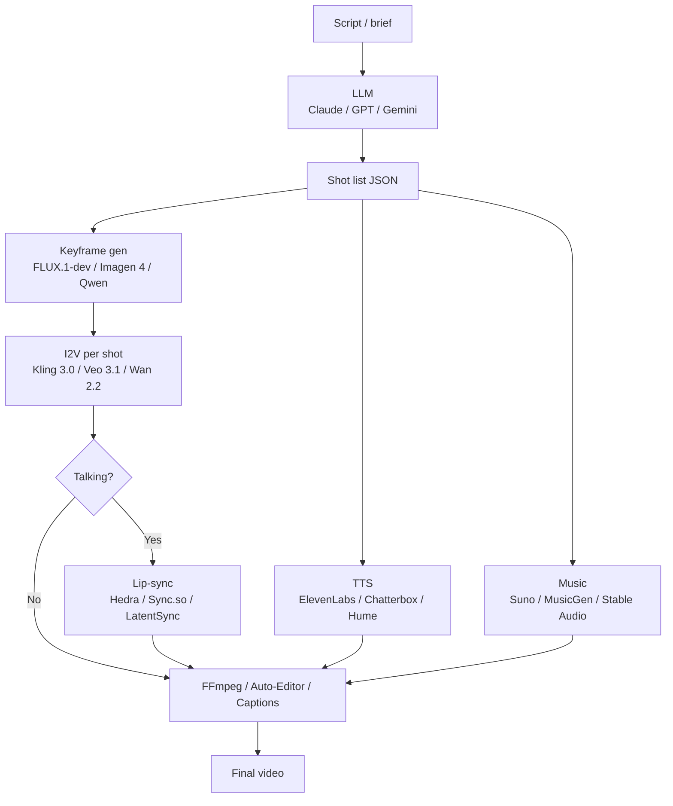

# Hybrid Script-to-Video Pipeline (May 2026)

The canonical 2026 pipeline. **Don't ask one model to do everything.** Stitch best-in-class tools per modality and per shot.

---

## The Canonical Pipeline



**Key insight**: Each stage uses the right tool. Veo's "audio comes free" feature is a hazard in this pipeline — **turn it off** (use Veo Fast, no audio) and route audio through dedicated tools.

---

## Stage 1: Script → Shot List (LLM)

Have an LLM (Claude / GPT / Gemini) emit a structured shot list:

```json
{
  "shots": [
    {
      "id": "shot-01",
      "duration_s": 5,
      "type": "establishing",
      "keyframe_prompt": "Wide cinematic shot, autumn forest, golden hour, lone path through pines, leaves drifting, 35mm film, shallow DoF",
      "motion_prompt": "Slow camera push-in. Leaves drift gently across frame.",
      "audio": null,
      "lip_sync": false
    },
    {
      "id": "shot-02",
      "duration_s": 6,
      "type": "talking",
      "keyframe_prompt": "Close-up portrait, woman in burgundy scarf, autumn forest background, eyes contemplative, 35mm",
      "motion_prompt": "She turns her head slowly, hair sways. Soft camera push-in.",
      "audio": "VOICEOVER: 'Some autumns you remember the leaves. Others, you remember who walked beside you.'",
      "lip_sync": true
    }
  ],
  "soundtrack": "melancholic indie folk, fingerpicked guitar, sparse, 95bpm, 30 seconds, fades into shot 3"
}
```

This contract drives every downstream stage.

---

## Stage 2: Keyframes (Image Gen)

For each shot, generate a keyframe image — the "first frame" of the video. Use:
- **FLUX.1 dev** (open, local, ~$0.025/image hosted) — best general purpose
- **Imagen 4** (Google) — best for photographic realism
- **Qwen Image** (local on M-Max) — fast iteration on Apple Silicon
- **Recraft** / **Ideogram 3** — typography-aware
- **Nano Banana 2 / Pro** (Gemini image gen) — see `nano-banana-image-gen` skill

For character consistency across keyframes, use **IP-Adapter** locked to a reference character image. See `lipsync-and-consistency.md`.

For full image-gen workflow guidance, see the `image-generation-workflow-engine` and `nano-banana-image-gen` skills.

---

## Stage 3: I2V (per shot)

Each keyframe → 5–10 second video clip via I2V:

| Tier | Pick |
|---|---|
| Cinematic hero shot | **Veo 3.1 Fast** (no audio, ~$0.10/s) or Sora 2 Pro |
| Storyboarded narrative | **Kling 3.0** I2V or **Wan 2.2 14B I2V** local |
| Cheap volume | **Hailuo 02 Pro** ($0.08/s @ 1080p) |
| Stylized / anime | Hailuo 2.3 or Vidu |
| Drawing → animation | **Pika 2.2 Pikaframes** (interp two stills) |

Always **disable audio** at the model level if available — generate it separately for control.

---

## Stage 4: Audio (parallel to Stage 3)

For each shot's audio:
- **Voiceover**: ElevenLabs v3 (with Pro voice clone) or Cartesia Sonic 3 (latency-critical) or Chatterbox (open).
- **Music**: Suno Pro (with commercial rights) or MusicGen self-hosted (NC! research only) or ACE-Step XL-turbo (open Apache-2.0).
- **SFX**: ElevenLabs SFX or Stable Audio.

Generate audio in parallel with the video stage to minimize wall-clock time.

For deep audio guidance, see the `generative-music-audio` skill.

---

## Stage 5: Lip-Sync (where needed)

Only for shots with on-camera dialogue:

```python
# Pseudo-code per talking shot
video_clip = i2v_render(keyframe, motion_prompt)
audio_clip = tts(line, voice_id)
synced = hedra_character3(video_clip, audio_clip)  # OR Sync.so / LatentSync
```

**Lip-sync per shot, before any cuts.** Stitching synced clips is cleaner than syncing a stitched video.

For lip-sync detail, see `lipsync-and-consistency.md`.

---

## Stage 6: Cuts + Transitions + Soundtrack

FFmpeg or Auto-Editor for assembly:

```bash
# Concat all video clips
ffmpeg -f concat -safe 0 -i clips.txt -c copy raw.mp4

# Mix in soundtrack at -18 LUFS, ducking under voiceover
ffmpeg -i raw.mp4 -i music.mp3 -filter_complex \
  "[1:a]volume=0.4[music];[0:a][music]amix=inputs=2:duration=first" \
  -c:v copy final.mp4
```

For viral short-form: **Captions** or **Submagic** for caption-burning + B-roll auto-edits + viral templates. Submagic owns the short-form caption space in 2026.

---

## Cost Economics (per finished minute)

| Quality tier | Stack | $/min |
|---|---|---|
| Throwaway social | Hailuo 02 Standard 768p | $2–3 |
| Solid prosumer | Kling 2.6 + ElevenLabs | $5–8 |
| Cinematic | Veo 3.1 + Sync.so + MusicGen | $25–45 |
| Best in show | Sora 2 Pro hero shots + Veo 3.1 dialogue + Aleph cleanup | $60–120 |
| **Local on a 4090** | Wan 2.2 5B + Hunyuan-1.5 + LatentSync + Suno Pro | electricity + ~$0.004/song |

Local pays for itself **somewhere around 30–40 finished minutes** vs cloud at the cinematic tier.

---

## Tools That Wrap the Pipeline

- **Runway** is the only single vendor with all of T2V + I2V + V2V (Aleph) + mocap (Act-Two) under one billing.
- **Captions / Submagic**: caption-burning + B-roll auto-edits + viral templates.
- **HeyGen / Argil**: avatar-led, scripted talking-head training video.
- **Higgsfield, fal, Replicate, Atlas Cloud, WaveSpeedAI, kie.ai**: API-side aggregators.

For ComfyUI in this pipeline (Kijai's WanVideoWrapper, HunyuanVideoWrapper, FLUX keyframes), see the `comfyui-mastery` skill.

---

## Anti-Patterns in Pipeline Design

### "Veo 3.1 with audio for every shot"
**Cost** explodes (4×). Use Veo Fast no-audio + dedicated TTS.

### "Generate the soundtrack last"
Music timing should inform shot pacing. Generate the soundtrack early; cut to its structure.

### "One LLM call to write the script"
Iterate. First pass: shot list. Second pass: dialogue + voice direction. Third pass: prompt engineering for keyframes. The LLM is cheap; iteration is the leverage.

### "Reuse the same keyframe for similar shots"
**Don't.** Same character ≠ same keyframe. Use IP-Adapter locked to a reference, generate fresh keyframes per shot.

### "Test on the final stack"
Use **LTX-2.3** or **Wan 2.2 5B** for fast iteration. Re-render winners with Veo / Wan 14B for production. Iterating on Sora 2 Pro at $0.50/s burns money.

### "Real-time lip-sync"
Most lip-sync is async. If you need real-time (live agent), accept the quality trade-off and use streaming TTS (Cartesia) + a real-time avatar tool (Hedra realtime endpoint, or running OmniHuman locally).

---

## Reference Repo Layout for a Pipeline Project

```
my-video-project/
├── scripts/
│   ├── generate_shot_list.py    # LLM call → JSON
│   ├── render_keyframes.py      # FLUX/Imagen → keyframes/
│   ├── render_i2v.py            # Kling/Veo/Wan → clips/
│   ├── render_audio.py          # TTS + Suno → audio/
│   ├── lip_sync.py              # Hedra → synced/
│   └── assemble.py              # FFmpeg concat
├── keyframes/
├── clips/
├── audio/
├── synced/
├── shot_list.json
├── final.mp4
└── README.md
```

Drive each stage from the same `shot_list.json` so re-runs are idempotent.

For deployment of this pipeline at scale (queues, webhooks, GPU rental), see the `media-gen-deployment` skill.
